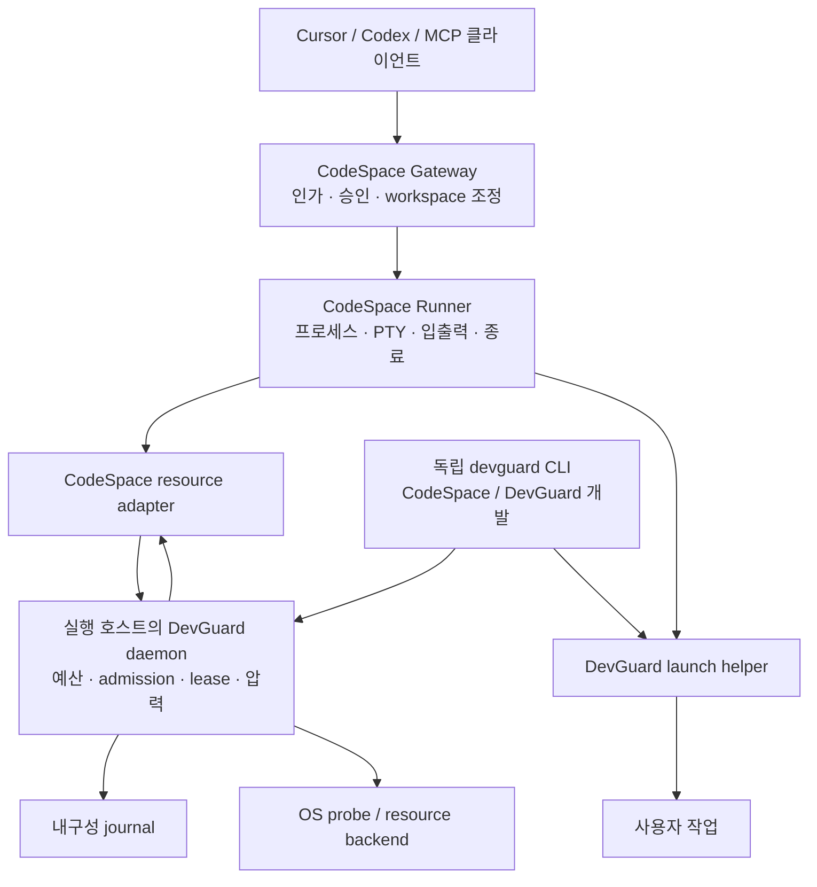
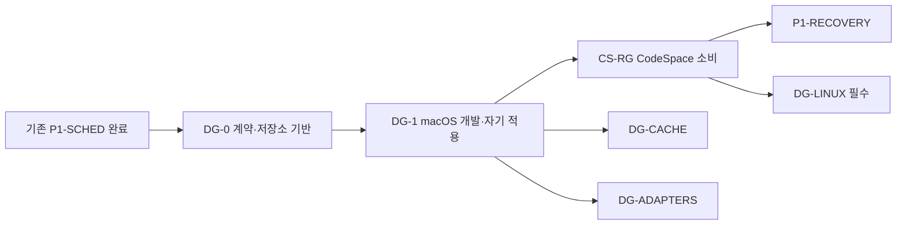

# DevGuard 독립 설계서 — 외부 검토 통합 개정안

**문서 기준일:** 2026-09-22  
**DevGuard 로컬 개발 위치:** `/Volumes/DevData/Projects/IdeaProjects/DevGuard`  
**결합 대상:** CodeSpace 및 같은 실행 호스트에서 수행되는 개발 작업  
**CodeSpace 조사 기준:** `e94d21475643608ad2a466256fb57266b86faa47`

DevGuard는 개발 작업에 사용할 자원을 실행 호스트에서 중앙 관리하는 독립 시스템이다. CodeSpace는 DevGuard가 발급하는 자원 예산과 실행 정책을 소비하며, 프로세스 실행·PTY·입출력·종료·승인은 계속 CodeSpace가 소유한다. DevGuard 자신의 개발과 검증도 안정 버전 DevGuard의 예산 안에서 수행한다.

이번 개정은 기존 구조를 유지하면서 **예약과 실제 적용의 구분, 실행 시도의 멱등성, 실행 확정 경계, 소비자 등록, 관제 경로, 자기 적용과 복구**를 구현 가능한 계약으로 확정한다.

지정된 DevGuard 디렉터리는 현재 존재하며 `.codex/config.toml`이 있다. 저장소를 설립할 때 이 설정을 보존한다. 이 문서는 구현 명세이며, 아래에서 새로 정의하는 설정·명령·API는 아직 구현되거나 검증된 기능을 의미하지 않는다.

## 1. 목적, 확정 방향과 현재 기준

### 1.1 해결할 문제와 성공 조건

| 목적 | 성공 조건 |
|---|---|
| CodeSpace를 개발하는 동안 발생하는 CPU·메모리·I/O 경쟁 완화 | 여러 빌드와 테스트가 동시에 요청되어도 중앙 예산을 중복 배분하지 않고, macOS의 foreground 작업과 개발 도구 연결에 대한 응답성 시험을 통과한다. |
| CodeSpace 제품의 최소 관제 자원 보호 | 신규 작업의 실행 허용과 기존 프로세스의 조회·종료가 분리된다. 자원 부족 또는 DevGuard 장애 중에도 기존 프로세스의 관제는 계속 가능하다. |
| 여러 저장소가 공통 시스템을 소비 | 저장소별 독립 governor가 전체 호스트 용량을 각각 계산하지 않는다. 하나의 권한 있는 daemon이 등록된 소비자의 자원 사용을 합산한다. |
| DevGuard의 자기 적용 | 안정 버전 N이 후보 N+1의 빌드·시험을 관리한다. 후보는 전체 호스트 예산을 다시 발급할 수 없고, 후보 실패가 안정 버전과 복구 자료를 훼손하지 않는다. |
| 현재 CodeSpace 개발 경로에 편입 | 최소 기반을 `P1-RECOVERY` 전에 완성한다. 캐시 GC 전체와 추가 언어 adapter는 이 선행 조건에 포함하지 않는다. |

“최소 자원을 보장한다”는 표현은 다음 세 의미를 분리한다.

1. **회계상 보장:** 제어 서비스에 예약한 예산을 일반 작업에 다시 배분하지 않는다.
2. **운영체제의 제어:** 플랫폼이 제공하는 우선순위·quota·메모리·프로세스 수 제어를 실제 scope에 적용한다.
3. **측정된 응답성:** 정해진 호스트·부하·연결 조건에서 관제와 foreground 작업이 SLO를 만족한다.

macOS native에서 첫 번째를 구현했다고 두 번째의 강제 상한이나 세 번째의 성능 검증이 완료된 것으로 표현하지 않는다.

### 1.2 유지하는 결정과 이유

| 구분 | 결정 | 이유와 영향 |
|---|---|---|
| 사용자 확정 방향 | macOS native의 응답성 개선을 먼저 구현 | 현재 개발 환경에서 직접 문제를 줄인다. 특정 물리 코어의 독점 배정은 완료 조건으로 삼지 않는다. |
| 사용자 확정 방향 | Linux는 후속 **필수** 마일스톤 | macOS 완료만으로 전체 제품의 자원 강제 기능이 완성되었다고 선언하지 않는다. |
| 사용자 확정 방향 | `DG-0 → DG-1 → CS-RG → P1-RECOVERY` | 프로세스 복구가 사용할 자원 식별·회계·실행 경계를 먼저 고정한다. |
| 사용자 확정 방향 | CodeSpace는 자원 부족 시 빠르게 거절 | workspace 점유 상태에서 장기 자원 대기를 만들지 않는다. 재시도는 명시적으로 수행한다. |
| 설계 결정 | 제어 자원은 정적 예약 풀 | 연결 단절·재접속 때문에 예약을 잘못 반환하거나 중복 적립하는 문제를 줄인다. |
| 설계 결정 | 실행 시도 식별자는 transport 요청과 분리 | 응답 유실·재접속·daemon 재시작을 지나서도 같은 시도를 식별한다. |
| 설계 결정 | UDS 관제와 데이터 전송을 분리 | 순차 dispatch뿐 아니라 대량 전송과 느린 stdin이 만드는 관제 지연을 제거한다. |
| 검증 전 가정 | 예산 기본값과 SLO 수치 | 초기 정책으로 채택하되, 실제 측정 전에는 검증된 값으로 표시하지 않는다. |

첫 버전의 신뢰 범위는 **하나의 운영 계정과 그 계정이 등록한 협조적 개발 작업**이다. 다른 UID의 프로세스, 등록되지 않은 앱, 악의적인 동일 UID 프로세스까지 강제로 통제하는 호스트 보안 제품으로 정의하지 않는다. 이들의 자원 사용은 호스트 압력에 반영한다.

### 1.3 현재 CodeSpace에서 확인한 결합 지점

아래 근거는 로컬에서 해당 commit의 내용을 확인한 것이다. 고정 commit 링크는 다른 환경에서도 같은 기준을 확인하기 위한 참조다.

| 관찰 | 설계에 주는 영향 | 고정 참조 |
|---|---|---|
| exec는 인가와 workspace 예약 후 Runner로 전달된다. 승인 resume는 Runner 실행 전 `resuming`으로 전환된다. | 자원 준비는 승인 소비 및 실행 dispatch보다 앞에 삽입해야 한다. | [MCP 실행 경로](https://github.com/novelKR/CodeSpace/blob/e94d21475643608ad2a466256fb57266b86faa47/crates/server/src/mcp.rs#L840) |
| pipe와 PTY 실행 경로의 live-process 상한 검사가 spawn 뒤에 있다. | 실행 슬롯을 spawn 전에 확보해야 한다. | [프로세스 관리](https://github.com/novelKR/CodeSpace/blob/e94d21475643608ad2a466256fb57266b86faa47/crates/runner/src/process.rs) |
| UDS는 요청을 순차 dispatch하고 응답·이벤트 writer를 공유한다. replay는 완료된 응답 중심이다. | 동시 dispatch, 진행 중 요청 식별, 관제 전송 분리가 함께 필요하다. | [Runner wire](https://github.com/novelKR/CodeSpace/blob/e94d21475643608ad2a466256fb57266b86faa47/crates/runner/src/wire.rs#L200) |
| 승인 결과 처리에서 일부 점유 오류만 `queued` 상태를 유지한다. | 자원 준비 거절을 승인 소비로 처리하지 않도록 명시적인 상태 전이가 필요하다. | [승인 저장소](https://github.com/novelKR/CodeSpace/blob/e94d21475643608ad2a466256fb57266b86faa47/crates/store/src/approvals.rs#L254) |
| upstream 검증은 `CARGO_TARGET_DIR`를 자체 지정하고 보고서를 별도로 보존한다. | DevGuard가 target 경로를 임의로 교체하거나 검증 보고서를 GC하면 안 된다. | [검증 진입점](https://github.com/novelKR/CodeSpace/blob/e94d21475643608ad2a466256fb57266b86faa47/scripts/validate-upstream.py#L99) |
| 기본 Runner는 InProcess이고 UDS worker도 같은 호스트에서 실행된다. 재시작 후 프로세스 복구는 없다. | 원격 MCP 접근과 원격 worker 실행을 혼동하지 않는다. DevGuard 결합만으로 프로세스 복구를 광고하지 않는다. | [운영 계약](https://github.com/novelKR/CodeSpace/blob/e94d21475643608ad2a466256fb57266b86faa47/docs/operations.md) |

현재 canvas는 `P1-SCHED`를 완료 상태로 두고 `P1-RECOVERY`를 다음 우선 작업으로 제시한다. DevGuard 항목은 이 사이에 선행 경로로 추가한다. 다른 후속 작업의 기존 상대 우선순위는 유지한다.

CodeSpace의 Codex pin은 `6b9826e3aa83b1a5947db50f4332cb9c65f1b340`, `rust-v0.154.0`을 유지한다. DevGuard 결합을 이유로 Codex를 함께 갱신하지 않는다.

## 2. DevGuard의 독립 아키텍처와 자원 계약

### 2.1 책임과 의존 방향



- **DevGuard daemon:** 호스트 용량, 예약, admission, lease, 압력 정책, 등록된 캐시 정책을 소유한다.
- **DevGuard launcher:** 사용자 명령 실행 전에 scope와 자원 정책을 적용하고 확인한다. 일반적인 프로세스 관리 서버가 되지 않는다.
- **CodeSpace Runner:** 프로세스 식별자, 실제 spawn, PTY, stdin·stdout·stderr, 상태, timeout, 종료를 소유한다.
- **독립 CLI:** 자신이 직접 시작한 개발 명령의 프로세스 관제를 소유한다.
- **CodeSpace adapter:** CodeSpace의 정책을 DevGuard 계약으로 변환한다. DevGuard 타입을 CodeSpace의 공개 도메인 전체에 전파하지 않는다.

DevGuard 내부는 `contract/client`, `policy/accounting`, `host backend`, `launch`, `tool adapters`, `cache`, `daemon/CLI` 책임으로 나눈다. 공통 policy/accounting에는 Cargo·Python·Node별 분기나 CodeSpace의 승인·workspace 타입을 넣지 않는다.

DevGuard는 CodeSpace나 Codex에 의존하지 않는다. CodeSpace가 DevGuard의 작은 contract/client 계층을 소비한다. DevGuard의 독립 테스트와 릴리스는 CodeSpace checkout 없이 수행할 수 있어야 한다.

권한 있는 daemon은 실행 호스트의 해당 운영 계정에 하나만 둔다. 소켓 경로를 바꾸어 같은 용량을 다시 배분하지 못하도록, 상태 디렉터리의 authority 식별자와 배타 lock을 사용한다.

향후 원격 worker를 지원하면 DevGuard는 **그 worker가 실제 실행되는 호스트**에 둔다. macOS와 Linux VM의 용량을 합산해 하나의 물리 호스트 여유분처럼 취급하지 않는다.

### 2.2 등록, 인증과 제어 예약

소비자는 다음 세 식별자를 가진다.

| 식별자 | 의미 |
|---|---|
| `consumer_id` | 운영자가 등록한 소비자. 예: `codespace-runtime`, `dev-cli` |
| `instance_id` | 실제 서비스 인스턴스. PID, 시작 시각, boot 식별자와 결합 |
| `attempt_id` | 한 번의 실행 시도. 연결 또는 transport 요청 ID와 독립 |

**제어 예약은 정적이다.** 운영자가 서비스별 최대 인스턴스 수와 인스턴스당 예산을 설정하면 그 총량을 항상 작업 예산에서 제외한다. 연결이 끊겼다는 이유로 일반 작업에 돌려주지 않는다. 인스턴스 등록은 이 정적 풀의 슬롯을 점유하며 새로운 호스트 예산을 추가하지 않는다.

등록된 인스턴스는 `active / suspect / retired`로 관리한다. 연결만 끊기면 `suspect`가 된다. 기존 인스턴스와 그 관리 작업이 종료되었다는 대조가 끝난 후 슬롯을 재사용한다. 정적 예약 크기의 변경은 운영자 설정 변경으로 수행한다.

인증과 권한은 다음으로 고정한다.

- 소켓 부모 디렉터리 `0700`, 소켓 `0600`, peer UID 검사를 사용한다.
- 소비자 등록 정보와 역할별 자격을 별도로 확인한다. UID 일치만으로 `control_service` 역할을 부여하지 않는다.
- 일반 CLI·프로젝트·MCP 인자는 제어 등급이나 예약 총량을 높일 수 없다.
- 제어 서비스 자격과 실행 helper의 일회성 자격을 분리한다.
- 자격은 전용 FD 등으로 전달하고 사용자 명령의 argv·환경변수·상속 FD에 남기지 않는다.
- 프로젝트 설정은 운영자 정책을 강화할 수 있으나 완화하거나 다른 소비자를 사칭할 수 없다.

동일 UID의 악의적인 프로세스가 다른 프로세스의 파일이나 메모리에 접근하는 상황까지 이 인증으로 차단한다고 주장하지 않는다.

### 2.3 중앙 예산과 초기 정책

CPU 회계는 정수 millicpu, 메모리는 byte 단위를 사용한다. `1000 millicpu`는 논리 CPU 하나에 해당하는 회계 단위이며 특정 물리 코어의 독점권을 뜻하지 않는다.

초기 `interactive` 정책은 다음과 같다.

| 항목 | 초기값 |
|---|---|
| 호스트·사용자 CPU 여유분 | `max(논리 CPU의 25%를 올림, 2 CPU)` |
| 호스트·사용자 메모리 여유분 | `max(물리 RAM의 25%, 4 GiB)` |
| CodeSpace 제어 서비스 | 인스턴스당 `1 CPU / 512 MiB`, 기본 최대 1개 |
| DevGuard daemon | `0.25 CPU / 128 MiB` |
| 독립 CLI 관제 풀 | 합계 `0.25 CPU / 128 MiB`, 최대 8개 동시 CLI |
| 작업 우선순위 | macOS Utility QoS와 `nice +10` |
| GC | Background QoS, 낮은 I/O 우선순위, 제한된 batch |
| 호스트 관측 | 2초 간격 |
| admission 응답 예산 | 250ms |
| 실행 전 준비 유효기간 | 5초 |

CLI 관제 풀의 예약도 중앙 합계에 포함한다. 개별 CLI가 같은 예약을 각각 다시 확보한 것으로 계산하지 않는다.

```text
기본 작업 예산 = 유효 용량 - 호스트 여유분 - 정적 제어 예약
현재 신규 허용량 = max(0, 압력 상태별 작업 목표 - 아직 회수하지 않은 예약 합계)
```

Linux의 유효 용량은 물리 호스트 수치와 ancestor cgroup 제약 중 실제 적용되는 작은 용량을 기준으로 한다. 계산 결과가 작업 하나의 최소 요구량보다 작으면 거절한다. 실행을 가능하게 하려고 강제로 “최소 1 worker”를 배정하지 않는다.

메모리 실측이 예약량을 초과하면 overrun을 기록하고 신규 admission을 보수적으로 제한한다. RSS가 잠깐 줄었다는 이유로 살아 있는 작업의 예약을 반환하지 않는다.

**압력 전환 규칙도 정책 버전에 포함한다.** 다음 값은 검증 전 초기값이다.

| 상태 | 진입 조건 | 신규 heavy 작업 |
|---|---|---|
| Normal | 아래 조건이 없고 복귀 안정 시간이 충족됨 | 기본 예산 범위에서 허용 |
| Constrained | macOS memory warning, 최근 10초 page-out 평균 ≥16 MiB/s, 10초 swap 증가 ≥64 MiB, 관제 event-loop 지연 ≥200ms 중 하나가 연속 2회 관측됨. Linux는 memory PSI `full avg10 ≥2%`도 포함 | 목표 예산을 기본값의 50%로 축소 |
| Critical | macOS memory critical, 대상 볼륨 가용 공간 ≤`max(5%, 2 GiB)`, 필수 관측값이 6초 넘게 갱신되지 않음. 또는 Linux memory PSI `full avg10 ≥10%`, 관제 event-loop 지연 ≥1초가 연속 2회 관측됨 | 신규 heavy 작업 차단 |

복귀는 메모리 상태 정상, 수치 조건이 진입 임계값의 절반 미만, 관측값 정상 갱신이 30초 지속될 때 한 단계씩 수행한다. 디스크는 `max(10%, 4 GiB)` 초과를 복귀 조건으로 한다. Critical에서 Normal로 바로 복귀하지 않는다.

CPU 사용률이 높다는 이유만으로 Critical로 전환하지 않는다. 메모리·스왑·관제 지연을 함께 관측한다. Linux PSI는 CPU·메모리·I/O로 인한 stall을 관측하는 인터페이스이며, 위 임계값 자체는 DevGuard가 검증해야 할 정책값이다. [Linux PSI 문서](https://docs.kernel.org/accounting/psi.html)

목표 예산을 줄여도 기존 lease 금액은 그대로 유지한다. 기존 사용량이 새 목표를 넘으면 신규 실행을 막는다. macOS에서 이미 실행 중인 Cargo의 jobs 수를 실시간으로 바꾼다고 가정하지 않으며, 압력이 높다는 이유만으로 임의 명령을 자동 종료하거나 재실행하지 않는다.

### 2.4 예약·계획·적용 결과를 분리하는 공개 계약

`required`는 DevGuard 참여가 필수라는 의미다. 자원별 강제 수준은 별도로 요구하고 보고한다.

| 계약 | 담는 내용 | 담지 않는 의미 |
|---|---|---|
| `ResourceIntent` | profile, 자원 요구, 자원별 최소 제어 수준, 실행 의미 digest | 실행 허용 |
| `ResourceReservation` | lease ID, 예약량, 적용한 정책 revision, 준비 기한 | OS 정책 적용 완료 |
| `ExecutionPlan` | adapter 조정, OS 제어 방법, scope 종류, 적용 가능 여부 | 실제 실행 scope에서의 성공 |
| `AppliedResources` | 자원별 적용 결과, 실제 scope, 확인 시각·증거, 실패 원인 | 사용자 프로그램의 정상 실행 |

CPU·메모리·프로세스 수 각각에 다음 의미를 표현한다.

- 요구량과 예약량.
- 제어 방법.
- 적용 범위: 단일 프로세스, 관측 process group, 관리 cgroup.
- 최소 요구 수준: `accounted / cooperative / kernel`.
- 적용 상태: `planned / applied / unsupported / failed`.
- 적용 결과를 확인한 backend와 scope 식별자.

macOS 기본 요구는 CPU `cooperative`, 메모리·프로세스 수 `accounted`다. Linux 강제 profile은 CPU·메모리·프로세스 수 모두 `kernel`을 요구한다. 요청한 최소 수준을 지원하지 못하면 실행 전에 거절한다.

| 플랫폼 | 기본 수단 | 계약상 한계 |
|---|---|---|
| macOS | admission, 작업 병렬도, QoS·nice, process group 관측, 압력 대응 | CPU·메모리·전체 자손 수에 대한 트리 단위 강제 상한이 아니다. |
| Linux | 관리 cgroup의 CPU bandwidth, 메모리·task 상한, scope 단위 종료·관측 | ancestor 설정과 controller 권한을 확인해야 한다. 특정 코어의 독점권이나 절대적인 응답 시간은 별도다. |

QoS는 작업의 중요도를 scheduler에 전달하는 수단이다. 원문의 `taskpolicy -m` 예시를 전체 자손 메모리 합계의 강제 상한으로 채택하지 않는다. 첫 macOS 버전은 그러한 보장을 광고하지 않는다. [Apple QoS 설명](https://developer.apple.com/library/archive/documentation/Performance/Conceptual/EnergyGuide-iOS/PrioritizeWorkWithQoS.html), [Apple taskpolicy 구현](https://github.com/apple-oss-distributions/system_cmds/blob/main/taskpolicy/taskpolicy.c)

Linux에서는 작업 합계와 개별 lease에 상한을 적용하고 제어 서비스를 별도 scope에 둔다. 메모리 보호 설정은 ancestor 조건을 검증한 경우에만 적용 완료로 보고한다. `memory.min`을 물리 메모리 사전 할당으로, `cpu.max`를 전용 코어 할당으로 설명하지 않는다. [cgroup v2 문서](https://docs.kernel.org/admin-guide/cgroup-v2.html)

### 2.5 실행 시도의 멱등성과 내구성

멱등성 키는 다음으로 고정한다.

```text
(consumer_id, consumer_generation, attempt_id)
```

`attempt_id`는 실행 시도마다 한 번 생성한다. 동일 시도의 통신 재시도에서는 바꾸지 않는다. `instance_id`는 소유 인스턴스를 검증하는 값이며 transport 연결이 바뀌었다는 이유로 새 시도를 만드는 근거가 되지 않는다.

의미 요청 digest에는 버전이 있는 정규 표현으로 실행 대상·작업 위치 식별·argv·허용된 환경 변경·TTY·timeout·자원 의도를 포함한다. daemon journal에는 명령 본문과 전체 환경 대신 digest 및 회계에 필요한 메타데이터를 저장한다.

| 상황 | 처리 |
|---|---|
| 같은 키, 같은 의미 요청 | 기존 예약 또는 기존 처리 결과 반환 |
| 같은 키, 다른 의미 요청 | 충돌로 거절 |
| 동일 시도의 정책 재조회 | 최초 판단의 정책 revision과 결과 유지 |
| 이미 만료·취소·종료된 키 | 기존 종결 결과 반환. 새 실행으로 바꾸지 않음 |
| admission 거절 후 다시 시도 | `NotStarted`가 확정된 별도 시도에 새 ID 사용 |
| 응답 유실 후 재전송 | 같은 ID로 조회·재시도. 새 프로세스 생성 금지 |
| 실행 여부 불확실 | `unknown` 및 보수적 예약 유지 |

정책 revision은 기록하지만 재시도 때 변하는 키로 사용하지 않는다. 정책 변경으로 기존 준비를 철회할 수는 있어도 같은 시도를 새 실행으로 바꾸지는 못한다.

journal은 SQLite의 원자적 transaction과 내구성 설정을 사용한다. **예약 응답, launch 권한, 실행 허용 응답 전에 각각 필요한 상태를 durable하게 기록한다.** 재시작 시 attempt·lease·scope·결과 관계를 복원한다.

종결 시도의 작은 tombstone은 일반 TTL 청소로 삭제하지 않는다. 정리가 필요하면 모든 관련 실행이 대조된 consumer generation을 운영자가 폐기하고, 폐기된 generation의 요청을 계속 거절하는 방식으로 압축한다. 저장 공간 부족이나 journal 손상은 신규 실행 차단으로 처리하며 빈 원장으로 자동 초기화하지 않는다.

이 계약은 중복 예약·중복 dispatch를 방지한다. OS 프로세스 실행을 모든 장애에서 무조건 “정확히 한 번” 보장한다고 표현하지 않는다.

### 2.6 실행 경계와 세 가지 수명

실행 순서는 다음과 같다.

```text
Prepared
  → LaunchCommitted
  → HelperSpawned
  → ScopeBound + PoliciesApplied
  → RunAuthorized
  → 사용자 executable 실행 시도
  → Draining
  → Released
```

- `Prepared`: 예산만 예약했다. 사용자 명령이나 helper를 실행하지 않았다.
- `LaunchCommitted`: 준비 토큰을 원자적으로 소비하고 해당 owner의 실행 시도를 기록했다.
- `HelperSpawned`: 관리 helper가 생성되었다. 사용자 프로그램 실행 성공을 뜻하지 않는다.
- `ScopeBound + PoliciesApplied`: 실제 scope와 정책 적용 결과를 확인했다.
- `RunAuthorized`: daemon이 해당 실행의 사용자 payload 진행을 허용했다.
- `READY`: 앞의 scope·정책·실행 허용이 준비되었다는 helper의 확인이다.
- 사용자 executable의 성공·실패는 별도의 실행 관측 및 종료 결과다. `READY`와 동일하지 않다.

일회성 launch 권한은 동일 owner와 실행 시도에 묶는다. 재전송으로 새로운 spawn 권한을 발급하지 않는다. helper는 실행 허용 확인 전 사용자 코드나 그 자손을 실행하지 않는다.

준비 TTL은 `Prepared`에서만 자동 만료에 사용한다. 만료·취소 transaction이 늦게 도착한 commit과 helper의 실행 허용을 먼저 무효화한 뒤 예약을 반환한다. `LaunchCommitted` 이후는 실제 생성 여부를 대조한다. 이미 실행 허용이 발급되었거나 spawn 여부가 불확실하면 시간 경과만으로 반환하지 않는다.

다음 수명은 서로 독립시킨다.

| 대상 | 확보 시점 | 종료 조건 |
|---|---|---|
| 실행 슬롯 | spawn 전 | 준비 실패 또는 해당 관리 실행 scope의 종료 확인 |
| 자원 lease | admission 성공 | 실행 불가가 확정되거나 scope 종료 증거 확보 |
| 완료 결과·출력 | 프로세스 생성 후 | 보존 정책의 만료·개수 제한 |

완료 출력 보존 때문에 lease를 유지하지 않는다. 반대로 루트 프로세스를 reap했다는 이유만으로 살아 있는 자손의 예산을 반환하지 않는다.

**macOS 회수 조건:** 지원하는 협조적 workload가 process group을 이탈하지 않는다는 전제에서, 루트 reap, 관측 group의 비어 있음, 알려진 구성원의 종료, 추적 오류 부재를 확인한다. 이것을 임의의 모든 자손에 대한 containment 증명으로 확대하지 않는다. 알려진 이탈·PID 정체성 불일치·추적 상실은 `suspect`로 유지한다.

**Linux 회수 조건:** 관리 cgroup의 `populated=0`과 관리 helper 종료를 확인한다. scope에는 sandbox helper와 그 proxy도 포함한다. cgroup이 비었다고 page cache나 실제 메모리·디스크 점유까지 즉시 0이 되었다고 계산하지 않는다.

PID는 시작 시각·boot 식별자와 함께 검증한다. 오래된 PID나 PGID만으로 무관한 프로세스를 종료하지 않는다. 재부팅은 종료 판단의 증거가 될 수 있지만, journal 전체를 초기화하는 이유로 사용하지 않는다.

### 2.7 adapter와 캐시

최초 adapter는 **generic과 Cargo**다.

- generic은 지원되는 OS 정책과 회계를 적용하고 병렬도 변환 미지원 여부를 보고한다.
- Cargo는 직접 실행과 명시적인 Cargo pipeline 모드를 제공한다. pipeline 모드는 Python 검증 스크립트처럼 내부에서 Cargo를 호출하는 알려진 경로에 환경 제약을 전달한다.
- 초기 Cargo jobs는 남은 CPU와 메모리 중 작은 제약으로 산정한다. 메모리 추정 기본값은 작업 기본 비용 512 MiB와 compiler job당 1.5 GiB다. 최소 1 job도 실제 예산이 맞을 때만 허용한다.
- 명시적 `-j`, `--jobs`와 환경 설정의 우선순위를 해석하고 상한 안으로 조정한다. 원래 값·적용 값·이유를 보고한다.
- shell 문자열을 해석해 임의로 재작성하지 않는다. 지원하지 않는 wrapper는 generic으로 표시하거나 명시적 pipeline 설정을 요구한다.
- 유효한 Cargo jobserver와 필요한 FD는 보존한다. 중첩 호출이 독립 토큰 풀과 호스트 예산을 다시 만들지 않게 한다.
- `RUST_TEST_THREADS`, `RAYON_NUM_THREADS` 등의 지원 범위는 adapter에 둔다. generic 코어가 임의 환경변수를 주입하지 않는다.

Cargo jobs는 컴파일 병렬도이며 임의 테스트 프로그램의 모든 스레드를 제한하는 값은 아니다. CLI 옵션은 환경 설정을 덮어쓸 수 있으므로 환경변수 하나만 주입한 상태를 완전 적용으로 판단하지 않는다. [Cargo 설정 문서](https://doc.rust-lang.org/cargo/reference/config.html)

학습형 메모리 추정, pytest·Jest·Bun·make/ninja·컨테이너 adapter는 후속 단계다. Docker CLI를 제한했다는 이유로 VM 안의 workload를 제한했다고 보고하지 않는다.

캐시는 소유자가 등록한 root와 수명 계약을 기준으로 관리한다.

| 종류 | 기본 처리 |
|---|---|
| Disposable / RebuildableCheap | 비활성·등록 조건을 만족하면 GC 가능 |
| RebuildableExpensive | 재생성 비용과 유지 정책을 고려 |
| Environment | `.venv`, `node_modules` 등. 기본 자동 삭제 제외 |
| Artifact / Persistent | 최종 산출물, DB, 검증 증거, 복구 배포물. 자동 GC 제외 |

CodeSpace의 `target/upstream-reports/local`, 운영 DB, Git 메타데이터, 안정 버전 실행 파일과 rollback 자료를 보호 대상으로 명시한다. `target`이라는 이름만으로 전체 디렉터리를 삭제하지 않는다.

GC는 **활성 사용 lease 확인 → 원자적 reclaim 표시 → 같은 파일시스템 내 trash 이동 → 제한된 sweep → 실제 가용 공간 확인** 순서다. reclaim 표시와 신규 사용 lease 발급은 같은 조정 경계에서 상호 배제한다. symlink나 재지정된 root를 따라 등록 범위 밖을 지우지 않는다.

trash는 삭제 전까지 점유 공간이다. 재시작 후 미완료 sweep을 복구하고 계속 점유량에 포함한다. APFS에서 `du` 값을 실제 회수량으로 보고하지 않고, 공유 저장 공간을 중복 계산하지 않는다.

초기 비활성 TTL은 7일, 관리 캐시 목표는 저장 공간의 8%와 50 GiB 중 작은 값으로 두되 보호 대상에는 적용하지 않는다. 이 값도 검증 전 기본값이다. `CARGO_TARGET_DIR` 변경과 `sccache` 활성화는 자동으로 수행하지 않는다.

## 3. CodeSpace 소비 계약

### 3.1 고정 버전 소비와 호환성

CodeSpace는 `third_party/devguard`를 full commit SHA로 고정하고 작은 resource adapter를 통해 소비한다. 실제 원격 URL은 DevGuard 저장소 설립 결과를 사용한다. 존재하지 않는 원격 저장소나 릴리스 번호를 문서가 미리 가정하지 않는다.

호환성은 세 축으로 관리한다.

| 축 | 고정·검증 내용 |
|---|---|
| CodeSpace에 포함된 contract/client | DevGuard source SHA, API·protocol 범위, 필수 capability |
| 호스트 daemon와 launch helper | 릴리스 manifest, artifact hash, OS·architecture, journal 호환성 |
| CodeSpace Gateway와 Runner | Runner wire와 resource capability |

CodeSpace별 pin이 다르더라도 검증된 client들은 하나의 공유 daemon을 사용한다. 불일치를 해결하기 위해 두 번째 full-host daemon을 자동 실행하지 않는다.

현재 Runner wire는 6이므로 이 변경의 목표는 7이다. 실제 구현 기준에서 다른 변경이 먼저 번호를 사용했다면 다음 번호로 조정한다. 필수 자원 정책을 구형 worker가 무시한 채 실행하지 못하도록 handshake에서 거절한다.

기존 설정에 자원 항목이 없으면 `off`로 해석해 기존 동작을 보존한다. 적용 대상은 운영자가 명시적으로 `required`로 전환한다. `required`에서는 연결 실패·capability 부족을 `off`로 낮추지 않는다.

### 3.2 준비와 실행 흐름

CodeSpace의 실행은 다음 순서로 변경한다.

1. 기존 인가, workspace·network 정책, 승인 요건을 확인한다.
2. 기존 workspace FIFO에서 실행 예약을 확보한다.
3. Runner의 `PrepareExec`가 **실행 슬롯을 먼저 확보**하고 DevGuard admission을 요청한다.
4. 250ms 안에 준비되지 않으면 해당 요청을 빠르게 끝내고 workspace 예약을 해제한다. DevGuard 내부 장기 대기열에 넣지 않는다.
5. 준비 성공 후 승인 resume를 `resuming`으로 기록하고 dispatch를 시작한다.
6. `ExecPrepared`가 준비 토큰을 소비하고 관리 helper를 생성한다.
7. helper가 scope·정책·실행 허용을 확인한 후 사용자 명령을 실행한다.
8. scope 종료 증거에 따라 자원 lease, 실행 슬롯, workspace 점유를 해제한다. 완료 결과는 별도 보존한다.

준비는 사용자 코드를 실행하지 않는다. 승인 상태 기록에 실패하면 준비를 취소한다. 준비 후 만료된 토큰을 실행할 때는 원자적으로 거절하며 새 lease나 새 실행을 조용히 만들지 않는다.

실행 시도 ID는 서버가 만든 해당 `process_id`와 일대일로 연결한다. 이것이 공개 MCP의 임의 재호출에 대한 영속적 exec idempotency API를 추가한다는 의미는 아니다.

`ExecPrepared`의 반환 의미는 현재 관리 helper 계약에 맞춘다.

- helper가 생성되어 Runner에 추적 가능하게 등록되면 관리 프로세스의 `confirmed` 결과를 반환할 수 있다.
- 그 시점의 자원 적용이 아직 진행 중이면 상태에 `pending`을 표시한다. 적용 완료로 위장하지 않는다.
- helper 이후 정책 설정이나 사용자 executable 실행이 실패하면 해당 `process_id`의 단계·종료 결과로 보고한다.
- helper 생성 전 실패가 확정된 경우에만 미시작 실패로 반환한다.
- helper가 생성되었을 가능성을 배제할 수 없는 응답 유실은 `unknown`이다.

따라서 `confirmed`, `READY`, 사용자 executable의 실행 성공은 서로 다른 사건이다.

### 3.3 승인과 오류

새 자원 오류는 다음으로 구분한다.

| 오류 | 의미 | 처리 |
|---|---|---|
| `RESOURCE_UNAVAILABLE` | 현재 예산 부족 또는 준비 유효기간 종료 | 미시작이 확정된 경우 나중에 명시적으로 재시도 |
| `RESOURCE_CONTROL_UNAVAILABLE` | daemon 연결·회계 복구·상태 저장 불가 | 신규 실행 차단. 기존 프로세스 관제 유지 |
| `RESOURCE_POLICY_UNSUPPORTED` | 요구한 자원 제어 capability 미지원 | 운영자 설정 또는 backend 수정 필요 |
| 기존 `WORKSPACE_BUSY` | workspace 또는 실행 슬롯 점유 | 기존 점유 계약 유지 |
| 기존 `RESOURCE_QUEUE_FULL` | CodeSpace workspace 대기열 포화 | DevGuard 예산 부족과 구분 |
| 기존 `unknown` dispatch | 실행 여부 불확실 | 자동 재실행 금지 |

준비 단계의 자원 거절은 승인 hold를 소비하지 않고 `queued`로 유지한다. `resuming` 이후 되돌릴 때는 **해당 실행 시도가 미시작이라는 확정 근거**와 현재 승인 상태가 일치해야 한다.

이를 위해 승인 저장소에는 nullable `resume_attempt_id`를 추가하고 상태 전이를 같은 시도에 대한 compare-and-set으로 제한한다. 기존 행은 `NULL`로 유지하며, 이전 버전의 불확실한 `resuming` 행을 미시작으로 추정하지 않는다.

`PROCESS_SPAWN_FAILED` 등 기존 오류의 의미를 일괄 변경하지 않는다. timeout·연결 단절만으로 승인을 재사용 가능한 상태로 돌리지 않는다. exec를 patch operations 원장에 넣거나 `operation_status`로 조회하지 않는다.

### 3.4 관제 경로와 replay

관제 보호는 실행 우선순위뿐 아니라 **요청 수신부터 응답 전송까지** 적용한다.

- InProcess는 관제와 작업 dispatch의 실행 여유를 분리한다. 파일 처리·stdin 쓰기·daemon admission을 기다리면서 관제 mutex를 점유하지 않는다.
- UDS는 같은 worker/session에 속한 **control socket과 data socket 두 개**를 사용한다.
- control에는 handshake, 상태, 종료, resize, 필수 수명 이벤트를 둔다.
- data에는 파일 작업, exec 준비·실행 요청, stdin, 출력 읽기를 둔다.
- 작업 dispatch 기본 상한은 8개, 대기 상한은 64개다. 관제에는 별도 처리 여유를 두고 종료 요청이 상태 조회 포화에 막히지 않게 한다.
- 출력 ring은 기존 제한을 유지한다. stdin 큐와 전송 버퍼도 유한하게 제한하며 한 프로세스의 backpressure를 다른 프로세스 관제로 전파하지 않는다.
- 공유 메모리·callback·이벤트 전달 경로도 유한하게 제한한다. 필수 수명 이벤트를 조용히 버리지 않는다.

두 소켓은 하나의 worker 세션으로 인증·결합한다. 어느 한쪽에서 세션이 실제로 소실되면 현재의 worker 연결 소실 정책에 따라 정리한다. 연결이 유지된 상태의 data backpressure 때문에 control 처리를 기다리게 하지 않는다.

동시 dispatch의 replay는 다음으로 고정한다.

| 요청 상태 | replay 처리 |
|---|---|
| 처음 받은 ID | 실행 기록을 등록한 뒤 한 번 dispatch |
| 같은 ID·같은 내용, 진행 중 | `in_flight`를 반환하거나 기존 완료를 관측. 다시 dispatch하지 않음 |
| 같은 ID·같은 내용, 완료 | 저장된 응답 반환 |
| 같은 ID·다른 내용 | 충돌 |
| 기록을 찾을 수 없음 | 알 수 없는 요청으로 반환. 원본 작업 재실행 금지 |

진행 중 기록은 완료 응답 cache와 분리한다. transport replay cache가 축출되더라도 DevGuard attempt journal이 새 lease를 발급하는 이유가 되지 않는다.

DevGuard 장애 중 `process_status`, `process_terminate`, 기존 출력 조회는 로컬 Runner의 상태와 handle로 수행한다. 이를 위해 매번 daemon 성공 응답을 요구하지 않는다. lease 반환 통신이 실패하면 pending reconciliation으로 남긴다.

MCP/HTTP handler와 응답 writer의 공유 자원도 부하 시험에 포함한다. 외부 네트워크 단절이나 응답을 읽지 않는 클라이언트에까지 유한한 종단 지연을 보장한다고 표현하지 않는다.

### 3.5 상태 노출과 Linux 결합

`workspace_info.execution`에는 자원 관리 mode, profile, backend capability, 요구 수준 충족 여부를 추가한다. 기존 `available`은 권한과 backend 지원의 의미를 유지한다. 일시적 예산 부족을 기존 권한 필드에 섞지 않는다.

프로세스 상태에는 예약량, 적용된 계획의 요약, 적용 결과, 실행 단계, scope 종류를 추가한다. 준비 계획만 있는 상태와 적용이 확인된 상태를 구분한다. 기본 응답에 전체 argv·환경·인증 자료를 추가하지 않는다.

Linux 실행 순서는 다음으로 고정한다.

```text
Runner가 실행 슬롯·lease 확보
→ launch helper를 관리 resource scope에 연결
→ CPU·메모리·task 정책 확인
→ 기존 sandbox helper 및 proxy 생성
→ 사용자 payload 실행
```

sandbox helper나 proxy를 생성한 뒤 최종 사용자 PID만 이동시키지 않는다. cgroup 권한과 controller가 부족하면 요구된 profile을 실행 전에 거절한다. CodeSpace의 filesystem·network 권한을 자원 정책이 확장하지 않는다.

## 4. 소비 절차, 자기 적용과 운영 복구

### 4.1 공통 설치·설정

DevGuard는 Rust로 구현하고 `devguard`, `devguardd`, `devguard-launch`와 contract/client를 제공한다. 초기 qualification toolchain은 현재 CodeSpace upstream 환경과 맞춰 `1.95.0`으로 고정한다. CodeSpace root의 선언값 `1.88`을 전체 통합 그래프의 검증된 MSRV로 간주하지 않는다.

macOS 기본 운영 경로는 다음으로 정한다.

| 용도 | 경로 |
|---|---|
| DevGuard 소스 | `/Volumes/DevData/Projects/IdeaProjects/DevGuard` |
| 운영자 설정 | `~/.config/devguard/host.toml` |
| 영속 상태·release·복구 자료·증거 | `~/Library/Application Support/DevGuard/` 아래 분리된 하위 디렉터리 |
| 짧은 UDS 경로 | `/private/tmp/devguard-<uid>/` |
| 관리 캐시 | `~/Library/Caches/DevGuard/` |

런타임 디렉터리는 소유자·권한·symlink 여부를 확인하고 생성한다. authority lock과 journal은 임시 디렉터리에 두지 않는다. Linux는 XDG runtime/state/cache 위치를 사용한다.

최소 운영자 설정 예시는 다음과 같다. 명시하지 않은 수치는 §2의 기본값을 사용한다.

```toml
schema = 1
default_profile = "interactive"

[consumers.codespace-runtime]
role = "control_service"
max_instances = 1
reserve_cpu_milli = 1000
reserve_memory_mib = 512

[projects.codespace-dev]
root = "/Volumes/DevData/Projects/IdeaProjects/CodeSpace"

[projects.devguard-dev]
root = "/Volumes/DevData/Projects/IdeaProjects/DevGuard"
```

프로젝트의 `.devguard.toml`은 `project_id`, profile, adapter 선택과 더 낮은 자원 상한을 담는다. 서비스 등록 권한·인증 자료·호스트 전체 용량은 담지 않는다.

아래 명령은 구현할 CLI 계약이다. 정상 운영용 `current`와 복구용 `last-known-good` artifact를 소스의 `target` 밖에 보존한다.

```sh
devguard daemon serve --config "$HOME/.config/devguard/host.toml"
devguard doctor --require admission,macos-cooperative
```

실제 상주 운영에서는 같은 foreground daemon 진입점을 macOS launchd 또는 Linux 서비스 관리자에서 실행한다.

### 4.2 소비 경로 A — CodeSpace 개발

프로젝트 최소 설정:

```toml
schema = 1
project_id = "codespace-dev"
profile = "interactive"
adapter = "auto"
```

실행 예시:

```sh
cd /Volumes/DevData/Projects/IdeaProjects/CodeSpace

devguard exec --project codespace-dev --wait 30s -- \
  cargo test --locked --workspace

devguard exec --project codespace-dev --adapter cargo-pipeline --wait 30s -- \
  python3 scripts/validate-upstream.py all

devguard exec --project codespace-dev --adapter cargo-pipeline --wait 30s -- \
  python3 scripts/validate-upstream.py macos-core
```

CLI의 `--wait`는 명시적으로 선택한 개발 편의 기능이다. CodeSpace의 제품 실행 경로에 장기 대기를 추가하지 않는다. CLI도 이전 시도의 미시작이 확정된 경우에만 다음 admission 시도를 만든다.

확인 절차:

- CLI receipt에서 중앙 daemon, attempt·lease, 예약량, Cargo 조정과 실제 적용 결과를 확인한다.
- 여러 worktree의 동시 요청이 하나의 예산 합계에 포함되는지 확인한다.
- upstream 검증의 target 경로와 보고서 위치가 유지되는지 확인한다.
- macOS에서 `all`의 Linux 단계가 `not_run/incomplete`로 남고, 별도 `macos-core`가 실행되는지 확인한다.

장애 시에는 명령을 자동으로 비관리 실행하지 않는다. CLI가 관리 중인 프로세스는 기존 handle로 상태·종료를 처리하고, 신규 명령은 daemon 복구 후 새 시도로 요청한다.

### 4.3 소비 경로 B — CodeSpace 제품 런타임

운영자 workspace 등록에 다음 자원 설정을 추가한다.

```json
{
  "workspaces": {
    "codespace": {
      "root": "/Volumes/DevData/Projects/IdeaProjects/CodeSpace",
      "profile": "workspace-write",
      "network": "restricted",
      "approvals": "confirm",
      "resources": {
        "mode": "required",
        "profile": "interactive",
        "minimum_enforcement": {
          "cpu": "cooperative",
          "memory": "accounted",
          "pids": "accounted"
        }
      }
    }
  }
}
```

기존 CodeSpace 설치 절차로 server와 helper를 준비하고, 운영 설정·DB 디렉터리는 관리 workspace 밖에 만든다. 실행 진입점은 다음과 같다.

```sh
devguard service-exec --consumer codespace-runtime -- \
  /Volumes/DevData/Projects/IdeaProjects/CodeSpace/dist/codespace-mcp \
  --http \
  --config "$HOME/.config/codespace/workspaces.json" \
  --operations-db "$HOME/Library/Application Support/CodeSpace/operations.sqlite"
```

`service-exec`는 정적 제어 슬롯을 등록하고 서비스 자격을 전달한 뒤 CodeSpace를 실행한다. CodeSpace 전체를 Utility나 Background workload로 감싸지 않는다. UDS worker를 사용하는 경우 Gateway와 worker를 같은 등록 서비스의 제어 예산 안에 포함한다.

확인 절차:

1. `workspace_info`에서 `required`, profile, 실제 capability를 확인한다.
2. 승인 후 명령을 실행하고 프로세스 상태에서 예약·적용·실행 단계를 확인한다.
3. 예산을 소진했을 때 신규 exec가 빠르게 거절되고 승인 hold가 유지되는지 확인한다.
4. daemon을 중단한 상태에서 기존 프로세스 조회·종료가 가능한지 확인한다.

daemon 복구 전에는 새 exec가 차단된다. 이때 기존 프로세스의 출력과 상태를 확보하고 필요한 종료를 수행할 수 있어야 한다. 자동으로 `off`로 바꾸거나 불확실한 exec를 재시작하지 않는다.

### 4.4 소비 경로 C — DevGuard 자신의 개발

프로젝트 최소 설정:

```toml
schema = 1
project_id = "devguard-dev"
profile = "interactive"
adapter = "auto"
```

안정 버전 N을 사용한 실행 예시:

```sh
cd /Volumes/DevData/Projects/IdeaProjects/DevGuard

devguard exec --project devguard-dev --wait 30s -- \
  cargo build --locked

devguard test-candidate \
  --project devguard-dev \
  --candidate "$PWD/target/debug/devguardd" \
  --suite dg1 \
  --report "$HOME/Library/Application Support/DevGuard/evidence"
```

`test-candidate`는 안정 N이 발급한 하나의 상위 lease에서 시작한다. 후보 daemon에는 다음만 제공한다.

- 상위 lease보다 작거나 같은 시험용 capacity.
- 격리된 socket·journal·설정·cache root.
- 시험에 필요한 제한된 capability.
- 안정 버전과 구분되는 candidate 식별자.

후보가 물리 호스트를 다시 조회해 별도의 전체 예산을 발급하는 경로는 시험 모드에서 사용하지 못한다. 실제 하위 workload를 실행하는 시험은 안정 버전 launcher를 통해 상위 lease에 연결하며, 하위 예약의 합계가 상위 예산을 초과하지 못하게 한다. Linux는 상위 cgroup에 포함하고, macOS는 협조적 scope 및 하위 실행 등록을 상위 회계에 연결한다.

이 기능은 자기 검증용의 제한된 상위 예산 계약이다. 범용 분산 위임·다단계 scheduler를 DG-0의 필수 기능으로 확대하지 않는다.

시험용 cache·GC root는 안정 artifact·운영 journal·rollback 자료와 겹칠 수 없다. 후보는 운영 제어 소비자를 등록하거나 운영 GC를 수행할 권한을 받지 않는다.

안정 artifact가 전혀 없는 최초 bootstrap만 한 번의 단일-job 빌드로 허용한다. 이 실행은 **bootstrap 예외**로 기록하며 자기 적용 검증 통과로 계산하지 않는다. 첫 안정 artifact를 확보한 뒤부터 자기 적용 경로를 필수로 한다.

### 4.5 업데이트와 복구

공유 daemon의 교체는 다음 순서다.

1. 설치된 소비자들의 protocol·필수 capability와 새 daemon/helper의 호환성을 확인한다.
2. 신규 admission을 중단한다.
3. 준비 단계 lease를 취소하고 실행 중 lease의 종료를 기다린다.
4. active·suspect lease가 없음을 대조한다.
5. journal과 release manifest를 백업한다.
6. daemon/helper를 교체하고 상태 복구·소비자 handshake를 확인한다.
7. 확인이 끝난 후 admission을 재개한다.

운영 명령 예시:

```sh
devguard upgrade --release <검증된-release-id> --drain-timeout 60s
devguard repair --use last-known-good
```

60초 안에 drain되지 않으면 교체를 중단한다. 기존 정상 daemon으로 운영을 계속하며, active·suspect lease를 시간 만료로 없애거나 강제로 journal을 초기화하지 않는다.

초기 릴리스는 인접한 안정 버전 사이에서 journal의 후방 호환을 유지한다. admission 재개 전 실패하면 quiescent backup으로 복귀할 수 있다. 재개 후에는 새 실행 기록을 버리는 과거 snapshot 복원으로 rollback하지 않는다.

`repair`는 설치된 안정 artifact와 authority lock을 사용하며 고장 난 후보의 admission 성공에 의존하지 않는다. 다른 권한 있는 daemon이 살아 있으면 두 번째 daemon을 시작하지 않는다. journal이 손상되어 대조가 불가능하면 신규 실행을 차단한 상태를 유지한다.

## 5. 검증, 마일스톤과 검토 의견 처리

### 5.1 검증 계약과 SLO

예산 기본값, 검증 가설, 실제 측정 결과를 별도 필드로 기록한다. 외부 검토 모델들의 동의는 테스트 통과나 성능 측정으로 취급하지 않는다.

응답성 qualification은 다음 조건을 고정한다.

- 호스트 모델·RAM·OS·전원 상태, 소스 SHA, dirty 상태 fingerprint, daemon/helper hash, policy revision, client pin을 기록한다.
- 각 대상 실행 backend에서 idle 기준선 10분과 부하 실행 최소 30분을 측정하고 3회 반복한다.
- 고정된 소스의 Cargo build·test, 여러 소비자의 동시 요청, 제한된 CPU·메모리·I/O fixture, 출력 포화와 느린 stdin을 포함한다.
- cold/warm cache를 구분한다. cold 시험은 시험 전용 디렉터리에서 수행하며 운영 캐시를 지워 만들지 않는다.
- 실제 검증 명령이 30분보다 길면 완료까지 관측한다.
- 로컬 관제 시간과 원격 연결 시간을 분리한다. 원격 RTT를 숨겨 로컬 처리 지연으로 보고하지 않는다.

초기 합격 기준은 다음과 같다.

| 항목 | 합격 기준 |
|---|---|
| 개발 도구·MCP 연결 | 자원 압력으로 유발된 연결 소실 0회 |
| 로컬 `process_status` | p99 ≤500ms |
| 종료 요청 수락·응답 | p99 ≤1초. 실제 scope 종료 시간은 별도 보고 |
| 브라우저 foreground fixture | 입력부터 다음 paint까지 p99 ≤100ms, 1초 초과 응답 0회 |
| 브라우저 frame 진행 | foreground 관측 중 500ms 초과 정지 0회 |
| 중복 실행·중복 예약 | 0회 |
| 보호 대상 GC | 0건 |
| 불확실한 실행의 자동 재시작 | 0회 |

브라우저 fixture는 고정된 로컬 페이지에서 스크롤·입력·화면 변경을 반복하고 paint와 frame 진행을 측정한다. background tab의 timer throttling을 foreground 성능 저하와 혼동하지 않는다. fixture 통과를 모든 웹사이트의 모든 작업에 대한 보장으로 확대하지 않는다.

원시 시계열, latency 표본, pressure 전환, jobs 조정, peak 메모리, 완료 시간, 처리량, 거절 사유를 보존한다. 평균값만으로 통과 판정하지 않는다. 기준선 자체가 목표를 만족하지 못하거나 측정 환경이 유효하지 않으면 `inconclusive`로 기록하고 통과로 처리하지 않는다.

필수 기능·장애 시험은 다음과 같다.

| 영역 | 반드시 확인할 사례 |
|---|---|
| 회계·등록 | 동시 소비자의 합계, 정적 예약 중복 방지, 재접속, 죽은 인스턴스 대조, 다른 역할의 제어 등록 거절 |
| 멱등성 | admission·commit 응답 유실, 같은 키의 변경 요청, 종결 키 재사용, daemon 재시작, tombstone 압축 |
| 실행 경계 | helper 생성 전 실패, READY 전 실패, READY 후 executable 실패, commit·취소·만료 경쟁, 늦은 helper |
| 수명 | 루트 종료 후 자손 생존, PID 재사용, macOS 추적 상실, Linux scope 비움, 완료 출력 보존과 lease 분리 |
| CodeSpace | pipe·PTY, InProcess·UDS 동등성, 준비 실패 시 승인 유지, 불확실 실행 재시작 금지, 기존 disconnect 계약 |
| 관제 | 작업 큐 포화, 동시 replay, 큰 응답, 느린 stdin·data reader, daemon 장애 중 조회·종료 |
| 자기 적용 | 후보 crash·정책 오류·journal 실패·초과 요청, 실제 하위 작업의 상위 합산, 안정 artifact와 복구 경로 보존 |
| 업데이트 | 구·신 client의 동일 daemon 소비, capability 불일치, drain timeout, 교체 실패와 rollback |
| 캐시 | 활성 lease와 reclaim 경쟁, 보고서 보호, symlink/root 교체, sweep 중단, trash 재시작 회계, 실제 가용 공간 |

CodeSpace의 기존 upstream qualification은 유지한다. 새 DevGuard 검증은 별도 stage와 보고서를 추가하되 기존 Codex pin·dependency·adapter·PTY·filesystem 검증을 대체하지 않는다.

### 5.2 마일스톤과 우선순위 경로



| 마일스톤 | 결과물과 완료 증거 |
|---|---|
| **DG-0** | 지정 경로의 독립 저장소, 기존 `.codex` 설정 보존, 책임 경계, 타입·상태·오류·멱등성·등록·호환성 계약, 가짜 backend로 검증 가능한 계약 시험 |
| **DG-1** | 중앙 회계, macOS probe와 launch, generic·Cargo adapter, CLI, 안정 N 아래의 자기 적용, 압력 전환 시험과 macOS 개발 SLO 증거 |
| **CS-RG** | pinned 소비, spawn 전 슬롯, `PrepareExec/ExecPrepared`, 승인 상태 보존, 관제·전송 분리, 진행 중 replay, InProcess·UDS 및 장애 시험, 기존 qualification 회귀 통과 |
| **P1-RECOVERY** | CodeSpace의 영속 프로세스 복구를 별도 구현. 복구된 프로세스와 DevGuard lease를 대조하되 불확실한 명령을 재시작하지 않음 |
| **DG-LINUX** | 실제 Linux의 controller·권한·ancestor 제약, sandbox·proxy 포함 scope, 제어면 보호와 종료·회수 시험. 미통과 상태를 Linux 완료로 표시하지 않음 |
| **DG-CACHE** | 등록·사용 lease·reclaim·trash·sweep, 보호 자료 시험, 실제 회수량과 재시작 복구 |
| **DG-ADAPTERS** | Python·Node/Bun·make/ninja 등 도구별 변환과 중첩 실행 검증. VM·컨테이너는 실제 실행 위치의 제약까지 확인 |

`DG-0 → DG-1 → CS-RG`가 `P1-RECOVERY`의 선행 조건이다. DG-LINUX는 전체 제품의 필수 완료 항목이지만 macOS 기반 P1-RECOVERY 착수를 막는 조건으로 추가하지 않는다. DG-CACHE와 추가 adapter도 P1의 선행 조건으로 확대하지 않는다.

canvas에는 각 항목의 소유 저장소, 의존 마일스톤, source/client pin, qualification 결과와 미완료 플랫폼을 연결한다. “설계 확정”, “구현 완료”, “해당 플랫폼 검증 완료”를 다른 상태로 표시한다.

### 5.3 주요 구조 변경의 평가

| 제안 | 관찰·원인과 대안 | 판단·영향·복귀 |
|---|---|---|
| 중앙 daemon과 공통 lease | 저장소별 jobs 설정은 다른 저장소의 사용량과 제어 예약을 합산하지 못한다. 고정 jobs는 임시 완화책이지만 중앙 보장의 대체는 어렵다. | **Required / 높은 확신.** 독립 서비스 운영 비용이 생긴다. 소비는 adapter와 명시적 mode로 경계를 유지한다. |
| 실행 전 준비·슬롯 확보 | 현재 spawn 뒤 상한 검사는 거절될 프로세스도 먼저 생성할 수 있다. 사후 kill은 미시작 보장이 아니다. | **Required / 높은 확신.** Runner와 승인 상태 전이가 영향받는다. 계약 시험과 wire 호환성 검증 후 도입한다. |
| 관제·데이터 전송 분리 | 순차 dispatch와 공유 writer가 지연을 전파할 수 있다. 동시 task 생성만으로 전송 병목은 해소되지 않는다. | **Required / 높은 확신.** UDS session 관리 비용이 늘어난다. Gateway·worker를 같은 버전으로 묶고 기존 artifact로 함께 복귀한다. |
| 증거에 따른 scope 회수 | 연결·TTL·루트 reap만으로 자손 종료를 입증할 수 없다. 조기 반환은 중복 배분을 만든다. | **Required / 높은 확신.** 일부 장애에서 가용 예산이 보수적으로 줄어든다. 대조 절차로 복구한다. |
| 전체 파일 read·hash의 메모리 상한 개선 | 현재 일부 파일 경로는 반환 창과 별개로 전체 파일을 읽는다. 큰 파일 요청은 제어 프로세스 메모리를 압박할 수 있다. | **Strongly Recommended / 높은 확신.** streaming hash와 bounded read가 적절하다. compiler workload 중심의 이번 선행 경로와 분리하되, 해결 전 임의 크기 파일 부하까지 제어면 메모리가 보호된다고 광고하지 않는다. |
| 캐시·추가 adapter·학습형 추정 | 성능과 범용성에 이익이 있지만 최소 admission·관제 보호를 먼저 완성할 수 있다. | **P1 선행 경로에는 Optional.** 각 후속 마일스톤의 명시된 범위로 개발한다. |

이 문서는 위 구조 변경의 설계안이다. 현재 코드에 구조 변경을 적용한 결과나 성능 개선을 입증한 보고서가 아니다.

### 5.4 외부 검토 의견의 반영 상태

| 처리 | 내용 |
|---|---|
| **이미 반영됨** | 독립 저장소, Runner의 프로세스 소유권, 세 소비 경로, macOS와 Linux 보장 구분, 불확실 실행의 보수적 회계, 안정 N으로 N+1 개발 |
| **이번에 구체화함** | 예약·계획·적용 결과, stable attempt ID, tombstone, READY와 실행 성공의 구분, 정적 제어 예약·인스턴스 수명·역할 인증 |
| **이번에 구체화함** | 세 수명 분리, 플랫폼별 회수 증거, 동시 replay, 관제·데이터 전송, 승인 복귀 조건, 공유 daemon 교체·복구, 세 소비 경로의 운영 예시 |
| **후속 단계로 유지함** | 실제 Linux 강제 보호, 캐시 GC 전체, 추가 도구 adapter, 학습형 추정, 큰 파일 처리의 메모리 상한 개선 |
| **채택하지 않음** | CodeSpace의 장기 자원 대기열, 모든 프로젝트의 독립 full-host daemon, DG-0의 범용 분산 위임 시스템, timeout을 근거로 한 실행 재시도, macOS process group을 강제 containment로 표현하는 방식 |

외부 검토는 구조와 계약을 보강하는 입력으로 사용했다. 사용자 선택, canvas의 우선순위, 현재 코드 상태는 별도로 대조했으며, 응답성·장애 복구·Linux 강제 기능은 각 마일스톤의 실제 증거를 확보한 뒤 완료로 판정한다.
