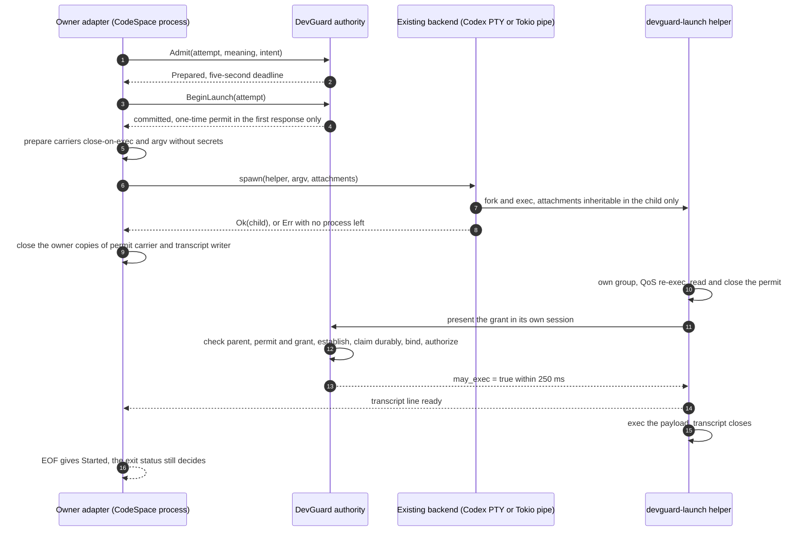
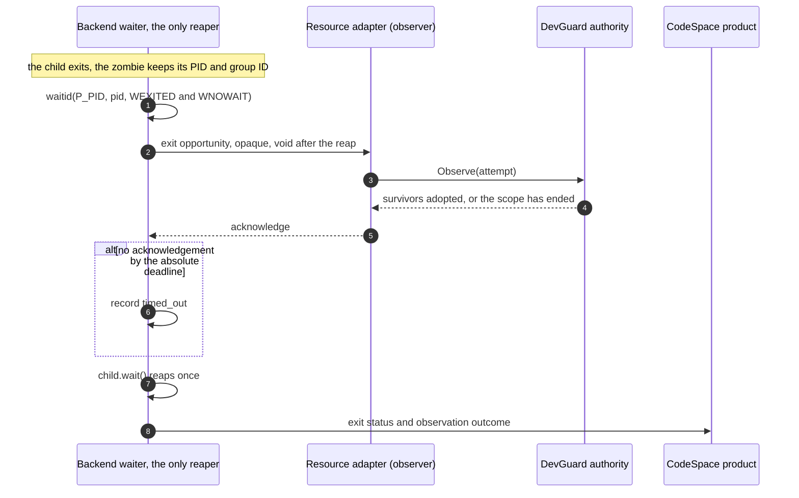

# Upstream-adapter packet: W0–W2 of CS-DG-UPSTREAM-ADAPTER-WORK-SPEC-1 v1.0 (2026-09-28)

> **Status: dated, non-normative research and handoff record.**
> - Nothing here approves an architecture, dependency, Codex pin, runtime contract, implementation, upstream
>   submission, service change or merge.
> - The CS-RG implementation hold stays in force.
> - Proposed text is labelled **DRAFT – candidate wording, not adopted**. No normative document, gate or manifest is
>   changed by this record.
> - It stops at the W3 owner gate (section 14).

This record executes W0 (intake and policy delta), W1 (upstream policy and adapter inventory) and W2 (contract
design) of [CS-DG-UPSTREAM-ADAPTER-WORK-SPEC-1 v1.0](2026-09-28-cs-dg-upstream-adapter-work-spec-1.md), which came
with its [start instruction](2026-09-28-cs-dg-upstream-adapter-start-instruction.md). Both committed copies are
normalized derivatives (section 1.4).

The living trackers are [#14](https://github.com/novelKR/DevGuard/issues/14) and
[novelKR/CodeSpace#76](https://github.com/novelKR/CodeSpace/issues/76). Re-query them and git before acting. English
only, with no Korean counterpart, like the other handoffs.

**Evidence levels** (as in the [session-close record](2026-09-27-session-close.md)):
- *record*: a PR, CI run, tracker or document;
- *source*: code or a document read at a fixed revision;
- *test*: a test, CI or diagnostic result;
- *inference*;
- *not run*.

**Raw evidence** is local and git-ignored under `<DEVGUARD_CHECKOUT>/evidence/`. Each directory has a
`MANIFEST.json` with SHA-256 digests, and the digests are listed in section 15.

## 1. Intake delta (W0)

### 1.1 Baseline

Re-queried on 2026-09-28 at 01:20Z, after `git fetch`.

| Item | Value | Change since the spec's snapshot |
| --- | --- | --- |
| DevGuard `main` | `1bb085ad1a75034fe7bd7ffe7dd358b1a336239e` | advanced from `7e3cbda` by merging #12 (`418c0da`), #11 (`85f2dbc`) and #15 (`1bb085a`) |
| CodeSpace `main` | `326bdcb181f62f61bcb3c4e9c3de7535d50b0232` | advanced from `794867e` by merging CodeSpace #75 (`8a5a924`) and #77 (`326bdcb`) |
| Codex gitlink in CodeSpace | `6b9826e3aa83b1a5947db50f4332cb9c65f1b340` (rust-v0.154.0) | unchanged |
| Open PRs | DevGuard #13 only, head `edf5e2f20f88feed55822a078abffc18af5f9a4e`, CLEAN; none in CodeSpace | #13's head moved from `1af1921` |
| Installed DevGuard service | LaunchAgent running release `0.1.0-5daee5d-b3fa569e` (read-only check) | not changed by this pass |

The spec's PR tables (its sections 1.1 and 1.3) are therefore dated. The five merges and the owner's policy
direction are recorded on the trackers:
- #14 comments [5858014440](https://github.com/novelKR/DevGuard/issues/14#issuecomment-5858014440) and
  [5858033332](https://github.com/novelKR/DevGuard/issues/14#issuecomment-5858033332);
- CodeSpace #76 comments [5858014659](https://github.com/novelKR/CodeSpace/issues/76#issuecomment-5858014659) and
  [5858033575](https://github.com/novelKR/CodeSpace/issues/76#issuecomment-5858033575).

This pass's intake delta is #14 comment
[5861778352](https://github.com/novelKR/DevGuard/issues/14#issuecomment-5861778352) and #76 comment
[5861779036](https://github.com/novelKR/CodeSpace/issues/76#issuecomment-5861779036). The issue bodies are dated
snapshots.

### 1.2 Post-merge verification and local alignment

- **Merge verification.** For each of the five merges, the merge commit's parents are the previous `main` and the
  approved head, and its diff against the first parent equals the PR's own diff (23, 11, 1, 1 and 1 files). *(source)*
- **Post-merge runs** were downloaded once and succeeded. *(test)*
  - DevGuard: 36336284259, 36336313208 and 36336325471 (contracts, macOS and Ubuntu).
  - CodeSpace: CI 36336288225 (documentation-only plan) and documentation 36336288630 on `8a5a924`; CI 36336337315
    (16 jobs, full) and documentation 36336337674 on `326bdcb`. Both documentation runs included deploy.
- **PR-head CI not preserved before** has now been collected: #12, CodeSpace #75, #15 and CodeSpace #77. So has
  #13's current-head CI: push 36336395942 and pull_request 36336399416, 4/4 success.
- **Local alignment.** Local `main` was fast-forwarded in both repositories. The five merged task worktrees and
  their local branches were removed with `git worktree remove` (no `--force`) and `git branch -d`, after checking
  each was clean, at its approved head and contained in `main`. Two local-only files were preserved first.
- **Kept:**
  - every remote branch;
  - the #13 worktree, deliberately left at its old head `1af1921`, two commits behind `edf5e2f`, and not used;
  - CodeSpace's fixture and diagnostic branches;
  - DevGuard's pre-existing untracked `.kiro/`.

### 1.3 Scheduled CodeSpace run

- **Superseded task.** The historical task "read the first scheduled run on `794867e`" can no longer be done:
  `main` moved to `326bdcb` before any scheduled run on `794867e`.
- **Replacement observation.** It is tied to `326bdcb`. The first scheduled run on that commit is
  [36355653598](https://github.com/novelKR/CodeSpace/actions/runs/36355653598), created 2026-09-27T22:32Z. It
  succeeded, 16/16 jobs. *(test)*
- **ETXTBSY check.** `linux_sandbox::tests::prepare_unread_large_stdin_times_out` passed. The Integration log has no
  match for ETXTBSY, "text file busy" or "os error 26".
- **Reading.** The #74 fixture fix showed no recurrence in this run. One run does not prove the race is gone.

### 1.4 Specification copies

No repository rule requires byte-identical copies; the byte-for-byte rule applies only to `docs/design.ko.md`. The
originals contain trailing whitespace, which repository whitespace checks reject. So the committed copies are
**normalized derivatives**, and the byte-identical originals remain in the git-ignored evidence set
(`upstream-adapter-2026-09-28/spec-originals/`).

| Committed file | Normalized SHA-256, bytes | Original file and SHA-256, bytes (stated = verified) | Normalization |
| --- | --- | --- | --- |
| [`2026-09-28-cs-dg-upstream-adapter-work-spec-1.md`](2026-09-28-cs-dg-upstream-adapter-work-spec-1.md) | `25cbf4ba661549c69260cc65b1d840e5513744d3938536792bc96d73d9ea045f`, 57,441 | `codespace_devguard_upstream_adapter_work_spec_en.md`, `21c934d76c59116dacbdcff46e2c31e7046c03cfe3cebdab540e3d6900aae2aa`, 57,451 | trailing spaces removed on lines 3–7 |
| [`2026-09-28-cs-dg-upstream-adapter-start-instruction.md`](2026-09-28-cs-dg-upstream-adapter-start-instruction.md) | `959164e1b0b3966f28d0cd32727c7c707de7e873ce17832c88259249d0f17efa`, 4,468 | `new_agent_upstream_adapter_handoff_en.md`, `7146aa8af276b9c04b0ce3412bfc69a2f471729babb7a1d43728a437283f36e6`, 4,472 | trailing spaces removed on lines 4–5 |

A line-by-line comparison after stripping trailing whitespace is identical for both files. No word changed. The
removed double spaces were Markdown hard line breaks in the two header blocks, so those lines now render as a single
paragraph.

### 1.5 Handoff resources and instructions

- **Resources read:**
  - #14 and #76 with all their comments;
  - the [session-close record](2026-09-27-session-close.md) (now on `main`);
  - CodeSpace's `.github/notes/pr75-cs-rg-suspension-handoff.md` (on CodeSpace `main`);
  - #13's
    [handoff](https://github.com/novelKR/DevGuard/blob/edf5e2f20f88feed55822a078abffc18af5f9a4e/docs/handoff/2026-09-27-cs-rg-boundary-revalidation.md)
    and
    [analysis](https://github.com/novelKR/DevGuard/blob/edf5e2f20f88feed55822a078abffc18af5f9a4e/docs/handoff/2026-09-27-cs-rg-boundary-revalidation-analysis.md)
    at `edf5e2f`.
- **Instructions:** DevGuard's `AGENTS.md` applies. CodeSpace has no `AGENTS.md`, and none was invented.
- **Private memory:** no private session memory was used.
- **Local-only evidence** of the earlier session was reused only where its manifest still verified. For example,
  #11's qualification outputs matched by SHA-256 before its worktree was removed.

## 2. Authorization record

- **Source of approval.** The owner instructed the agent doing this work directly, in the executing session on
  2026-09-28. The wording and times are kept in the local record `upstream-adapter-2026-09-28/authorization.md`.
  Tracker comments are written through the shared `novelKR` account and are not independent proof of approval.
- **Policy delta.** The owner explicitly approves DevGuard using Codex and other external dependencies, with adapters
  and flexible, reviewed, explicit upstream pins. This general permission is settled and is not requested again. It
  does not approve:
  - a specific package, revision, integration mechanism or default feature set;
  - a production change or a merge;
  - reviving the suspended C00/C03/C09 direction.

  N1 and N2 remain joint hard constraints. The older records (the 2026-09-27 handoffs, the session-close record,
  CodeSpace's note and #13's dated analysis) predate this approval. They remain accurate as records of their time and
  are not rewritten.
- **Merges.** The five merges were authorized by the owner in the preceding session with the instruction "proceed
  with the work on the basis of the recommended plan". The merging agent re-checked head and base before each merge.
  This pass completed their post-merge verification, evidence and approved local cleanup.
- **This pass may:**
  - carry out W0–W2 as this non-normative record;
  - open a CodeSpace `.github/notes/` pointer and post tracker deltas;
  - run BD-1 under its bounded-diagnostic conditions (section 11);
  - read the upstream revisions and Rust std/mio/tokio sources (sections 7 and 8).
- **This pass may not:**
  - merge #13 or either new PR;
  - run W3 experiments A, B or C;
  - open normative PRs (`AGENTS.md`, D3/ADR-006, design documents, `NOTICE`, validation policy, CodeSpace
    upstream-policy pages);
  - change any pin, dependency, service, credential, journal or host setting;
  - submit anything upstream.

## 3. Adapter map (W1)

The responsibilities follow spec section 6. The names describe responsibilities; they are not crate names or
existing APIs.

| Boundary | Domain owner | Mechanism today → candidate | Maintenance owner | Source identity | Must not acquire |
| --- | --- | --- | --- | --- | --- |
| Authority and contract core (`devguard-contract`, `-core`, `-daemon`, `-macos`) | DevGuard | DevGuard native backend (libproc, QoS, journal) | DevGuard | DevGuard SHA; registry crates in `Cargo.lock` (80 packages at `1bb085a`, none `codex-*` or `codespace-*`) | Codex or CodeSpace product types, sessions, login or agent semantics. The contract crate's dependencies stay `serde`, `serde_json`, `sha2` (`scripts/validate.py:113`) |
| Client and transport adapter (`devguard-client`: `connect.rs`, framing, `credential.rs`) | DevGuard | std `UnixStream` and libc → an authenticated-transport library is a candidate, not selected (section 9.3) | DevGuard | as above | an implicit unmanaged fallback or a second authority. No Codex types, because CodeSpace would link this crate |
| Launch-preparation adapter (`devguard-client::launch`, `devguard-launch`) | DevGuard | std `Command` spawned by `HelperCommand::spawn` under `spawn_guard` (`launch.rs:150-154`); descriptors created in `helper_command` (`:162-206`) → a preparation separable from spawn (section 9.1) | DevGuard | DevGuard SHA | PTY allocation, or taking over the caller's spawn |
| Upstream-execution binding (new; e.g. an isolated crate, name `TBD - not selected`) | DevGuard (the mapping) | Codex `codex-utils-pty` generic contracts: `ChildFds::Attached` (prerelease/main), `Command` + `DescriptorPolicy::Explicit`, and a future generic pre-reap observation (section 9.2) | DevGuard (binding); Codex upstream (mechanism) | an explicit Codex commit under section 4; `TBD - not selected` | Codex types outside the binding; being reachable from the core or the generic client contract |
| CodeSpace resource adapter (planned; CS-RG suspended) | CodeSpace | DevGuard client calls; consumes generic backend events | CodeSpace | CodeSpace SHA, plus the DevGuard client pinned by full SHA | PTY allocation, native spawn or a new reaper for DevGuard; `off` needing DevGuard |
| Existing execution backends (CodeSpace `crates/pty` for PTY; `crates/runner` Tokio pipe path) | CodeSpace product semantics | Codex PTY through `codespace-pty` (`crates/pty/src/lib.rs:66-77`); Tokio/std for pipe | CodeSpace (adapter); Codex upstream (PTY mechanism) | CodeSpace gitlink `6b9826e` | knowledge of DevGuard leases, RPCs or credentials; extensions must be generic |

### 3.1 Placement by process

- **The CodeSpace Gateway or Runner process** would link CodeSpace's crates, Codex at the gitlink, the DevGuard
  client and possibly the binding.
  - One executable must have one Codex source identity (spec §5.5). So a binding linked there consumes Codex through
    CodeSpace's gitlink, not its own pin.
  - Two sources of the same crate name compile as distinct crates, each with its own process-wide statics. An
    example is the reaper worker (`static REAPER`, prerelease `child_reaper.rs:22`). Neither copy's guarantees then
    cover the other, as with the duplicate-lock caveat in spec §9.4. *(inference)*
- **DevGuard's daemon, helper (`devguard-launch`) and CLI (`devguard`)** are separate executables.
  - A Codex pin there may differ from CodeSpace's.
  - What is qualified is the tuple of client, wire, helper, capabilities and artifacts (spec §5.5, §16), not
    lockstep versions.
- **Runtime cost of the candidate crate.**
  - `codex-utils-pty` depends on Tokio with a multi-thread runtime, `process` and `signal`, and on portable-pty.
    DevGuard's lock contains no Tokio today.
  - Any DevGuard executable that links the binding therefore gains a Tokio runtime and threads.
  - That cost must be justified by what it replaces (section 12). *(source: prerelease `Cargo.toml`, DevGuard
    `Cargo.lock`)*

## 4. Upstream-pin policy

> **DRAFT – candidate wording, not adopted.** This section proposes the policy the owner approved in principle. It
> becomes normative only through a reviewed design revision and the gate change of section 6, merged on exact-head
> approval.

### 4.1 Objective

DevGuard selects, qualifies, updates and rolls back external implementations behind adapters. Its domain contracts
do not change merely because upstream refactored internals. When upstream behaviour changes materially, the adapter
rejects the change, translates it explicitly, or triggers a reviewed contract change. Flexibility applies to *which
tested revision is selected*, never to building from a floating reference.

### 4.2 Candidate classes

| Class | Use | Promotion requires | Example from this packet |
| --- | --- | --- | --- |
| Released tag resolved to a full commit | preferred where sufficient | the actual commit, artifacts, dependency graph, behaviour and target matrix verified | rust-v0.157.1 = `3665039…`; lacks `ChildFds::Attached` |
| Explicit commit not yet released (including prereleases) | valid; not banned | why waiting for a release is insufficient, the snapshot qualified, rollback evidence kept | rust-v0.159.0-alpha.11 = `72b8d8b…`, exercised by BD-1 |
| Small upstream-first downstream patch | temporary | original commit, patch digest, upstream proposal status, divergence and removal tests | none |
| Registry package | valid | registry, locked version and checksum, features, targets, provenance, update policy | e.g. `tokio 1.53.1`, whose `Cargo.lock` checksum was verified in section 8 |
| Floating branch or mutable PR head | never promoted | resolve to an immutable commit first | — |

### 4.3 Pin record

The proposed record is a human-readable document plus one machine-validated input read by `scripts/validate.py`.
Suggested names are `docs/upstream.md` and `upstream.lock.json`; neither exists. Values not selected stay
`TBD - not selected` and never appear in a machine-validated production record.

| Field group | Content | Candidate `codex-utils-pty` (illustration) |
| --- | --- | --- |
| Identity | repository or registry, package names, full commit or locked package identity (a tag is only an annotation) | `https://github.com/openai/codex`, `codex-rs/utils/pty`, commit `TBD - not selected` |
| Selection | baseline and candidate, reason, required capabilities, availability versus contract fit | baseline: none (no Codex dependency at `1bb085a`). Evaluated: `6b9826e`, `3665039`, `72b8d8b` (section 7) |
| Consumption | adapter owner, affected product roots, target triples, features, normal/build/dev classification | `TBD - not selected` (section 3, row 4) |
| Reproducibility | lock digests, source-tree or patch digest, compiler and tool versions, acquisition method | `TBD - not selected` |
| Compatibility | adapter contract version, wire/helper/journal/config effects, known incompatible combinations | `TBD - not selected` |
| Provenance | licence and NOTICE handling, attribution, supply-chain review, advisories checked | Apache-2.0 at all evaluated revisions; review `not_run` |
| Qualification | reports, executed/skipped/not-run cases, artifact hashes, baseline comparison | BD-1 only (section 11) |
| Rollback | last accepted pin and artifact combination, schema constraints, drain/reconcile needs | none yet |
| Divergence | local patches, upstream tracking reference, why still needed, removal condition | none |

### 4.4 Update and promotion workflow

1. Capture the baseline.
2. Select a candidate and record its class.
3. Read the relevant upstream changes and the resolved dependency graph for each target.
4. Update the adapter on a reviewable branch.
5. Run the adapter's conformance tests, then the affected product regressions.
6. Qualify the required platforms and publish the evidence.
7. Request an exact-head merge approval, then verify the post-merge result.
8. Promote artifacts only through the deployment gate.

Rules for the evidence:
- A compile success is not behavioural compatibility.
- A matching tag is not an artifact hash.
- A changed source or lock input invalidates a candidate report unless its continued applicability is shown.

### 4.5 Same process, separate process

- **Same executable** (DevGuard binding inside CodeSpace): one reviewed Codex source identity, CodeSpace's gitlink.
  The CodeSpace pin PR qualifies both adapters together.
- **Separate executables** (DevGuard daemon, helper or CLI versus CodeSpace): pins may differ. Qualify the
  client/wire/helper/capability/artifact tuple.
- **No silent moves in either direction.** A DevGuard-only upgrade never moves CodeSpace's gitlink. A CodeSpace-only
  upgrade never replaces the installed DevGuard release.

### 4.6 Patches and divergence

- **Upstream first.** A local patch is temporary and is proposed upstream. Submitting it needs the owner's separate
  approval.
- **Record.** It records its original commit, patch digest, tests and removal condition.
- **Hidden vendoring** (copying crates to escape dependency checks) stays forbidden, as in CodeSpace's policy.

### 4.7 Rollback

A rollback restores together:
- source selection, locks and patches;
- attribution;
- capabilities and behaviour documentation.

Then it reruns the affected gates. A runtime that owns charged work follows the existing
close-admission / drain / reconcile process. A journal schema an older release cannot read needs an explicit
migration or drain procedure; reverting a commit is not a runtime rollback.

### 4.8 Evidence states

Every gate records `passed`, `failed`, `skipped-by-plan` or `not_run` with a reason:
- a missing platform runner is not a pass;
- a source review is not a runtime result;
- failed attempts are kept.

## 5. Codex-free wording to reconcile later (W1)

The owner's approval supersedes the premise that DevGuard stays Codex-free. The current documents state it as a
present engineering choice with a conditional reuse policy, and `scripts/validate.py` enforces it. None of the
following is changed by this record. The column "vehicle" names the normative change that would carry each
replacement:
- **R2**: a new design revision document with its Korean counterpart and translation hash, plus the editorial
  reference and ADR-006/D3 updates (as `AGENTS.md` directs for user-directed revisions);
- **G**: the gate change of section 6;
- **CS**: a CodeSpace documentation PR with its Korean pages and registry hashes.

| # | Location (DevGuard `1bb085a`, CodeSpace `326bdcb`) | Current wording (excerpt) | Draft replacement (DRAFT – candidate wording, not adopted) | Vehicle |
| --- | --- | --- | --- | --- |
| 1 | DevGuard `AGENTS.md:7` | "Keep the default distribution and the shared client free of Codex dependencies… `scripts/validate.py` rejects `codex-` and `codespace-` packages until such a decision changes that gate." | "Keep CodeSpace/Codex product types out of the authority core and the generic client contract. External implementations, Codex included, enter only through a declared adapter with a reviewed pin; the PR that adds one shows what it replaces and changes `scripts/validate.py` to allow exactly that adapter's reachable set." | R2, G |
| 2 | `docs/design.md:18` (and `ko/design.md:16`) | "…default distribution and shared client currently build, test and release without CodeSpace or Codex… present engineering choice, not a permanent prohibition…" | Keep the first clause while it is true. Replace the rationale with a reference to the adapter and pin policy. | R2 |
| 3 | `docs/design-revision-1.md:27`, `:107`, §10.3 `:565-585`, `:836` (and `ko` `:27`, `:567`, `:838`) | D3 = C0: "Add no Codex dependency to the current implementation"; "Keep DevGuard's current Codex-free implementation as the present engineering choice." | Not edited: revision 1 is a dated revision. A new revision supersedes D3 with: external dependencies permitted behind declared adapters with reviewed pins; core and generic-client boundary unchanged; each dependency justified by what it replaces. | R2 |
| 4 | `docs/planning/decisions.md:106`, `:112` (and `ko` `:116`, `:122`) | D3 row "C0: none; conditional reuse…"; "The validator's dependency-boundary stage … rejects any `codex-` or `codespace-` package … enforces C0" | D3 → "C1: adapter-bounded external dependencies with reviewed pins". Boundary sentence kept. Gate sentence → "the validator allows only declared adapter roots to reach approved upstream crates". | R2, G |
| 5 | `docs/planning/codespace-integration.md:176` (and `ko` `:184`) | "DevGuard adds no Codex dependency now; the default distribution and shared client stay Codex-free…" | "DevGuard may consume Codex behind a declared binding; the client CodeSpace links carries no Codex types, and a binding linked into CodeSpace uses CodeSpace's gitlink." | R2 |
| 6 | `docs/planning/README.md:40`, `docs/milestones.md:5` (and `ko`) | "keeps DevGuard free of Codex dependencies as a present engineering choice…" | Point to the new revision; drop "free of Codex dependencies". | R2 |
| 7 | `docs/planning/milestones/CS-RG.md:77` (and `ko`; CS-RG suspended) | "No CodeSpace/Codex dependency in DevGuard core; the client brings no transitive Codex dependency; … design revision 1 keeps the Codex pin." | Keep the first two clauses. Replace "keeps the Codex pin" with "a pin change follows the reviewed pin policy". Only once CS-RG is re-planned. | R2, after re-planning |
| 8 | DevGuard `NOTICE` | "DevGuard does not include CodeSpace, OpenAI Codex or rmcp as implementation dependencies." | True today; unchanged. The PR that adds a Codex dependency adds its attribution and NOTICE handling (Apache-2.0). | with the dependency |
| 9 | `scripts/validate.py:63-65` | rejects every package whose name starts with `codex-` or `codespace-` | See section 6: per-root allowed reachability, changed only in the PR that defines and tests the boundary. | G |
| 10 | CodeSpace `docs/codex-reuse.md:78` (and `ko` `:96`; section under a hold notice) | "D3, DevGuard. No Codex dependency is added to DevGuard now. Its core and shared client stay Codex-free…" | "D3, DevGuard (superseded 2026-09-28): DevGuard may consume Codex and other external implementations behind declared adapters with reviewed pins. CodeSpace's generic resource client imports no Codex types, and CodeSpace's own pin process is unchanged." | CS |
| 11 | CodeSpace `docs/upstream-update.md:90-131` (and `ko` `:91-128`) | "The planned resource client must bring no transitive Codex dependency… documentation policy, not an executable gate." | Keep, and add: "A DevGuard binding linked into a CodeSpace executable consumes Codex through this repository's gitlink; the same PR adds an executable single-identity check (section 6)." | CS |

Keep intact: `docs/design.ko.md` (byte-for-byte approval), the dated handoffs (`docs/handoff/2026-09-27-*`), the
session-close record, CodeSpace's `.github/notes/` records, #13's documents and the hold notices.

## 6. Executable gate inventory (W1)

Current behaviour is read from source at the baseline. The column "change later" is **DRAFT – candidate wording, not
adopted**. It is made only in the reviewed PR that adds a component, with tests; nothing is disabled.

**DevGuard**

| Gate | Current behaviour | Effect on a DevGuard Codex adapter | Change later |
| --- | --- | --- | --- |
| `validate.py` toolchain | expects Rust `1.95.0` (`PINNED_RUST`, `:17`) | `codex-utils-pty` needs at least 1.88 (section 12) | none |
| `validate.py` source contract | approved-design hash, milestone critical path, DG-LINUX required | none | none |
| `validate.py` documentation | `check_docs.py` plus its unit tests | revision documents need Korean pairs and hashes | none |
| `validate.py` dependency boundary (`:57-115`) | `cargo metadata --locked`. Rejects any package named `codex-*` or `codespace-*` anywhere (`:63-65`). Workspace roots must equal the explicit map (`:86`). Intra-workspace edges exact. Contract dependencies exactly `serde`, `serde_json`, `sha2` | any Codex crate fails. A new binding crate fails until it is mapped | Replace the name-prefix rule with: (i) a forbidden set for every root (`codex-core`, `codex-exec`, `codex-app-server`, `codex-login`, `codespace-*`); (ii) per-root allowed upstream crates, so only the binding root may reach `codex-utils-pty`; (iii) a check that no other root reaches any `codex-*` package, on target-filtered, non-dev graphs as CodeSpace's `upstream_dependencies.py` does. Keep (iv) the contract rule and the workspace map |
| `validate.py` format / clippy / tests (`--workspace`) | whole workspace on macOS and Ubuntu, one job | an in-workspace binding is built and tested on both. An isolated workspace needs its own stage (CodeSpace precedent: one stage per adapter) | a binding stage if isolated |
| CI `contracts` (macOS 14, Ubuntu 24.04) | `validate.py`, then the qualify suites (native suites macOS only) | build time and memory grow with Tokio and portable-pty | none |
| `package.py` | builds `devguardd`, `devguard`, `devguard-launch` from one clean release build (not read further) | the binding ships only if one of these links it | provenance fields if it ships |

**CodeSpace**

| Gate | Current behaviour | Effect | Change later |
| --- | --- | --- | --- |
| `scripts/upstream_dependencies.py` | target-filtered, non-dev graphs for the root and five adapter workspaces. Members must equal `PRODUCTS`. `FORBIDDEN` (`codex-core`, `codex-exec`, `codex-app-server`, `codex-login`) rejected from every root; `RUNNER_FORBIDDEN` from the Runner | a DevGuard client in the root graph adds packages. A binding reaching `codex-utils-pty` from a second source would add a second package key, which is not rejected today | when a DevGuard crate first enters a CodeSpace graph: a single-identity check (each `codex-*` name only from the gitlink path within a product root), and an executable form of "the resource client brings no transitive Codex dependency" |
| `scripts/check-no-model-deps.sh` | core manifests: **direct** `codex-* =` keys rejected (`scan_manifest`, `:222-227`). Adapters: direct keys against per-adapter allowlists (`pty`: `codex-utils-pty` only) | a transitive Codex crate reaching a core crate through a DevGuard client is caught by neither this script nor `FORBIDDEN`. The rule in `upstream-update.md:130` is documentation-only (`:94`) | the transitive check above |
| `scripts/check-upstream-pin.sh` | gitlink equals the `docs/upstream-lock.md` commit | untouched by DevGuard pins | none |
| `scripts/validate-upstream.py`, `ci_plan.py`, `ci-policy.json` | per-adapter stages. Manifests, locks, `third_party/**`, `.github/**` and `scripts/**` run every leg | a manifest change that adds a DevGuard client runs every leg | component entries for a new crate |
| `scripts/check_docs.py`, `docs.yml` | registry pairs; exact-commit publication provenance | none | none |

## 7. Upstream capability matrix (W1)

`codex-rs/utils/pty` was read at four revisions on 2026-09-28, with `main` looked up at 01:37Z. Every cited file was
checked against its git blob ID (62 files). "Present" says the API exists; "fit" says whether it meets the contract
need (AC-03). Citations are under `codex-rs/utils/pty/src/` at the named revision. *(source)*

| Label | Tag | Commit | `utils/pty` tree |
| --- | --- | --- | --- |
| pin | rust-v0.154.0 | `6b9826e3aa83b1a5947db50f4332cb9c65f1b340` | `7137225` |
| stable | rust-v0.157.1, published 2026-09-26T01:02Z | `36650394c5b38c2990ccf2a3457165ca3e9d9726` | `745084b` |
| prerelease | rust-v0.159.0-alpha.11, published 2026-09-28T00:20Z | `72b8d8b5516bcf6581140d2aca337f4f76ba9958` | `db23e5b` |
| main | — | `1cc7e2361237ce7244430ee1d581c77f95c57ac8` | `db23e5b`, identical to the prerelease |

The prerelease is a release-branch commit, 7 ahead of and 1 behind `main`. Every prerelease cell below also holds
for `main` at `1cc7e23`, for this crate only.

| ID | Need | pin | stable | prerelease = main | Fit |
| --- | --- | --- | --- | --- | --- |
| K2 | deliver close-on-exec descriptors only to the intended PTY child | absent: `inherited_fds: &[i32]` (`pty.rs:135`) must already be inheritable | absent (same `pty.rs`) | present: `ChildFds::Attached` (`pty.rs:46-51`); close-on-exec cleared only in the child (`:524-526`); an upstream test asserts parent flags unchanged (`tests.rs:1280-1312`) | delivery only. BD-1 observed it as documented (section 11). Creation atomicity, D6, reaping and authorization are untouched |
| K3 | exit observation before reap, or owner-controlled reap, for a PTY child | absent: `spawn_blocking(child.wait())` (`pty.rs:244-245`) | absent | absent: portable path `pty.rs:275-276`; attached path `:447` (Linux), `:449` (macOS) | investigation B remains a proposal (section 9.2) |
| K3b | caller-owned generic (non-PTY) child | absent | present: `Child::id/wait/kill` (`child.rs:33-84`) | present (`child.rs:42-105`). Dropped `ReapOnly` children pass to one `codex-child-reaper` thread that polls `waitpid(pid, WNOHANG)` per PID (`child_reaper.rs:26-68`) | no non-reaping exit observation |
| X | PTY child PID accessor | absent: `SpawnedProcess {session, stdout_rx, stderr_rx, exit_rx}` (`process.rs:356-360`) | absent (same `process.rs` blob) | absent (same blob `5593450`) | — |
| K4, OX-02 | identity-safe termination | handle `Drop` → `terminate()` → numeric `killpg` (`process.rs:221-275`) | same | same (`pty.rs:114-129`). The local `Child` gives up its PID on reap (`posix_child.rs:314-323`), direct child only | unchanged |
| K6 | exclude unrelated descriptors from the child | PTY: best-effort pre-exec sweep (`pty.rs:465`) | PTY: same. Local `Command`: `DescriptorPolicy::StdioOnly` → `POSIX_SPAWN_CLOEXEC_DEFAULT` (`macos_child.rs:137`) | PTY: sweep (`pty.rs:541`). Local `Command`: `DescriptorPolicy::Explicit` → `POSIX_SPAWN_CLOEXEC_DEFAULT` plus `posix_spawn_file_actions_addinherit_np` (`posix_child.rs:189`, `:218`); Codex's own pipe backend uses it (`pipe.rs:156-167`) | a kernel-applied exclusion exists for Codex local children. CodeSpace's Tokio pipe path does not use it |
| K8 | PTY exit detail | code only | code only | code only. With `Attached`, a SIGTERM death reports 1 (`pty.rs:434-435`; `tests.rs:1280ff`) | a signal death cannot be told from `exit(1)` (AC-08) |
| K9 | Linux fork-safe spawn helper | absent | absent | Linux only (`spawn_helper.rs:42`; used at `pty.rs:164`, `:368`) | may break DevGuard's direct-child check on Linux *(inference)* |

**CodeSpace adapter impact.** `crates/pty` (`codespace-pty`, `rust-version = "1.88"`, its own workspace) calls
`spawn_pty_process(..., &[])` (`crates/pty/src/lib.rs:66-77` at `326bdcb`). From the prerelease on, the parameter is
`ChildFds<'_>` (`pty.rs:154`). So moving the pin past stable needs a coordinated adapter edit in the reviewed pin
PR, for example `ChildFds::Inherited(&[])`, which keeps today's behaviour.

Conclusions:
1. `ChildFds::Attached` is in no stable release yet. Using it needs an explicit-commit candidate (section 4.2), or
   waiting for a stable release that contains it.
2. No checked revision offers pre-reap observation or owner-controlled reap for PTY children (K3), or a PTY child
   PID (X).
3. A generic, kernel-applied descriptor exclusion now exists for Codex local non-PTY children. Adopting it in
   CodeSpace's pipe path would be a CodeSpace change that CS-RG alone cannot justify (N1.3). It could be part of an
   independent descriptor-hygiene proposal (N1.5; decision 9).
4. With `Attached`, the exit status cannot serve as signal evidence (K8).

## 8. macOS descriptor creation (W1)

This replaces the unverified belief recorded in #13's analysis (its section 7) that std pipe and socket-pair creation
is non-atomic on macOS. *(source)* Sources read:
- Rust `library/std` at 1.88.0 (CodeSpace's declared floor), 1.95.0 (DevGuard's and Codex's toolchain) and 1.98.1
  (the rustc of CodeSpace CI 36336337315 and scheduled run 36355653598);
- mio 1.2.3 and tokio 1.53.1, whose archives match CodeSpace's `Cargo.lock` checksums;
- Codex at `72b8d8b`;
- DevGuard at `1bb085a`.

"Atomic" means close-on-exec from creation. "No" means that a concurrent `fork` or `posix_spawn` in another thread
can pass the descriptor to a child that does not close unrelated descriptors. Citations are at 1.98.1. The same
branches hold at 1.88.0 and 1.95.0; per-tag citations are in the evidence findings.

| # | Site | Apple mechanism | Atomic | Citation |
| --- | --- | --- | --- | --- |
| S1 | std pipe: `Stdio::piped()`, `io::pipe()`, the exec-error pipe | `pipe()`, then `ioctl(FIOCLEX)` on each end | no | `sys/pipe/unix.rs:8-43` |
| S2 | std `UnixStream::connect` | `socket()`, then FIOCLEX | no | `sys/net/connection/socket/unix.rs:66` |
| S3 | std `UnixStream::pair` | `socketpair()`, then FIOCLEX | no | same file `:112` |
| S4 | std `UnixListener::accept` | `accept()`, then FIOCLEX | no | same file `:243` |
| S5 | std `File::open` | `open(… O_CLOEXEC)` | yes | `sys/fs/unix.rs:1382` |
| S7 | std `Command::spawn` | `posix_spawnp` with only `SETPGROUP` and `SETSIGDEF`, no `POSIX_SPAWN_CLOEXEC_DEFAULT`; fork/exec when a `pre_exec` closure exists. The child inherits every descriptor not close-on-exec at that moment | n/a | `sys/process/unix/unix.rs:456`, `:467-476`, `:697-767` |
| S8–S10 | mio socket, socket pair and pipe (tokio `net`) | create, then `fcntl(FD_CLOEXEC)` | no | `src/sys/unix/net.rs:15-80`, `uds/mod.rs:84-135`, `pipe.rs:9-60` |
| S11 | tokio `process::Command::spawn` | delegates to std (S7); stdio pipes are S1 | as S1, S7 | `src/process/mod.rs:863-865` |
| S12 | Codex `open_unix_pty` (attached path) | `openpty()`, then close-on-exec on master and slave | no | `pty.rs:481-506` |
| S13 | Codex native spawn stdio | `io::pipe()` (S1), then an `F_DUPFD_CLOEXEC` copy | no | `posix_child.rs:142` |
| S14 | DevGuard `connect_timeout` (D6) | raw `socket()`, then `F_DUPFD_CLOEXEC`, then `drop(initial)`; the copy is connected | no | `crates/client/src/connect.rs:39`, `:46`, `:51`, `:59` |

Child-side protection differs by spawner:
- `POSIX_SPAWN_CLOEXEC_DEFAULT` (Codex local `Command`, native path): the kernel closes every descriptor not
  explicitly inherited, including one still inside another thread's creation window.
- The Codex PTY paths use a best-effort pre-exec sweep of inheritable descriptors.
- std and tokio `Command` defaults have none. This covers CodeSpace's Tokio pipe path, patch helper and sandbox
  probe.

Implications *(inference)*:
- D6 cannot be closed by swapping libraries: std (S2) and mio/tokio (S8) have the same window as DevGuard's raw
  `socket()` (S14).
- In CodeSpace's process on macOS, children spawned without child-side protection can inherit another spawn's pipe
  ends (S1), a Codex PTY master or slave (S12) and DevGuard's session socket (S14). BD-1 observed the first two
  (section 11).
- The macOS remedy is child-side: every same-process spawner excludes unrelated descriptors. The alternative, one
  lock shared by all creation sites and spawns, is rejected by spec §9.4.
- Linux is not covered: std uses `pipe2` and `SOCK_CLOEXEC` there, and DevGuard's `socket()` could pass
  `SOCK_CLOEXEC` (DG-LINUX).

## 9. Protocol pack (W2)

These protocols refine #13's analysis (sections 3–7), which remains the audit input for R, RB, RC, RE, RA and RG.
They are candidate specifications for review, not contracts. Fact types follow that analysis:
- OS: observed by the authority from the OS;
- OWN: an owner assertion;
- HLP: a helper assertion;
- DUR: durable authority state.

Names such as `LaunchPreparation` are illustrative (spec §7.2). `contracts.md` line numbers are at `1bb085a`.

### 9.1 A: permit-preserving preparation, spawn left to the backend

**Coupling today** *(source)*:
- `helper_command` (`crates/client/src/launch.rs:162-206`) holds `spawn_guard` while it creates both grant
  descriptors:
  - the transcript pipe: `libc::pipe`, then moved above 2 close-on-exec (`:116-125`);
  - the permit carrier (`credential.rs:20-21`): `UnixStream::pair`; the 64-byte permit is written and the writer
    dropped.

  It then installs `pre_exec` closures that clear close-on-exec in the child (`credential.rs:42`, `launch.rs:183-192`).
- `HelperCommand::spawn` (`launch.rs:150-154`) spawns that std `Command` under the guard. The `pre_exec` closures
  force std's fork/exec path (S7).
- So DevGuard's client performs the spawn. A governed PTY launch through it would take PTY and spawn ownership from
  Codex (N1.2; #13 F-3).

**Candidate.** The client prepares and an existing CodeSpace backend spawns. The authority's wire, journal and rules
stay as in `docs/contracts.md`, so wire version 1 is unchanged. A preparation carries:
- an immutable binding: `AttemptKey` (consumer, generation, attempt), instance and endpoint;
- the helper invocation: absolute helper path and argv without secrets (`launch.rs:194-204`);
- owned attachments, the permit carrier and the transcript writer, close-on-exec in the owner, with their target
  numbers;
- the transcript reader, which the owner keeps (`HelperReport`);
- a local consumption deadline. This is new: the authority sets no deadline for a committed grant while its owner
  runs (`contracts.md:105`);
- a single-use consumption right. It is consumed by value, and the backend reports whether a process may exist.

**Consumption by backend:**
- **PTY:** Codex `spawn_pty_process(..., ChildFds::Attached(&[...]))` at prerelease or `main` (K2). Codex's `setsid`
  and controlling-terminal setup make the helper a session and group leader, as step 1 of the contract expects
  (`contracts.md:74`).
- **Pipe:** CodeSpace's Tokio `Command` (`crates/runner/src/process.rs:283-291`) has no attachment facility.
  - Delivering close-on-exec carriers needs a child-side step such as `pre_exec`, which also moves std from
    `posix_spawn` to fork/exec (S7).
  - Whether that counts as a generic backend capability or a pipe-path rewrite is an owner interpretation against
    N1.2, N1.3 and the generic-only rule. It is recorded here, not decided.
- **UDS:** the authority requires the helper's parent to be the registered owner. So the process that spawns, the
  worker, must register and prepare in its own session. A preparation cannot be made in the Gateway and moved to
  the worker (#13 section 10).

States. The key of every durable record is the `AttemptKey`.

| State | Actor and live descriptors | Facts | Durable record | May the executable have run? |
| --- | --- | --- | --- | --- |
| A0 admitted | owner, its session | DUR | Prepared attempt, five-second deadline (`contracts.md:103`) | no |
| A1 committed | owner holds the permit in memory | DUR | committed grant; the permit only in the first `BeginLaunch` response (`:72`) | no |
| A2 prepared | owner: permit carrier, transcript reader and writer, close-on-exec once created (creation windows: section 9.3) | OWN | none new | no |
| A3 with the backend | backend: spawn in progress, attachments borrowed | OWN (the backend's result) | none | no |
| A4 helper before claim | helper: permit carrier (closed after reading), transcript writer, own session. Owner: transcript reader | OS: parent is the registered running owner, same user; permit match | none | no |
| A5 claimed | helper; the authority holds the scope | OS, DUR | scope recorded before binding (`:85`) | no |
| A6 authorized | helper; `may_exec` reply in flight | DUR | run authorized | only once the helper has received `may_exec = true` |
| A7 READY, exec | helper becomes the payload; transcript closes at exec | HLP (`ready`, `exec_failed`), OS (EOF, exit status) | none new | possibly |
| A8 running, exit | backend owns the child and its reaping; the authority owns the scope | OS | bound scope | yes |
| A9 settled | reconciler | OS, DUR | `ScopeTerminated`, `NoHelperCreated` or previous-boot termination (`:351`) | as the record says |

Failures:

| State | Cancel or deadline | Crash | Lost reply or result | Second consumer or helper | Drop |
| --- | --- | --- | --- | --- | --- |
| A0 | `Cancel` or expiry: terminal, reservation returned, known not started (`:345`; test `reconcile.rs:299`) | expiry still applies; a restart keeps the deadline (`:345`) | the CLI replays a lost admission reply once with the same key (`:126`); an adapter follows the same rule | attempts belong to the registered instance (`:72`) | — |
| A1 | `Cancel` → Draining: late binding and authorization blocked, reservation kept (`:345`) | owner gone: the unclaimed grant becomes Suspect and is never released before reboot (`:105`) | lost commit reply: look it up; the permit was never received, so `AbandonLaunch` → `NoHelperCreated` (`:111`, `:126`) | a repeated `BeginLaunch` carries no permit (`:72`) | — |
| A2 | drop the preparation, then `AbandonLaunch`; the same at the local deadline (new) | as A1 | — | consumption by value: a second in-process consumption does not compile *(design)* | `Drop` closes the carriers only. `AbandonLaunch` is sent outside `Drop`; without it the grant stays committed and unclaimed while the owner runs, then Suspect (conservative) |
| A3 | cannot be interrupted; continue at A2 on `Err` or A4 on `Ok` | as A1 | backend `Err`: `AbandonLaunch` needs positive evidence that no helper was created or that it was reaped before READY (`:111`, `:351`). BD-1 C4a and C4b saw `Err` with no child for two error classes; every `Err` after process creation must be checked (experiment A). A lost result (task dropped) allows no `AbandonLaunch` | — | after `Ok` the owner closes its carrier copies at once; otherwise transcript EOF never arrives (BD-1 C2: the parent's copies stay open, close-on-exec) |
| A4 | Draining refuses the helper (`:85`); it exits 125, is reaped, then `AbandonLaunch` → `NoHelperCreated` | the helper dies: same path | the helper's reply is lost: it never execs, and presenting again gets `may_exec = false` (`:85`) | first claim wins; a second helper is refused. An unrelated sibling that inherited the permit carrier would also pass the parent check, so atomic carrier creation is an N2 requirement *(inference)* | dropping Codex's handle kills the group (OX-02); continue as a crash |
| A5 | Draining refuses binding; a helper refused after its claim is killed, and its scope settles by observation (`:86`) | scope settlement | as A4 | refused | as A4 |
| A6 | authorization already given | the payload starts only if the reply arrived | lost `may_exec`: no exec; the attempt stays bound and settles by scope | presenting again gets `may_exec = false` | as A4 |
| A7 | `Terminate` signals rechecked identities (`:113`) | a helper killed between READY and exec looks like `Started` (`LaunchOutcome`, `launch.rs:69-82`); with `Attached` a signal death reports 1 (K8), so the exit status cannot decide: keep `uncertain` | transcript cut: `Lost { ready }`, reconcile | — | — |
| A8 | as today | the backend reaps; survivors need B (section 9.2) | — | — | — |

Uncertainty (spec §7.4):
- Losing the authorization reply and losing the owner's result are different. A helper without `may_exec = true`
  never execs. An owner that misses the transcript or exit report may still have a running payload.
- READY is pre-exec progress only. EOF and the exit status do not separate a helper killed after READY from a payload
  failure. With `Attached` they do not even separate a signal death from `exit(1)`. Record `uncertain`; a new attempt
  follows only a known non-start (`:126`).

Open items for A:
- **A-1:** atomic carrier creation, or child-side exclusion in every same-process spawner (section 9.3).
- **A-2:** the pipe delivery mechanism (owner interpretation, above).
- **A-3:** `Err` semantics of every backend error path after process creation, at the selected revision.
- **A-4:** a local consumption deadline and an `AbandonLaunch` sent after `Drop`.
- **A-5:** UDS worker registration and its credential.
- **A-6:** Linux, where the K9 spawn helper may break the direct-child check (DG-LINUX).
- **A-7:** exit-status fidelity with `Attached` (K8).

### 9.2 B: backend-owned pre-reap observation

**Candidate facility** (generic, no DevGuard types; names `TBD - not selected`):
- **Registration:** an optional observer is passed in the spawn request, so it exists before the child does.
- **Detection:** the backend's single waiter blocks in `waitid(P_PID, pid, WEXITED | WNOWAIT)`, which does not
  consume the status, instead of `wait()`.
- **Publication:** a one-shot, opaque opportunity. It hands out no PID as authority and is void after the reap.
- **Bound:** the waiter waits for an acknowledgement or an absolute deadline fixed at registration.
- **Reap:** exactly once, through the original child object.
- **Record:** `completed`, `timed_out`, `failed` or `unavailable`, delivered with the exit result.
- **Without an observer,** today's path is unchanged, with no added wait. A platform without the capability rejects
  a spawn that has an observer explicitly.

**Where it would sit at `72b8d8b`:**
- the PTY waiters (`pty.rs:276` portable path, `:447` Linux, `:449` macOS);
- the local `Child::wait` (`child.rs:55`), and the shared reaper for dropped `ReapOnly` children
  (`child_reaper.rs:26-68`).

Upstream tests already use `waitid(P_PID, …, WEXITED | WNOHANG | WNOWAIT)` to observe without reaping
(`child_tests.rs:117-127`). The test module is compiled for every Unix target (`child.rs:123`). *(source)*

**Consumer:** the DevGuard resource adapter maps the opportunity to its attempt and calls `Observe(attempt)`. An
exited root that is not yet reaped still holds its PID, so its group's members can still be adopted
(`contracts.md:112`). The adapter then acknowledges. It never sends a PID; the authority observes the scope it
recorded. *(design)*

Checklist (spec §8.3):

| Condition | Required result | Candidate mechanism | Experiment B must show |
| --- | --- | --- | --- |
| very fast exit | no lost-event window | the observer is registered in the spawn request; `WNOWAIT` on an existing zombie loses nothing | an exit before the waiter starts is still observed |
| terminate and timeout races | no competing waiter | only the waiter reaps; `terminate()` signals and never waits. At `72b8d8b`, the only waits in `pty.rs`, `process.rs`, `process_group.rs` and `unix_io.rs` are the three waiter sites *(source)*. While the zombie holds the group ID, a numeric `killpg` cannot reach a reused group *(inference)* | one reap per child (instrumented); terminate inside the window |
| handle or task `Drop` | defined owner; no double reap or lasting zombie | the waiter owns reaping; the deadline bounds the wait after the handle is gone | drop inside the window; runtime shutdown inside the window |
| observer stalls | bounded cleanup; missing evidence surfaced | absolute deadline → `timed_out` | reaped at the deadline; outcome reported; nothing claims "observed" |
| authority unavailable | honest result; no false release | the observer reports `failed`; release still needs scope evidence | authority stopped: no release |
| output still draining | no silent loss; control not blocked | the PTY reader runs independently; only the exit report waits | complete tail output; added exit latency measured |
| stale identity | no expired PID or PGID used as authority | the opportunity is void after the reap; the adapter sends only the attempt key | use after reap is refused |
| no observer | no DevGuard dependency, handshake or wait on `off` | unchanged path | timing and behaviour equal to the baseline |
| platform lacks capability | explicit unsupported | the spawn with an observer fails | macOS supported or not; Linux not_run |

A timeout is never a routine way to claim governance. The healthy matrix must show normal recovery: a series of
completed runs, each leaving a short-lived survivor, each returning its reservation.

**Pipe, evaluated separately** (spec §8.4). CodeSpace's pipe path reaps in `try_wait` (`process.rs:366`, `:684`,
`:714`, polled every 20 ms, e.g. `:696`) and sets `kill_on_drop(true)` (`:291`). Tokio 1.53.1's `Child` offers `id`,
`start_kill`, `kill`, `wait`, `try_wait` and `wait_with_output` (`src/process/mod.rs:1222-1446`). None observes an
exit without reaping, and `src/process/` contains no `waitid` or `WNOWAIT`. *(source)* The options:

| Option | Assessment |
| --- | --- |
| P-a: a generic, non-reaping exit notification in Tokio upstream | another upstream; submission deferred (decision 8) |
| P-b: a `waitid(WNOWAIT)` peek inside CodeSpace's existing loop | conflicts with spec §8.1 ("CodeSpace must not implement its own Unix wait loop to manufacture this event") unless the owner rules it a generic capability of the existing backend. Not recommended |
| P-c: moving pipe execution to Codex's `Command` to get an observer | excluded by spec §8.4 and N1 |
| P-d: a supervising helper (RA) or a group anchor (RG) | alternatives, not defaults (#13 section 9, where RA is blocked by N1 for pipe) |

`ProcessDriver` does not count (spec §8.4). No thin, backend-owned pipe facility has been identified, so governed
pipe stays incomplete for B.

### 9.3 C: launch attachments and client sessions

| Aspect | Launch attachments | Authenticated client sessions |
| --- | --- | --- |
| Objects | permit carrier (`credential.rs:21`), transcript pipe (`launch.rs:119`) | session socket (`connect.rs:39`) |
| macOS creation window | S3 and S1: inheritable until moved close-on-exec | S14: from `socket()` until `drop(initial)` (`:39`–`:51`) |
| Who can inherit | any concurrent same-process spawn without child-side exclusion: std or tokio `Command` in CodeSpace (pipe path, patch helper, sandbox probe) | the same, plus DevGuard's own `HelperCommand::spawn`, because `connect` does not take `spawn_guard` |
| Intended delivery | Y delivers only to the intended PTY child (K2; BD-1 C1–C3) | none |
| If leaked *(inference)* | permit exposure to a sibling that also passes the parent check; a stray transcript writer delays EOF and could write false phases | the copy names the socket the owner then connects and authenticates; a holder could read replies or inject frames (#13 section 7); not demonstrated |
| Mitigation today | `spawn_guard` around creation and DevGuard spawns only (`launch.rs:29-37`) | none |

Evidence status:
- The code-level windows are *source* (S1, S3, S14).
- Inheritance in practice is *test*, from one run on one host. BD-1 saw unrelated std and tokio children receive
  descriptors from other threads' creation windows: a PTY master in 104/2000 (about 5 %), a PTY slave in 4/2000 and
  pipe ends in 39/2000 (about 2 %).
- Endpoint usability, credential exposure, authorized-message forgery and denial of service are *not run*. BD-1
  involved no DevGuard component.

Eligible remedies (spec §9.3):

| Remedy | Closes | Leaves open | Locus |
| --- | --- | --- | --- |
| atomic creation | macOS: files only (S5). Linux: `pipe2`, `SOCK_CLOEXEC` | macOS sockets and pipes | platform |
| file-backed permit carrier: `O_CLOEXEC` open of a private file, unlinked at once | the permit's creation window | transcript, sessions. To assess: secret persistence on disk, paths and permissions, unlinking, crash cleanup, backups and snapshots | DevGuard client |
| kernel-applied close-by-default for every same-process spawn (`POSIX_SPAWN_CLOEXEC_DEFAULT`, as Codex `DescriptorPolicy::Explicit`) | every creation window, for those spawns | spawns that do not use it | each spawner. For CodeSpace's Tokio paths this is a CodeSpace change that CS-RG cannot justify (N1.3); an independent hygiene proposal could (N1.5, decision 9) |
| best-effort pre-exec sweep | the same, best effort | loses the `posix_spawn` path | each spawner (Codex PTY already sweeps) |
| RC: results through the authority | the transcript descriptor | permit, sessions | DevGuard wire and journal (#13 section 6) |
| authenticated or encrypted session transport (no library selected) | separates holding a raw endpoint from reading or writing valid messages | inheritance, interference such as a stray holder shutting the socket down *(inference)*, in-memory secrets, denial of service | DevGuard client and daemon. Never a D6 fix by itself (spec §9.3) |
| a DevGuard-local lock | DevGuard's own spawns only | every CodeSpace spawn | excluded (spec §9.4) |

**Threat-model boundary.** The declared trust scope is one operating account and registered cooperative workloads; it
is not containment against malicious same-UID programs (`docs/design.md:14`). Accidental exposure still falls under
N2 (credential isolation, no channel exposure). Redefining N2 is a separate owner decision that is not requested
here (spec §9.3). D6 remains a prerequisite of every CodeSpace route. The smallest bounded next step is experiment C.

## 10. Resource recovery and support (W2)

### 10.1 Recovery conditions

| Condition | Today *(source, test)* | With B | Remaining gap |
| --- | --- | --- | --- |
| normal completion, no survivor | released once the scope is observed ended (`contracts.md:104`) | same | none |
| short-lived survivor, observed before reap | adopted; released after it ends (test `reconcile.rs:470`) | the normal PTY path | B itself |
| short-lived survivor, root reaped first | sticky tracking loss; charged until reboot (test `reconcile.rs:521`, "The loss is sticky after the survivor ends", `:548`) | avoided when the observation completes; a timed-out or failed one falls back here | pipe (no facility) |
| payload creates its own process group or session, e.g. job control in an interactive PTY shell | escape → sticky Suspect (`contracts.md:56`, `:62`, `:104`, `:224`; `design.md:62` assumes workloads stay in the group) | unchanged | a workload restriction or a contract change; none proposed *(inference: not run)* |
| owner dies holding an unclaimed grant | Suspect, never released before reboot (`contracts.md:105`) | unchanged | operability gap (#13 R row 22) |
| helper refused or dead before claim | `AbandonLaunch` → `NoHelperCreated` (`:111`; test `reconcile.rs:355`) | unchanged | none |
| claimed grant, report of no helper | never released by the report (test `reconcile.rs:441`) | unchanged | none (by design) |
| daemon restart | committed attempts Suspect; bound scopes Suspect until reboot (`:114`) | unchanged | operability gap (#13 R row 23) |
| UDS worker shutdown | as owner death for its attempts | unchanged | not analysed further |
| reboot | released as previous-boot termination | unchanged | none |

### 10.2 Support table

Evidence stages as in spec §11: `candidate`, `protocol-reviewed`, `experiment-passed`, `implemented`, `qualified`,
`unsupported under the selected constraints`. No row is `protocol-reviewed`: this packet drafts the protocols, and
review is a separate owner step.

| Platform | Transport | Runner mode | Resource mode | Source and artifact set | Stage |
| --- | --- | --- | --- | --- | --- |
| macOS | pipe, PTY | InProcess, UDS | `off` | CodeSpace `326bdcb`, gitlink `6b9826e` | existing behaviour, unchanged (CI 36336337315, scheduled 36355653598) |
| macOS | PTY | InProcess | `required` | Codex explicit commit with `Attached` (e.g. `72b8d8b`), A, B, C | candidate; Y delivery observed (BD-1); A, B, C not run |
| macOS | PTY | UDS | `required` | as above, plus worker registration | candidate |
| macOS | pipe | InProcess | `required` | A with an open delivery mechanism; no observation facility | candidate, incomplete |
| macOS | pipe | UDS | `required` | as above, plus worker registration | candidate, incomplete |
| Linux | pipe, PTY | InProcess, UDS | `off` | CodeSpace `326bdcb` | existing behaviour, unchanged |
| Linux | pipe, PTY | InProcess, UDS | `required` | — | DevGuard-required integration not implemented or qualified (DG-LINUX) |

DevGuard's own CLI owner on macOS remains implemented and qualified in release `0.1.0-5daee5d-b3fa569e` (session-close
record). That qualification does not cover any newly linked library or helper.

## 11. BD-1 bounded diagnostic (W2)

**Status: run and conclusive.** Every case met its frozen expectation. This is behavioural evidence for the W3
decisions only. *(test)*

**Conditions** (owner answer 3 = c). All held:
- the revision was fixed;
- the protocol was preserved before any build (SHA-256
  `1bfc371d4b416cb5cf6447fc52494a8a54ed07fcbc452aa730eb48ad0025bcf8`);
- the scratch directory lay outside both repositories and was removed after preservation;
- only the `codex-utils-pty` surface was exercised, with one Cargo job;
- there was no product, dependency, pin, service, credential or host change;
- it ran after W0 was complete, so it blocked nothing.

**Identity:**
- Codex `72b8d8b` (tree `db23e5b`, equal to `main`);
- rustc 1.95.0 (`59807616e`);
- a lock seeded from upstream: all 36 third-party packages at the upstream-locked versions;
- Apple M1, 16 GiB, macOS 27.0 (26A428).

The first build failed in harness code only; that log is kept, and the harness was fixed. The run took 3.05 s at
02:06Z (host clock).

| Case | Frozen expectation | Observed |
| --- | --- | --- |
| C1a | attachments at the requested numbers, each object once | 20/20 |
| C1b | nothing besides 0–2 and the attachments; a deliberately inheritable file absent | 20/20 |
| C2 | parent `F_GETFD` and object unchanged after return and after exit | 20/20 and 200/200 |
| C3 | no unrelated child holds an attachment; every attached child correctly delivered | **0/2000 unrelated children observed with an attachment** (M = 2000 fixed in advance: 1000 std, 1000 tokio; 1994 started inside the attached window); **200/200** attached children delivered (N = 200); 0 spawn errors |
| C4a | missing program: `Err`; parent table unchanged; no unreaped child | `Err(ENOENT)`; table equal; `waitid(P_ALL, …, WNOWAIT)` gives `ECHILD` |
| C4b | invalid attached descriptor: `Err`; table unchanged; no child | `Err(EBADF)`; table equal; the probe never ran |
| C5 | handle dropped mid-run: child gone within 5 s; table restored | gone after 24 ms (the harness never waited on it); table restored |
| NC1, NC2, NC2b | controls: an inheritable file reaches std children; `Attached([])` delivers nothing; `Attached([a])` delivers `a` only | 5/5; as expected; as expected |

C3 is a finite run: behavioural evidence, not proof of race freedom.

**Observations outside the criteria (C3-obs).** No expectation was fixed for these:
- Unrelated std and tokio children held a PTY master in 104/2000 cases, a specific attached trial's PTY slave in
  4/2000 and pipe ends in 39/2000 (23 objects). These are the S12 and S1 creation windows.
- Every unrelated child also held one socket that was already inheritable in the harness process at start. It came
  from the agent's execution environment and is not a creation-window leak.
- Attached PTY children held none of these (0/200).

**Establishes** (this revision, host and run):
- `Attached` delivered close-on-exec attachments to the intended PTY child, at their numbers, exactly once;
- it left the parent's flags unchanged;
- no attachment reached 2000 concurrent unrelated children;
- its error paths leaked no parent descriptor and left no child;
- dropping the handle killed and reaped the child promptly.

**Does not establish:**
- race freedom in general, or behaviour at other revisions, hosts or Linux;
- atomic creation of attachments, which were deliberately `O_CLOEXEC` files;
- D6 safety or pre-reap observation;
- authorization semantics or exit-status fidelity (K8).

**Consequence for Y.** Y's delivery part is behaviourally supported at `72b8d8b`. Y remains incomplete: it still
needs a pin of the explicit-commit class, atomic carriers, the D6 answer and B.

## 12. Dependency report (W1)

| Item | Finding | Level |
| --- | --- | --- |
| DevGuard graph at `1bb085a` | 80 packages, none `codex-*` or `codespace-*` (`dependencies.json` of post-merge CI 36336325471, macOS and Ubuntu) | test |
| `codex-utils-pty` direct dependencies (Unix) | `anyhow`, `portable-pty`, `tokio` (features `io-util`, `macros`, `net`, `process`, `rt-multi-thread`, `signal`, `sync`, `time`), `libc` (prerelease `Cargo.toml`) | source |
| Lockfile closure | 49 / 95 / 99 packages at pin / stable / prerelease. This is the union over all targets and features in upstream `Cargo.lock`, not a resolved per-target graph. It contains no other `codex-*` crate | source |
| Resolved build on aarch64-apple-darwin | BD-1 harness plus the crate: 38 packages, 36 third-party at the upstream-locked versions (tokio 1.52.3, portable-pty 0.9.0, libc 0.2.186, mio 1.2.0, nix 0.28.0). 27 dependency crates compiled in about 18 s in debug with one job, including 26 downloads into an empty `CARGO_HOME` | test |
| Compiler floor | no `rust-version` key. The crate uses edition 2024 and let-chains, so it needs at least Rust 1.88. Upstream builds with 1.95.0. DevGuard (1.95) and CodeSpace's floor (1.88) both satisfy it | source; floor is inference |
| Runtime cost | a Tokio multi-thread runtime, blocking waiter tasks and the `codex-child-reaper` thread in any DevGuard executable that links the binding. DevGuard has no Tokio today | source; size, threads and memory not_run |
| Licence | Codex workspace Apache-2.0. Closure licence review not_run | source / not_run |
| Binary size, build time for a product, runtime tasks and buffers | not_run: no product change proposed | not run |
| CodeSpace `off` build | not_run: no change proposed. The current evidence for the unchanged build is CI 36336337315 on `326bdcb` | not run |

Negative assertions any dependency PR must prove (spec §15.3):
- `codex-core`, `codex-exec`, `codex-app-server` and `codex-login` are unreachable from every DevGuard root;
- `codex-*` is reachable only from the binding root;
- the contract crate's dependencies are unchanged;
- CodeSpace's governance-free build runs without a DevGuard service or credential, and without a compiler-floor
  change.

These are checked with target-filtered metadata and separate build invocations; `default-features = false` alone is
not evidence.

## 13. W3 experiment requests

None of these runs without its own owner approval (decisions 4–6 in section 14). Each is independent of the others.

**Conditions common to A, B and C:**
- **Protocol first.** Fixed parameters, finite trial counts and source-derived expectations are preserved, with their
  SHA-256, before any build. Results are reported as "k/N observed": behavioural evidence, not proof.
- **Place.** A scratch directory outside both repositories (`<SCRATCH>`), or a local DevGuard worktree branch that is
  never pushed. One Cargo job; memory and disk are checked before each build.
- **Authority.** DevGuard's test fixture, `devguard_daemon::fixture::TestAuthority` (feature `test-fixtures`,
  `crates/daemon/src/fixture.rs:52-86`), in a private temporary directory.
  - Never the installed LaunchAgent, its journal or its endpoint.
  - Dummy permits and synthetic sessions only; no operational credential.
- **No change** to any product, dependency, pin, gate, service, credential, journal or host setting. Nothing is
  pushed, merged or submitted upstream.
- **Evidence.** Sealed in a new manifest; failed attempts are kept. It covers:
  - the per-case command and environment;
  - source and lock identities, and the toolchain;
  - logs, receipts and fixture journals;
  - descriptor inventories and exit statuses.
- **Cleanup.** The scratch directory is removed only after preservation. A worktree and its branch stay until the
  owner approves `git worktree remove` and `git branch -d`.

### 13.1 Experiment A: preparation without taking over spawn

- **Question:** can a permit-preserving preparation be consumed by an existing backend, without DevGuard's client
  spawning, while every obligation of section 9.1 holds?
- **Scope:**
  - an experimental preparation module in a local DevGuard worktree branch at the then-current `main`, for example
    `codex/exp-a-preparation`, never pushed;
  - a scratch harness that consumes it through Codex `ChildFds::Attached` at `72b8d8b` (PTY), and through a Tokio
    `Command` with a child-side step (pipe; diagnostic only, not a CodeSpace change);
  - the real `devguard-launch` helper, built from that branch.
- **Cases:**
  - single consumption, and the binding of helper and attempt;
  - attachment lifetime: owner copies closed after spawn, transcript EOF at exec;
  - cancellation before carrier creation, after it, and after spawn but before the claim;
  - setup errors: carrier creation failure, an invalid descriptor, a missing helper;
  - two competing helpers;
  - a lost authorization reply, compared with a lost owner result;
  - READY followed by a kill (uncertain exec status);
  - every backend `Err` path after process creation (A-3).
- **Negative controls:**
  - an incorrect permit;
  - a wrong attempt;
  - duplicate consumption;
  - a failed attachment setup;
  - an owner that never receives the launch result.
- **Invariants:**
  - at most one helper authorized per grant;
  - no payload exec without a `may_exec = true` that the helper received;
  - `NoHelperCreated` only for unclaimed grants;
  - no attachment in any unrelated child (inventory as in BD-1 C3);
  - no secret in receipts, checked as `assert_receipts_hold_no_secret` does (`crates/launch/tests/reconcile.rs:284`).
- **Not covered:** B, D6 (experiment C), UDS worker credentials, Linux.

### 13.2 Experiment B: backend-owned observation

- **Question:** can a generic pre-reap observation owned by the backend meet the checklist of section 9.2 for PTY
  children, and turn the reap-first survivor case into normal recovery?
- **Scope:**
  - a local scratch clone of Codex at `72b8d8b`, never pushed;
  - a minimal generic observer patch in `codex-rs/utils/pty`: the PTY waiters, optionally the local `Child`;
  - a harness whose registered observer calls the fixture authority's `Observe`.

  This modifies an upstream utility in scratch, which spec §3.3 says needs this specific authorization.
- **Cases:**
  - fast exit;
  - a live descendant (`/bin/sh -c "/bin/sleep 3 & exit 0"`, the #13 scenario);
  - no observer;
  - acknowledgement, timeout and observer crash;
  - terminate and timeout races;
  - handle `Drop` and runtime shutdown;
  - output drain, including tail output;
  - the reaping call site, traced by instrumentation: one reap per child.
- **Comparison:** the native tests `reconcile.rs:470` (observed before reap) and `:521` (reaped first).
- **Recovery:** N consecutive completed runs, each with a short-lived survivor and each returning its reservation. N is
  fixed in the protocol, for example 50.
- **Negative controls:**
  - the authority stopped: no release, outcome `failed`;
  - use of the opportunity after the reap: refused;
  - no observer: the sticky loss is reproduced as today.
- **Not covered:** pipe (no facility identified, section 9.2), Linux, upstream acceptance.

### 13.3 Experiment C: attachments and client-session safety

- **Question:** what does an unrelated child actually gain from the D6 and carrier creation windows, and which
  eligible remedy closes which part?
- **Scope:** a scratch harness with the fixture authority, synthetic non-secret sessions and dummy permits. macOS
  only; Linux separately, later.
- **Cases:**
  - descriptor inventories of M concurrent std, tokio and Codex children (M fixed in advance), while sessions connect
    and carriers are created;
  - connection and authentication progression;
  - for an inherited session endpoint: whether the child can read replies or inject frames against the fixture;
  - handshake replay and malformed frames;
  - cancellation and EOF;
  - interference, such as `shutdown` by a stray holder;
  - error cleanup.
- **Remedy boundaries:**
  - kernel-applied close-by-default for the unrelated spawns (Codex `DescriptorPolicy::Explicit`), compared with none;
  - a file-backed permit carrier;
  - a transport library only once one is selected (none is now).
- **Negative controls:**
  - an inheritable file visible to std children (as NC1);
  - no concurrent spawns: 0 leaks expected;
  - a remedy disabled: the leak class returns.
- **Not covered:** operational credentials, the installed service, Linux.

## 14. W3 owner decision packet

**Candidates after this pass:**

| Candidate | Status | Still needed | Maintenance and recovery cost |
| --- | --- | --- | --- |
| Y with A (PTY) | incomplete; Y's delivery observed (BD-1) | a pin of the explicit-commit class, or a stable release with `Attached`; atomic carriers (C); B; the K8 uncertainty | Codex in the CodeSpace process through its gitlink, or a DevGuard binding with a Tokio runtime and reaper thread (sections 3.1, 12). A CodeSpace adapter edit for `ChildFds`. No recovery gain without B |
| A (pipe) | incomplete | the delivery mechanism (owner interpretation), an observation facility, C | a CodeSpace pipe-path change of undetermined size |
| B (PTY) | proposal | experiment B; upstream acceptance and a release; a pin | an upstream feature to track, or a temporary patch under section 4.6. Turns reap-first survivor cases into normal recovery when the observation completes |
| B (pipe) | no thin facility identified | P-a (Tokio upstream), or an owner ruling on P-b | — |
| X, RB | incomplete (unchanged from #13) | X is absent at every checked revision | — |
| RC | incomplete (unchanged) | journal schema | — |
| RE | safe; fails operability (unchanged) | a pre-reap mechanism or a restriction | reservations lost until reboot for the survivor pattern |
| RA, RG | alternatives, not defaults (unchanged) | #13 section 9 | — |
| D6 | prerequisite of every CodeSpace route; unresolved | experiment C, then a remedy from section 9.3 | — |

No complete route satisfying both N1 and N2 is demonstrated. The smallest bounded next steps are experiments A, B and
C.

**Decisions requested:**
1. **This packet PR.** Merge the DevGuard PR at its exact head (both are given in the PR and the tracker comment) as
   a non-normative record, or request changes. Merging approves nothing proposed in it.
2. **The CodeSpace pointer PR.** Merge it at its exact head. It links this packet at a fixed commit; if the packet
   changes before merge, the pointer is updated first.
3. **#13 at `edf5e2f`.** Decide separately: merge as a dated analysis record, keep open, or close unmerged. This
   packet uses it only as an audit input.
4. **Experiment A.** Authorize as scoped in section 13.1, or not.
5. **Experiment B.** Authorize as scoped in section 13.2, or not. It includes a scratch modification of an upstream
   utility.
6. **Experiment C.** Authorize as scoped in section 13.3, or not.
7. **Normative reconciliation.** Decide whether to prepare the reviewed PRs for the drafts of sections 4–6 now or
   after W3:
   - R2: a DevGuard design revision with its Korean counterpart, recorded with
     `scripts/check_docs.py record --id <id>`; plus the editorial reference, ADR-006 and D3, and `AGENTS.md`;
   - CS: CodeSpace's `codex-reuse` and `upstream-update` pages with their Korean counterparts;
   - G, the gate change, stays with the first real component.
8. **Upstream submission.** Deferred. It would be requested after experiment B, with a concrete generic patch.
9. **Optional: CodeSpace descriptor hygiene.** Decide whether to open an independent proposal (N1.5) for
   kernel-applied close-by-default in CodeSpace's own spawns. It would be justified by CodeSpace's own cross-spawn
   leakage (section 11), not by CS-RG.

Suggested order, not binding: C and A first, since they decide the carrier and session design; B in parallel.

Settled, and not asked again (spec §20): whether DevGuard may use Codex or other external dependencies, and whether
CodeSpace's pin process changes.

## 15. Handoff and evidence

**Heads when this record was written:**
- DevGuard `main`: `1bb085ad1a75034fe7bd7ffe7dd358b1a336239e`.
- CodeSpace `main`: `326bdcb181f62f61bcb3c4e9c3de7535d50b0232`, with gitlink
  `6b9826e3aa83b1a5947db50f4332cb9c65f1b340`.
- #13: `edf5e2f20f88feed55822a078abffc18af5f9a4e`, open. Its local worktree is stale at `1af1921` and untouched.
- Codex revisions: as in section 7.

A commit cannot contain its own SHA. So the exact heads of this PR and of the CodeSpace pointer PR are given in the
PRs and in the final tracker comments.

**Trackers.** The intake deltas are #14 comment 5861778352 and #76 comment 5861779036. The final comments are posted
after both PRs open. They carry the PR numbers, heads, CI state and the digest of the evidence seal.

**Evidence** is local, git-ignored and not published, under `<DEVGUARD_CHECKOUT>/evidence/`:

| Directory | Contents | `MANIFEST.json` SHA-256 |
| --- | --- | --- |
| `post-merge-2026-09-27/` | merge proofs; 15 runs | `170495cc7c9bc8651caa4d98e29be4805535e6c9ed6b6209f46aec492c86c740` |
| `post-merge-2026-09-27-cleanup/` | inventories, cleanup record, preserved local files | `10af3d30811647b3a8e93338c6cba065e251d2b342143f61b8f751c728727456` |
| `upstream-adapter-2026-09-28/spec-originals/` | exact specification originals | `da4cca7d681edd647cb9531f7256a7c77b87a1b4bbcf9d4be2a5804ea4a9a042` |
| `upstream-adapter-2026-09-28/pr13-ci-edf5e2f/` | #13 CI | `a5ed821db65ba1e49594730cbd7bc707cae0d528fb65a1d7aa9b36f52331dad5` |
| `upstream-adapter-2026-09-28/scheduled-run/` | CodeSpace scheduled run 36355653598 | `fc205e6c6bbc80ab0be38915555d4830208d2578ee3f5a957e45192dee830617` |
| `upstream-adapter-2026-09-28/upstream-matrix/` | Codex snapshots, matrix, lock closure | `77ff65f91ca9b6da154f02f3ab8d268f3f85448e175c9104d5bd48a995338255` |
| `upstream-adapter-2026-09-28/fd-creation/` | Rust std, mio and tokio sources; findings | `01d58c470351ebf7f75ae30b067018947cf89e1cf1589c45e63984b6a80ebc07` |
| `upstream-adapter-2026-09-28/bd1/` | protocol, harness, logs, 224 reports, results | `91d7fac012c56943d33ba8ff6f5aba81456e202549defad0ee36fac5166a5f64` |
| `upstream-adapter-2026-09-28/` | seal over all of the above, plus the intake, authorization, tracker and PR records | written after the PRs open; its digest is in the final tracker comments |

**Next allowed action:** the owner's decisions in section 14.

**Stop boundary:** until those decisions, there is no merge, no W3 experiment and no normative PR; no pin,
dependency, service or credential change; and no upstream submission.

## Sources

Fixed revisions read for this record. Repository paths are at the baseline commits of section 1.1 unless stated.

| ID | Source |
| --- | --- |
| SP | [CS-DG-UPSTREAM-ADAPTER-WORK-SPEC-1 v1.0](2026-09-28-cs-dg-upstream-adapter-work-spec-1.md) and its [start instruction](2026-09-28-cs-dg-upstream-adapter-start-instruction.md), normalized derivatives (section 1.4) |
| T14, T76 | [#14](https://github.com/novelKR/DevGuard/issues/14), [novelKR/CodeSpace#76](https://github.com/novelKR/CodeSpace/issues/76) and their comments, read 2026-09-28 |
| SC | [Session-close record](2026-09-27-session-close.md) (merged in `1bb085a`) |
| AN | #13 analysis at [`edf5e2f`](https://github.com/novelKR/DevGuard/blob/edf5e2f20f88feed55822a078abffc18af5f9a4e/docs/handoff/2026-09-27-cs-rg-boundary-revalidation-analysis.md) |
| DC | DevGuard [`docs/contracts.md`](../contracts.md), [`docs/design.md`](../design.md), `crates/client/src/{launch,credential,connect}.rs`, `crates/daemon/src/fixture.rs`, `crates/launch/tests/reconcile.rs`, `scripts/validate.py` at `1bb085a` |
| CS | CodeSpace `docs/{codex-reuse,upstream-update}.md`, `crates/pty/src/lib.rs`, `crates/runner/src/process.rs`, `scripts/*` at [`326bdcb`](https://github.com/novelKR/CodeSpace/tree/326bdcb181f62f61bcb3c4e9c3de7535d50b0232) |
| UM | [openai/codex](https://github.com/openai/codex) `codex-rs/utils/pty`, the workspace `Cargo.toml` and `Cargo.lock` at the four commits of section 7, read 2026-09-28 |
| RS | Rust `library/std` at [1.88.0](https://github.com/rust-lang/rust/tree/6b00bc3880198600130e1cf62b8f8a93494488cc/library/std) (`6b00bc3880198600130e1cf62b8f8a93494488cc`), [1.95.0](https://github.com/rust-lang/rust/tree/59807616e1fa2540724bfbac14d7976d7e4a3860/library/std) (`59807616e1fa2540724bfbac14d7976d7e4a3860`) and [1.98.1](https://github.com/rust-lang/rust/tree/48a229ceaefd4985c50990b14116b6d856af0985/library/std) (`48a229ceaefd4985c50990b14116b6d856af0985`) |
| CR | mio 1.2.3, tokio 1.53.1 and portable-pty 0.9.0 archives from static.crates.io, with SHA-256 equal to CodeSpace's `Cargo.lock` checksums |
| BD | BD-1 local evidence `upstream-adapter-2026-09-28/bd1/`; protocol SHA-256 in section 11 |
