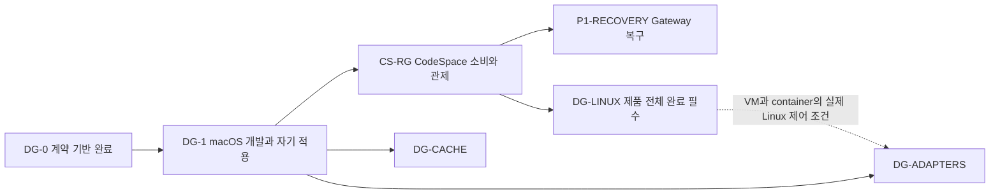

# DevGuard 상세 실행 계획

문서 기준일: 2026-09-22. 기준 저장소: `/Volumes/DevData/Projects/IdeaProjects/DevGuard`. 이 문서 집합은 승인 설계를 구현 가능한 작업·도입 gate·시험·PR 경계로 구체화한다. 영문 문서가 편집 정본이며 이 문서는 검토된 한국어 번역이다. CodeSpace 소비 안내도 영어·한국어를 함께 유지한다.

**현재 적용 가능 범위는 DG-0 계약 검토와 adapter 준비다.** 실제 daemon·CLI·OS 자원 제어·자기 적용·CodeSpace runtime 결합은 미구현이다. 상세 계획이 생겼다고 후속 마일스톤을 완료로 바꾸지 않는다. 실제 이행 기록은 [DG-0](milestones/DG-0.md), 선택 근거와 immutable source는 [결정 기록](decisions.md)에 있다.

## 읽는 순서와 문서 소유권

| 순서/문서 | 필요한 판단 | 원본으로 소유하는 정보 |
| --- | --- | --- |
| 1. [승인 독립 설계](../../design.ko.md) / [checksum](../../design-source.json) | 설립 목적과 큰 계약 | 승인 원문; byte 그대로 보존 |
| 2. [결정 기록](decisions.md) | 왜 Runner 단일 등록과 Gateway 한정 복구인가 | 후속 결정·대안·재검토 조건·기준 source |
| 3. [최소 소비 조건](consumer-readiness.md) | 지금 어떤 수준으로 도입할 수 있는가 | 범용 readiness gate·platform claim |
| 4. 아래 마일스톤 상세 문서 | 무엇을 어떤 commit/PR로 구현할 것인가 | 작업 ID·선행·시험·완료 증거·rollback·인계 |
| 5. [CodeSpace 결합 명세](codespace-integration.md) | 현재 코드에서 어느 경로를 바꿀 것인가 | 실제 source 대응·mode·승인/실행/관제/복구 흐름 |
| 6. [검증 규칙](verification.md) | 무엇이 통과이고 어떤 증거를 남기는가 | 현재/예정 명령·검증 범위·SLO·재현/보존 |
| 7. [PR 진행서](pr-delivery.md) | 문서와 구현 변경을 어떻게 전달하는가 | 이번 DGP/CSP commit·두 PR 순서·미래 인계 절차 |

[contracts.md](../../contracts.md)는 현재 구현된 DG-0 계약만 설명한다. [milestones.json](../../../milestones.json)은 ID·선행·상태의 원본이며 상세 문서 참조만 추가한다. 다른 문서는 작업 ID를 참조하고 상세 작업 정의를 복제하지 않는다. canvas는 저장소 문서와 실제 PR을 표시하는 보조 자료다.

## 마일스톤과 우선 경로

DG-1은 독립 CLI/daemon·개발 workload·자기 적용을 검증한다. CS-RG는 결합된 Runner·MCP·승인·replay를 추가 검증한다. DG-1에 미구현 CS-RG를 선행 요구하지 않는다. P1 복구는 독립 Runner가 살아 있는 동안 Gateway만 재시작하는 opt-in 모드다. InProcess나 Runner 자체의 I/O 복원을 완료 범위에 넣지 않는다.

| 마일스톤 | 소유 | 예정 작업 commit 수 | 예정 PR 묶음 수 | 현재 구현 |
| --- | --- | --- | --- | --- |
| [DG-0](milestones/DG-0.md) | DevGuard | 실제 초기 commit 1개에 대한 이행 기록 | 과거 PR 재구성 없음 | 계약·fake backend 구현 |
| [DG-1](milestones/DG-1.md) | DevGuard | 12 | 6 | 미착수 |
| [CS-RG](milestones/CS-RG.md) | CodeSpace | 8 | 4 | 미착수 |
| [P1-RECOVERY](milestones/P1-RECOVERY.md) | CodeSpace | 6 | 3 | 미착수 |
| [DG-LINUX](milestones/DG-LINUX.md) | DevGuard + CodeSpace | 6 | 3 | 미착수; 전체 제품 필수 |
| [DG-CACHE](milestones/DG-CACHE.md) | DevGuard | 6 | 3 | 미착수; P1 선행 아님 |
| [DG-ADAPTERS](milestones/DG-ADAPTERS.md) | DevGuard | 8 | 4 | 미착수; P1 선행 아님 |
| 후속 합계 | — | **46** | **23** | 계획 수이며 실제 GitHub 번호 아님 |

VM/container는 작업 단위에서 실제 Linux qualification 등 추가 조건을 요구한다. 모든 플랫폼의 완료를 macOS 최초 도입과 혼동하지 않는다. 기존 CodeSpace 후속 우선순위의 상대 순서는 유지한다.

## 사용 규칙

`DG1-C01` 같은 ID는 안정적인 예정 작업 ID이고 제목도 예정 값이다. 실제 commit SHA·PR URL은 생성 후 PR과 검증 report에서 연결한다. 이번 문서 작성의 DGP-D01~D04, CSP-D01~D02는 후속 runtime 46개에 포함하지 않는다.

각 작업의 현재 제공 명령은 기존 계약/회귀 범위만 확인한다. `scripts/qualify.py`와 `scripts/qualify-devguard.py`는 후속 구현이 제공할 예정 명령으로 지금 실행할 수 없다. 명령 이름이나 설정 파일만으로 실행이 governor를 통과했다고 판단하지 않는다.

의존 등록은 실제 실행 소유자 Runner 한 곳에서 완료한다. source/client pin, 설치 daemon/helper artifact, 제품 wire, 이 계획을 인용하는 문서 revision을 별도 값으로 기록한다. 현재 pinned Codex `6b9826e3aa83b1a5947db50f4332cb9c65f1b340`과 Apache-2.0 라이선스는 유지한다.

## 승인된 순차 실행

문서 준비 PR을 먼저 검증·정상 병합하고 main CI를 확인한다. 이후 DG1-P1~P6을 PR마다 구현·검토·현재 head 검사·정상 병합·main 검사·증거 보존·정리 순서로 완료한다. 원격 branch는 보존한다. C08까지 foreground daemon과 최소 단일 Cargo job/시험 thread bootstrap을 사용한다. P4 기능 artifact를 target 밖에 보존한다. C10에서는 부모 예산 기능을 실제 시험한 뒤 그 기능이 포함된 부모를 동결하고 즉시 bounded 실제 자기 적용을 시작한다. C08/C09 artifact가 C10 기능을 이미 지원한다고 가정하지 않는다. 기능 부모와 C12 SLO 안정 릴리스는 별개다.
