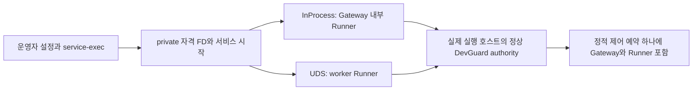

# CodeSpace 결합 명세

분석 기준: CodeSpace `e94d21475643608ad2a466256fb57266b86faa47`, DevGuard `d59cbd43d206a9a9281328a946eddf1dc199f710`. 문서 기준일: 2026-09-22. 현재 CodeSpace에 DevGuard dependency·daemon 소비·PrepareExec·복구 capability는 구현되지 않았다. 아래는 승인된 후속 구현 명세이며 [CS-RG](milestones/CS-RG.md)와 [P1-RECOVERY](milestones/P1-RECOVERY.md)가 상세 작업의 원본이다.

## 현재 코드와 목표 계약

| 기준 코드 | 관찰된 동작 | 결합 변경/작업 |
| --- | --- | --- |
| [server/main.rs](https://github.com/novelKR/CodeSpace/blob/e94d21475643608ad2a466256fb57266b86faa47/crates/server/src/main.rs) | HTTP/stdio 제공 전 start_runner | 선택 Runner가 등록 완료 후 자원 capability 노출, CSRG-C02 |
| [server/runtime.rs](https://github.com/novelKR/CodeSpace/blob/e94d21475643608ad2a466256fb57266b86faa47/crates/server/src/runtime.rs) | Gateway-owned child, kill_on_drop, disconnect 정리, restart recovery 없음 | 기존 계약 유지; 독립 Runner는 명시 새 모드, P1R-C01 |
| [runner/process.rs](https://github.com/novelKR/CodeSpace/blob/e94d21475643608ad2a466256fb57266b86faa47/crates/runner/src/process.rs) | 메모리 Slot이 child/PTY/I/O 소유, 기본 max8 검사 spawn 뒤, 완료64개/15분 | prespawn permit·prepare·수명 분리, CSRG-C03/C04 |
| [server/mcp.rs](https://github.com/novelKR/CodeSpace/blob/e94d21475643608ad2a466256fb57266b86faa47/crates/server/src/mcp.rs) | 인가→workspace acquire→mark_resuming→runner.exec | acquire 뒤 prepare, 성공 뒤 mark_resuming/ExecPrepared, CSRG-C03/C04 |
| [store/approvals.rs](https://github.com/novelKR/CodeSpace/blob/e94d21475643608ad2a466256fb57266b86faa47/crates/store/src/approvals.rs) | WorkspaceBusy/ResourceQueueFull에 queued 보존 | 자원 거절·동일 resume attempt·미시작 증거 CAS, CSRG-C04 |
| [runner/wire.rs](https://github.com/novelKR/CodeSpace/blob/e94d21475643608ad2a466256fb57266b86faa47/crates/runner/src/wire.rs) | wire6, frame16MiB, 완료 replay32개, 직렬 dispatch/공유 writer | lanes·동시 처리 여유·in-flight registry·총량 상한, CSRG-C05/C06 |
| [pty/lib.rs](https://github.com/novelKR/CodeSpace/blob/e94d21475643608ad2a466256fb57266b86faa47/crates/pty/src/lib.rs) | pinned spawn_pty_process에 상속 FD `[]` 전달 | private 선택 FD 전달·payload 전 닫기, CSRG-C02/C07 |
| [pinned Codex PTY](https://github.com/openai/codex/blob/6b9826e3aa83b1a5947db50f4332cb9c65f1b340/codex-rs/utils/pty/src/pty.rs) | 선택한 inherited_fds 인자를 지원 | 현재 pin을 활용; 이 목적만으로 upstream 갱신 안 함 |
| [runner/files.rs](https://github.com/novelKR/CodeSpace/blob/e94d21475643608ad2a466256fb57266b86faa47/crates/runner/src/files.rs) | 전체 파일 read/hash 뒤 window 적용 | 별도 메모리 상한 개선 권고; 검증 workload에 파일 크기 상한 명시 |
| [validate-upstream.py](https://github.com/novelKR/CodeSpace/blob/e94d21475643608ad2a466256fb57266b86faa47/scripts/validate-upstream.py) | 고정 target·보고서, all과 macos-core 별도, platform별 skip | 기존 검사 유지+별도 결합 qualification, CSRG-C08/DGL-C06 |

## 등록과 시작의 단일 소유자

이 그림의 mode는 대안이며 동시에 두 개의 전체 호스트 예산을 만드는 구성이 아니다. SDK 소비자의 `service-exec`는 자격 전달과 시작을 준비한다. 실제 등록은 선택된 Runner 한 곳에서 완료한다. InProcess는 Gateway PID, UDS는 worker PID를 OS peer/boot/start identity로 검증한다. Gateway가 worker identity를 대신 선언하지 않는다. 승인 원문의 일반 service-exec 설명과의 관계는 [ADR-001](decisions.md#adr-001--실행-소유자인-runner의-단일-등록)에 기록한다.

pipe/PTY 모두 필요한 helper 단계까지만 credential FD를 상속한다. launcher가 자격 확인·scope 적용·실행 허용을 마친 뒤 사용자 executable 전에 FD를 닫고 close-on-exec/오류 정리 여부를 실제 payload fixture로 검사한다. jobserver 등 별도의 필요한 FD와 자격 FD를 구분한다. secret을 argv/env·MCP 입력·로그·journal에 넣지 않는다.

기본 `resources` 참여는 off이며 operator가 required를 선택하면 인증·capability·예산을 검증한다. 실패를 조용히 off로 처리하지 않는다. 구체 설정 schema와 wire 변화는 CSRG-C02 구현 PR의 계약이며 이번 문서 revision은 현재 설정을 활성화하지 않는다.

## 실행과 승인의 순서

1. 기존 인가, workspace/network 정책, argv 및 승인 요건을 검증한다.
2. 기존 workspace FIFO에서 해당 process_id의 실행 예약을 획득한다.
3. Runner `PrepareExec`가 spawn 전 실행 슬롯을 확보하고 고정 의미의 attempt로 admission을 요청한다.
4. 승인 설계의 250ms 준비 예산 안에 준비되지 않으면 빠르게 응답한다. 미시작 준비를 취소하고 workspace/slot을 정리하며 DevGuard 내부 장기 대기열로 옮기지 않는다. CLI의 명시 wait와 구분한다.
5. 준비 성공 뒤 승인 resume를 같은 attempt에 대해 `resuming`으로 전환한다. DB 전이 실패는 준비 취소로 연결한다.
6. `ExecPrepared`가 5초 원래 준비 기한 안에서 원자적으로 token을 소비한다. 만료 token에 새 lease를 조용히 발급하지 않는다.
7. Runner가 관리 helper handle을 소유한다. helper는 scope 적용·bind·실행 허용·READY 뒤 user executable로 전환한다.
8. 실행 슬롯·workspace·resource lease는 각자의 실제 종료 근거로 대조한다. 완료 출력의 보존 TTL은 별도로 유지한다.

attempt는 server-minted process_id와 일대일로 연결한다. 이는 공개 MCP 임의 재호출을 영속 idempotency API로 바꾼다는 뜻이 아니다. 같은 transport 요청/attempt replay와 사용자의 새 exec 요청을 구분한다.

| 사건 | 의미 | 승인·재시도 |
| --- | --- | --- |
| prepare 거절 | 사용자 코드 미실행 | 해당 hold queued 보존; 새 명시 시도 가능 |
| helper 생성 전 실패 확정 | `known_not_started`와 일치하는 증거 | 같은 resume attempt 상태의 CAS로만 재사용 가능 |
| `confirmed` | 관리 helper가 추적 가능한 상태 | executable 성공으로 해석하지 않음; 적용은 pending일 수 있음 |
| helper READY | 실행 전 경계 준비를 관측 | user executable 성공/종료와 구분 |
| READY 뒤 executable 실패 | 이미 시작된 관리 실행의 단계·종료 결과 | 무조건 승인 queued 복귀 금지 |
| launch/authorize 응답 유실 | spawn/exec 가능성을 배제하지 못함 | unknown 유지; 자동 재실행 금지 |
| resource lease 회수 | 해당 scope/미생성/이전 boot 증거로 회계 정리 | 자원 반환만으로 승인 재사용을 허용하지 않음 |

기존 approval row에는 미래 nullable `resume_attempt_id`와 같은 동일 시도 비교가 필요하다. 기존 NULL이나 오래된 resuming을 미시작으로 추정하지 않는다. schema migration과 구·신 버전 fixture를 CSRG-C04에서 함께 제출한다. exec를 patch operations 원장으로 옮기지 않는다.

## 오류·관제·수명

| 오류/상태 | 목표 의미 | 처리 |
| --- | --- | --- |
| `RESOURCE_UNAVAILABLE` | 예산 부족·준비 기한 종료 | 미시작 증거가 있으면 이후 명시 재시도 |
| `RESOURCE_CONTROL_UNAVAILABLE` | daemon 연결·회계 복구·저장 실패 | 신규 실행 거절, 기존 handle 관제 유지 |
| `RESOURCE_POLICY_UNSUPPORTED` | required 자원 capability 미지원 | 운영자 설정/지원 조합 검토 |
| 기존 `WORKSPACE_BUSY` / `RESOURCE_QUEUE_FULL` | workspace/실행 슬롯 점유 또는 기존 FIFO 포화 | 기존 의미 보존; DevGuard 예산 부족과 구분 |
| 기존 `dispatch_status=unknown` | 실행 여부 불확실 | 동일 process_id 조회·종료·대조, blind replay 금지 |

기존 MCP 이름은 유지한다. 종료 도구의 실제 이름은 **`terminate_process`**이며 승인 원문의 다른 표기 때문에 새 도구를 추가하지 않는다. DevGuard 장애 시 Runner의 실제 child/PTY handle로 상태와 종료를 처리한다. 신규 admission 성공을 관제 선행 조건으로 넣지 않는다.

control/data를 나눈 뒤에도 공유 mutex·writer·callback이 data backpressure를 control로 전파하는지 확인한다. 총 요청 수뿐 아니라 동시 처리 수, queued bytes, response/replay bytes, in-flight entries, 완료 캐시 TTL, stdin 대기, 이벤트 callback 대기를 모두 제한한다. 이미 존재하는 frame16MiB·replay32개·출력 ring256KiB만으로 전체 메모리 상한이 증명되지는 않는다.

| 수명 | 소유자 | 끝나는 근거 |
| --- | --- | --- |
| 실행 슬롯·workspace 점유 | CodeSpace Runner/store | 관리 실행과 자손/출력 pump의 정의된 완료 대조; 준비 취소는 미실행 guard |
| resource lease | DevGuard | 정확한 scope와 종료 증거, NoHelperCreated 또는 검증된 이전 boot 종료 |
| 완료 결과·출력 | CodeSpace retention | 기존 15분/64개 등 보존 정책; 자원 반환과 무관 |

scope 추적 상실을 root reap으로 덮지 않는다. 완성된 응답 cache가 없어져도 종결 attempt가 새 spawn으로 변하지 않는다. 관제 지연은 요청 접수부터 응답까지를 측정하고 실제 scope 종료 시간과 구분한다.

## P1 복구 모드의 경계

| 상황 | 기존 모드 | 새 독립 Runner 모드 |
| --- | --- | --- |
| 정상 Gateway 종료 | 현재 mode의 child/disconnect 정리 계약 유지 | 명시 종료 의도와 운영 설정대로 처리; detach와 구분 |
| 명시 서비스 중지 | 기존 stop 경로 | Runner가 drain/terminate·lease 대조, 증거 후 정리 |
| 재시작용 detach | 새 기능을 기존 모드로 소급하지 않음 | Runner 생존, 원래 timeout·I/O·상태 유지 |
| 예상치 못한 Gateway 연결 소실 | 현재 kill/release callback 계약 회귀 검증 | Runner 생존, 인증된 새 Gateway 대기, 같은 deadline 유지 |
| Runner/host 손실 | 현재 한계를 사실대로 표시 | unknown 및 실제 termination 대조; PID/DB만으로 I/O 복원 불가 |

새 Gateway는 인증과 epoch/fence 후 같은 실행에 재연결한다. stale Gateway mutation은 거절한다. workspace occupancy·approval·DevGuard lease를 대조하기 전 새 mutation을 열지 않는다. 이 재연결은 신규 workload budget을 발급받는 흐름이 아니다. Runner 자체의 재시작 후 출력 복원을 위한 별도 I/O 계층은 최초 P1 범위 밖이다.

## 관찰된 구조 조건과 최소 변경

| 권고 | 근거/원인 | 최소 변경과 대안 | 비용·위험·검증/복귀 |
| --- | --- | --- | --- |
| Required, 높음 | PID 기반 authority와 Runner 소유권 | Runner 단일 등록; service/하위 등록은 실제 다중 Runner 수요 때 | 중간; FD/권한 시험 후 rollout, admission 닫고 drain |
| Required, 높음 | spawn 후 슬롯 검사·준비 전 승인 전이 | prespawn permit + PrepareExec/ExecPrepared + 동일 attempt CAS | 높음; 취소/유실/경쟁 검증, unknown 보존하며 복귀 |
| Required, 높음 | 빈 FD 목록 adapter·private 자격 필요 | 고정 Codex FD API를 private adapter로 전달 | 중간; payload 누출/pipe·PTY 시험, 자격 회전은 대조 후 |
| Required, 높음 | 직렬 dispatch·공유 writer·제한 없는 누적 가능성 | 처리/전송/버퍼 전체 상한과 control 여유 | 높음; saturation/latency/lock trace, session drain 후 rollback |
| Required, 높음 | authority 잠금은 디렉터리별 | canonical 정상 경로 + parent-budget 시험 | 중간; 별칭/동시 시작 시험, journal 보존 |
| Required, 높음 | strict serde와 journal schema | 실제 N/N+1 reader/writer fixture·명시 migration | 중간; 새 쓰기 후 snapshot rollback 금지 |
| Strongly Recommended, 높음 | 전체 파일 read/hash가 window보다 큼 | 크기 상한 거절 또는 streaming; 별도 후속 승인 | 중간; 큰 파일/동시 read/peak memory, API 호환·rollback 검토 |

위 Required는 승인된 CS-RG/DG-1 방향의 후속 구현 조건이며 이번 PR은 문서만 적용한다. 전체 파일 메모리 개선은 현재 범위 밖이다. 당장의 완전한 검증 범위는 fixture 파일 크기·동시성을 제한해 명시할 수 있다. 이를 임의 파일 크기에 대한 보호 완료로 설명하지 않는다.

## 적용 순서와 인계

DG1-C12의 독립 개발 qualification → CSRG-C01/C02의 pin·등록 → C03/C04 준비·승인 → C05/C06 관제·replay → C07/C08 제품 qualification → P1R-C01~C06 Gateway 복구 순서다. 실제 Linux는 DGL-C01~C06을 추가한다. 기존 CodeSpace upstream 검증과 Codex pin을 유지하고 DevGuard 검증은 별도 보고서로 추가한다.

문서 PR은 [PR 진행서](pr-delivery.md)의 DGP/CSP 작업으로 분리한다. 고정 문서 revision은 검토 링크이며 runtime pin이 아니다. 구현 단계의 도입 허가는 [소비 조건](consumer-readiness.md)과 [검증 범위](verification.md)를 모두 충족한 조합에만 부여한다.
