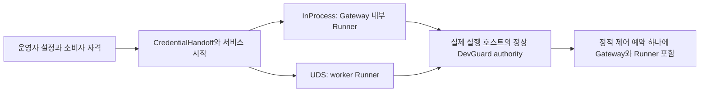

# CodeSpace 결합 명세

확인 기준: CodeSpace `b6e7ed22e2c730ac987297455e250cbd6e8e8b0c`([설계 개정 1](../design-revision-1.md), 2026-09-27). 초기 분석 기준인 CodeSpace `e94d21475643608ad2a466256fb57266b86faa47`과 DevGuard `d59cbd43d206a9a9281328a946eddf1dc199f710`은 이력으로 보존하며, 아래 runtime 경로는 patch helper의 시험 재사용을 제외하면 두 CodeSpace 기준 사이에 바뀌지 않았다. 문서 기준일: 2026-09-22, 개정 2026-09-27. 현재 CodeSpace에 DevGuard dependency·daemon 소비·PrepareExec·복구 capability는 구현되지 않았다. DG1-C12는 완료되었고 macOS qualification을 마친 release `0.1.0-5daee5d-b3fa569e`가 pin 후보다. 설계 개정 1은 Codex `6b9826e3aa83b1a5947db50f4332cb9c65f1b340` pin을 유지하며, 이후의 pin 변경은 검증 결과에 근거한 별도 결정이다. 2026-09-26 검토에서 이 명세를 DG-1이 구현한 소비 인터페이스([계약](../contracts.md))에 맞췄고, 설계 개정 1이 실행 계층을 개정했다. 아래는 후속 구현 명세이며 [CS-RG](milestones/CS-RG.md)와 [P1-RECOVERY](milestones/P1-RECOVERY.md)가 상세 작업의 원본이다.

## 현재 코드와 목표 계약

| 기준 코드 | 관찰된 동작 | 결합 변경/작업 |
| --- | --- | --- |
| [server/main.rs](https://github.com/novelKR/CodeSpace/blob/b6e7ed22e2c730ac987297455e250cbd6e8e8b0c/crates/server/src/main.rs) | HTTP/stdio 제공 전 start_runner | 선택 Runner가 등록 완료 후 자원 capability 노출, CSRG-C02 |
| [server/runtime.rs](https://github.com/novelKR/CodeSpace/blob/b6e7ed22e2c730ac987297455e250cbd6e8e8b0c/crates/server/src/runtime.rs) | Gateway-owned child, kill_on_drop, disconnect 정리, restart recovery 없음 | 기존 계약 유지; 독립 Runner는 명시 새 모드, P1R-C01 |
| [runner/process.rs](https://github.com/novelKR/CodeSpace/blob/b6e7ed22e2c730ac987297455e250cbd6e8e8b0c/crates/runner/src/process.rs) | 메모리 Slot이 child/PTY/I/O 소유, 기본 max8 검사 spawn 뒤, 완료64개/15분; 대기 외에도 pipe timeout task와 `request_kill`이 `try_wait`로 회수(`:366`, `:714`), pipe child는 `kill_on_drop` | 실행마다 supervisor와 회수 책임자 하나, prespawn permit·prepare·회수 전 관측·수명 분리, CSRG-C00/C03/C04 |
| [server/mcp.rs](https://github.com/novelKR/CodeSpace/blob/b6e7ed22e2c730ac987297455e250cbd6e8e8b0c/crates/server/src/mcp.rs) | 인가→workspace acquire→mark_resuming→runner.exec | acquire 뒤 prepare, 성공 뒤 mark_resuming/ExecPrepared, CSRG-C03/C04 |
| [store/approvals.rs](https://github.com/novelKR/CodeSpace/blob/b6e7ed22e2c730ac987297455e250cbd6e8e8b0c/crates/store/src/approvals.rs) | WorkspaceBusy/ResourceQueueFull에 queued 보존 | 자원 거절·동일 resume attempt·미시작 증거 CAS, CSRG-C04 |
| [runner/wire.rs](https://github.com/novelKR/CodeSpace/blob/b6e7ed22e2c730ac987297455e250cbd6e8e8b0c/crates/runner/src/wire.rs) | wire6, frame16MiB, 완료 replay32개, 직렬 dispatch/공유 writer | lanes·동시 처리 여유·in-flight registry·총량 상한, CSRG-C05/C06 |
| [pty/lib.rs](https://github.com/novelKR/CodeSpace/blob/b6e7ed22e2c730ac987297455e250cbd6e8e8b0c/crates/pty/src/lib.rs) | pinned spawn_pty_process에 상속 FD `[]` 전달; pinned spawn이 내부에서 회수하고 종료 코드만 전달 | Codex 타입을 격리하는 legacy `off` backend(`BackendReaped`); CSRG-C09 결정까지 유지 |
| [pinned Codex PTY](https://github.com/openai/codex/blob/6b9826e3aa83b1a5947db50f4332cb9c65f1b340/codex-rs/utils/pty/src/pty.rs) | 선택한 inherited_fds 인자를 지원하지만 child를 내부에서 회수하고 이미 상속 가능한 descriptor만 유지 | 고수준 spawn은 변경 없이 관리 실행에 쓸 수 없음; 설계 개정 1은 pin을 유지 |
| [runner/files.rs](https://github.com/novelKR/CodeSpace/blob/b6e7ed22e2c730ac987297455e250cbd6e8e8b0c/crates/runner/src/files.rs) | 전체 파일 read/hash 뒤 window 적용 | 별도 메모리 상한 개선 권고; 검증 workload에 파일 크기 상한 명시 |
| [validate-upstream.py](https://github.com/novelKR/CodeSpace/blob/b6e7ed22e2c730ac987297455e250cbd6e8e8b0c/scripts/validate-upstream.py) | 고정 target·보고서, all과 macos-core 별도, platform별 skip | 기존 검사 유지+별도 결합 qualification, CSRG-C08/DGL-C06 |

## 실행 소유권

이 절은 [설계 개정 1](../design-revision-1.md)을 적용한다. 고정된 Codex 고수준 spawn은 변경 없이 DG-1 관리 실행을 담을 수 없다. pipe·PTY spawn 함수가 자체 task에서 child를 회수하므로 소유자가 회수 전에 scope를 관찰할 수 없고, 이미 상속 가능한 descriptor만 열어 두는 반면 DG-1은 permit과 transcript descriptor를 자체 `pre_exec`까지 close-on-exec로 유지하기 때문이다. 원인은 회수 소유권과 FD 전달 계약의 불일치이다. 이를 wrapper로 숨기지 않으며 “Codex는 쓸 수 없다”로 일반화하지도 않는다. 이 발견은 다섯 부분으로 나뉜다.

| 부분 | 문제 | 필요한 변경 |
| --- | --- | --- |
| F1a 회수 소유권 | waiter 외의 종료·timeout·Drop 경로도 child를 회수할 수 있음 | 모든 경로를 목록화하고 실행당 회수 책임자 하나 유지 |
| F1b FD 전달 | FD를 닫지 않는 것과 close-on-exec FD를 특정 child에만 전달하는 것은 다름 | 준비부터 payload까지 FD 소유·상속·종료 규칙 명세 |
| F1c 동시 spawn | 다른 스레드의 spawn이 private descriptor 생성과 경쟁할 수 있음 | 프로세스 전체의 spawn 보호와 예외별 증명 |
| F1d 출력·handle | bridge 내부 손실과 Drop 동작이 상위 계약과 다를 수 있음 | 출력 손실·backpressure·Drop 적합성 검사 |
| F1e 유지보수 분기 | 공통 인터페이스 아래 중복 backend가 무기한 남음 | CSRG-C09에서 통합 또는 제한적 backend 결정 |

Runner는 모든 실행을 한 계층에서 조정한다. 실행 identity, 승인과 실행의 연결, 상태 전이, timeout, 종료 요청, 출력 기록, 완료와 반환 조정이 공통이다. backend에는 OS child 생성, 입출력 연결, terminal 설정, 플랫폼별 종료 관찰, 실제 회수가 남는다. 예정 책임은 기존 API가 아닌 개념 이름으로 실행 조정자, 자원 governor(off 또는 DevGuard), `PreparedExecution`과 그 `LaunchPlan`, process supervisor, 그리고 backend(legacy Codex PTY, legacy Tokio pipe, pipe·PTY transport를 가진 소유 Unix process)다. DevGuard client 타입과 Codex 타입은 공개 MCP 타입에 드러나지 않으며, 범용 조정 계층은 두 upstream의 내부 타입을 직접 섞지 않는다.

| 소유 모델 | 의미 | 범위 |
| --- | --- | --- |
| `BackendReaped` | backend가 회수하고 결과를 보고 | 초기 legacy `off` 경로; 회수되지 않은 종료 상태를 제공한다고 표시하지 않음 |
| `OwnerControlledReap` | CodeSpace가 비회수 관찰과 회수 순서를 제어 | DevGuard `required` 경로 |

네 상태 축을 독립적으로 관리한다: 준비·dispatch(Prepared, Committed, HelperSpawned, Uncertain), OS child(Running, ExitedUnreaped, Reaped, OwnershipLost), 입출력(Open, EOF, Truncated, Failed), DevGuard 자원(Reserved, Active, Suspect, Released). EOF는 종료가 아니고, 종료는 회수가 아니며, 회수는 자손 종료가 아니고, 출력 보존 만료는 lease 반환이 아니며, READY는 payload 성공이 아니다. DG-1의 `LaunchOutcome::Started`도 transcript에서 읽은 징후다. READY와 exec 사이에 종료된 helper도 같은 값으로 나타난다.

- **단일 회수자.** `required` 경로에서는 child를 소유한 객체 밖의 어떤 코드도 `wait`, `try_wait`, `waitpid`를 호출하지 않는다. `terminate_process`·timeout·shutdown은 supervisor에 의도를 보내고 supervisor가 검증된 종료를 수행한다. OS 종료 통지는 supervisor의 비회수 관찰, `Observe`, 같은 소유 객체를 통한 회수로 이어진다. 기준 코드에서는 pipe timeout task와 `request_kill`도 회수하므로 waiter 하나를 바꾸는 것으로는 부족하다. CSRG-C00은 spawn, 종료 감시, timeout, `request_kill`, workspace 단위 종료, shutdown, backend Drop, task 취소, 오류 정리마다 소유자와 보내는 메시지를 적은 소유권 표를 남긴다.
- **회수 전 관찰.** 회수하지 않고 종료를 감지하고(`WNOWAIT`를 준 `waitid`), 전체 예산 안에서 `Observe`를 시도해 성공·실패·timeout을 기록한 뒤, 소유한 child로 회수하고 필요하면 다시 관찰·대조한다. 예산은 1초로 제안하고 CSRG-C00에서 검증하며, qualification된 값이 아니고 상태·종료 응답을 늦추지 않는다. 실패해도 lease는 점유된 채 남고, 성공을 기다리며 zombie를 무기한 두지 않으며, `ECHILD`나 소유권 상실은 성공한 관찰도 미실행 증거도 아니다. timeout future로 감싼 blocking 호출은 실제로 계속 실행되는 동안 추적한다.
- **signal.** 종료에는 새 DevGuard 허가가 필요 없지만 authority 장애 중에는 scope 전체의 종료를 증명할 수 없다. Runner는 안전하게 식별한 대상만 제어하고, 그렇지 않으면 결과를 불완전으로 보고하고 자원을 반환하지 않는다. 관리 backend는 오래된 숫자 PID·PGID로 signal을 보내지 않으며, Codex의 process-group 종료 코드를 재사용하기 전에 DevGuard identity·scope 계약과 대조한다.
- **spawn 보호.** `helper_command`와 `HelperCommand::spawn`은 DG-1의 `spawn_guard`를 직접 잡고, 표준 `Mutex`는 보유 스레드가 다시 잠그면 정상 반환하지 않으므로 호출자는 그 주위에서 guard를 잡지 않는다. 같은 OS 프로세스의 다른 모든 child 생성 경로(pipe·PTY spawn, patch·sandbox helper, 보조 명령, worker 생성, 시험 helper)는 descriptor 생성·상속 설정·spawn 구간만 공통 guard나 검증된 동등 보호로 감싼다. guard를 잡은 채 DevGuard 요청, permit 대기, transcript 읽기, child 대기, 출력 drain, 장시간 기록을 하지 않는다. 자기 descriptor를 close-on-exec로 만드는 것만으로 다른 스레드의 descriptor 생성과의 경쟁이 해결되지 않으며, 커널 수준 close-on-exec 기본 경로는 적용·오류·fallback 경로를 검증한 경우에만 예외로 인정한다. client crate가 두 버전으로 링크되면 guard도 둘이 되므로 같은 보호 객체를 공유하는지 검증한다. Gateway와 UDS Runner는 서로 다른 프로세스이므로 따로 조사한다. legacy Codex PTY의 spawn·descriptor 정리 경로가 안전하다고 입증되기 전에는 한 프로세스 안의 legacy·관리 혼합 실행을 검증 완료로 선언하지 않으며, 같은 범위에서 그 backend를 교체하거나 지원 조합을 제한한다.
- **PTY 구성.** 관리 PTY는 `HelperCommand`의 permit·transcript 전달을 보존한다. 부모의 private descriptor는 helper 생성 전까지 보호되고, child는 permit·transcript·정당한 jobserver descriptor를 구분해 받으며, 자격은 payload 전에 닫히고 transcript는 close-on-exec로 남는다. PTY slave를 stdin·stdout·stderr로 연결하고 session과 controlling terminal 설정 순서(`setsid` 다음 `TIOCSCTTY`)를 명시한다. setup 실패 시 child·master·slave·private descriptor를 모두 정리하며, helper의 QoS 재실행 뒤에도 descriptor와 PID 의미가 유지된다. `pre_exec` callback은 fork 뒤 등록 순서대로 실행되므로 데이터를 미리 준비하고 할당·잠금·환경 조회를 하지 않는다. helper에 필요한 descriptor를 보존 목록에서 빠뜨리거나 PTY 설정과 process-group 설정을 무작정 중복 적용하지 않는다.

## 등록과 시작의 단일 소유자

이 그림의 mode는 대안이며 동시에 두 개의 전체 호스트 예산을 만드는 구성이 아니다. DG-1에는 별도의 `service-exec` 경로가 없다. Gateway는 소비자 자격을 `CredentialHandoff`로 UDS worker에 넘기고 InProcess는 직접 읽는다. 실행 소유자당 등록 instance는 하나이며 launcher는 두 번째 instance를 등록하지 않는다. DG-1은 idle 대기를 포함한 모든 frame에 250ms 절대 기한을 두므로, 소유자는 단계마다 새 세션을 열고(연결, `Hello`, `Authenticate`, 같은 instance ID로 `Register`, 요청 하나) 같은 instance를 다시 등록한다. InProcess는 Gateway PID, UDS는 worker PID를 OS peer/boot/start identity로 검증한다. Gateway가 worker identity를 대신 선언하지 않는다. 승인 원문의 일반 service-exec 설명과의 관계는 [ADR-001](decisions.md#adr-001--실행-소유자인-runner의-단일-등록)에 기록한다. 준비 예산 250ms, Prepared 수명 5초, 이 frame별 250ms 기한은 서로 다른 제한이다. frame마다 250ms를 허용해도 전체 준비가 250ms 안에 끝나지는 않으며, CSRG-C00이 연결부터 `Admit`까지의 기한 전파를 검증한다.

worker는 시작할 때 자격 descriptor를 읽고 닫는다. permit과 transcript descriptor는 helper 하나를 위해서만 존재하며 그 exec에서 닫힌다. [spawn 보호](#실행-소유권) 규칙이 다른 child가 grant를 상속하지 않게 한다. close-on-exec/오류 정리 여부를 실제 payload fixture로 검사한다. jobserver 등 별도의 필요한 FD와 자격 FD를 구분한다. secret을 argv/env·MCP 입력·로그·journal에 넣지 않는다.

기본 `resources` 참여는 off이며 operator가 required를 선택하면 인증·capability·예산을 검증한다. 실패를 조용히 off로 처리하지 않으며, DG-LINUX 전의 Linux처럼 DG-1이 `ResourcePolicyUnsupported`를 보고하는 곳도 마찬가지다.

- **소비자 준비.** 운영자는 `host.toml`에 `codespace` 소비자를 준비한다: role `control_service`, generation, private 자격 파일, instance 상한, 정적 제어 예약. 서비스는 시작할 때만 이 파일을 읽고 재시작은 commit된 attempt를 Suspect로 남긴다. 따라서 점유 중인 예산이 없음을 `CloseAdmission`과 `Quiescence`로 확인한 뒤 적용한다.
- **workspace 설정.** workspace `resources` 설정은 실행마다 profile, 요청 예산, 최소 수준을 정한다. load할 때 작업 용량과 대조하며 호출이 이를 덮어쓰지 못한다.

구체 설정 schema와 wire 변화는 CSRG-C02 구현 PR의 계약이며 이번 문서 revision은 현재 설정을 활성화하지 않는다.

## 실행과 승인의 순서

준비 결과는 소유권 있는 일회성 객체다. 실행 identity(process_id와 attempt의 대응), 명령 의미, spawn 전에 확보한 실행 슬롯, FIFO·승인 흐름과 연결된 workspace 점유, 자원 상태(`off` 또는 Prepared), 최초 준비의 기한을 가진다. 한 번 실행하거나 취소할 수 있으며, 정리는 미실행 작업과 committed·불확실 작업을 구분한다. 두 번째 spawn을 위해 복제하거나 직렬화된 argv로 다시 만들지 않는다. 취소된 task의 Drop이 lease를 반환했다고 가정하지 않으며, 원격 정리는 명시적인 대조 작업으로 남긴다.

1. 기존 인가, workspace/network 정책, argv 및 승인 요건을 검증한다.
2. 기존 workspace FIFO에서 해당 process_id의 실행 예약을 획득한다.
3. Runner `PrepareExec`가 spawn 전 실행 슬롯을 확보하고 고정 의미의 attempt로 admission을 요청한다.
   - 요청은 Prepared attempt를 기록하는 DG-1 `Admit`이다.
   - execution digest는 argv·cwd·환경·tty·workspace·정책을 포함한다.
4. 승인 설계의 250ms 준비 예산 안에 준비되지 않으면 빠르게 응답한다. 미시작 준비를 취소하고 workspace/slot을 정리하며 DevGuard 내부 장기 대기열로 옮기지 않는다. CLI의 명시 wait와 구분한다.
5. 준비 성공 뒤 승인 resume를 같은 attempt에 대해 `resuming`으로 전환한다. DB 전이 실패는 준비 취소로 연결한다.
6. `ExecPrepared`가 원래 5초 Prepared 기한 안에 `BeginLaunch`로 attempt를 commit한다.
   - 일회용 permit은 첫 응답에만 들어 있다.
   - 만료된 attempt에 새 lease를 조용히 발급하지 않는다.
7. Runner가 launch plan을 한 번 소비한다. `HelperCommand`로 `devguard-launch`를 직접 child로 시작하고 그 handle을 소유하며, transcript와 process handle을 각각 추적한다. helper는 scope 적용·bind·실행 허용 뒤 transcript에 `ready`를 쓰고 user executable로 전환한다.
8. root가 종료되면 소유 supervisor가 회수하지 않고 감지한 뒤(`WNOWAIT`를 준 `waitid`) 예산 안에서 `Observe`를 시도하고, 그다음에 회수한다. 실행 슬롯·workspace·resource lease는 각자의 실제 종료 근거로 대조한다. 완료 출력의 보존 TTL은 별도로 유지한다.

attempt는 server-minted process_id와 일대일로 연결한다. 이는 공개 MCP 임의 재호출을 영속 idempotency API로 바꾼다는 뜻이 아니다. 같은 transport 요청/attempt replay와 사용자의 새 exec 요청을 구분한다. 아래 표는 실행 미발생 증거와 자원 정리 증거를 분리한다.

| 사건 | 실행 판단 | 자원·승인 처리 |
| --- | --- | --- |
| `Admit` 명시적 거절 | 사용자 코드 미실행 | 승인 미소비, hold queued 보존, 준비 guard 정리; 새 명시 시도 가능 |
| `Admit` 응답 유실 | child는 없지만 예약 상태는 불명 | 같은 attempt 조회·취소; authority 확인 전 임의 반환 금지 |
| `BeginLaunch` 응답 유실 | permit을 받지 못했는지 helper에 넘겼는지 로컬 소유권으로 확인 | 같은 attempt 유지; helper가 존재할 수 없을 때만 `AbandonLaunch` 보고 |
| helper spawn 실패 또는 READY 전 helper 종료 | spawn API가 보장하는 범위에서 helper 없음; READY 없는 helper는 executable을 시도하지 않음 | `AbandonLaunch` 보고. claim되지 않은 grant에만 주어지는 authority의 `NoHelperCreated`(`known_not_started`) 해제가 미시작 증거이며, claim된 grant는 scope로만 정리; 같은 resume attempt 상태의 CAS로만 재사용 |
| transcript `failed`·`refused` | helper가 exec하지 않았다고 보고 | claim된 scope와 claim되지 않은 grant를 구분해 정리; 같은 resume attempt 상태의 CAS로만 재사용 |
| transcript `ready` | 실행 전 경계 준비를 관측 | user executable 성공/종료와 구분 |
| READY 뒤 transcript `exec_failed` | 준비를 통과한 뒤 executable 진입 실패 | 예산 거절과 구분; 승인 자동 복귀·재사용 금지 |
| `ready` 뒤 최종 보고 없음, transcript나 종료를 읽지 못함 | 실행 가능성을 배제하지 못함 | unknown 유지; 자동 재실행 금지 |
| root 종료, 자손 생존 | root 종료만 확인 | scope·workspace·lease를 따로 정리 |
| `Observe` 실패 또는 추적 상실 | 전체 종료를 증명하지 못함 | 제한된 절차로 회수하되 lease는 점유 유지 |
| resource lease 회수 | 해당 scope/미생성/이전 boot 증거로 회계 정리 | 자원 반환만으로 승인 재사용을 허용하지 않음 |

`AbandonLaunch` 호출 자체는 증거가 아니며 authority가 돌려준 상태가 기준이다. user executable도 helper의 자체 종료 상태인 125·126·127을 반환할 수 있으므로 종료 코드만으로 helper 단계나 승인 재사용 가능성을 추론하지 않는다.

기존 approval row에는 미래 nullable `resume_attempt_id`와 같은 동일 시도 비교가 필요하다. 기존 NULL이나 오래된 resuming을 미시작으로 추정하지 않는다. schema migration과 구·신 버전 fixture를 CSRG-C04에서 함께 제출한다. exec를 patch operations 원장으로 옮기지 않는다.

## 오류·관제·수명

| 오류/상태 | 목표 의미 | 처리 |
| --- | --- | --- |
| `RESOURCE_UNAVAILABLE` | 예산 부족·호스트 압력·준비 기한 종료 | 미시작 증거가 있으면 이후 명시 재시도. 압력 거절은 그렇다고 밝힌다: DG-1은 메모리가 30초 동안 정상일 때까지 admission을 닫아 둔다 |
| `RESOURCE_CONTROL_UNAVAILABLE` | daemon 연결·회계 복구·저장 실패 | 신규 실행 거절, 기존 handle 관제 유지 |
| `RESOURCE_POLICY_UNSUPPORTED` | required 자원 capability 미지원(DG-LINUX 전의 Linux 포함) | 운영자 설정/지원 조합 검토 |
| DG-1 `Unauthorized` / `InvalidRequest` | 자격·generation·요청 거절 | 신규 실행 거절; 운영자 설정 수정 |
| DG-1 `AttemptConflict` / `InvalidTransition` / `NotFound` / `ReconciliationRequired` / `JournalInvalid` | attempt나 authority 저장소가 Runner 기록과 불일치 | 신규 실행은 거절. 기존 attempt는 불확실로 보고 같은 attempt를 조회·대조; replay 금지 |
| 기존 `WORKSPACE_BUSY` / `RESOURCE_QUEUE_FULL` | workspace/실행 슬롯 점유 또는 기존 FIFO 포화 | 기존 의미 보존; DevGuard 예산 부족과 구분 |
| 기존 `dispatch_status=unknown` | 실행 여부 불확실 | 동일 process_id 조회·종료·대조, blind replay 금지 |

기존 MCP 이름은 유지한다. 종료 도구의 실제 이름은 **`terminate_process`**이며 승인 원문의 다른 표기 때문에 새 도구를 추가하지 않는다. DevGuard 장애 시 Runner의 실제 child/PTY handle로 상태와 종료를 처리한다. 신규 admission 성공을 관제 선행 조건으로 넣지 않는다.

control/data를 나눈 뒤에도 공유 mutex·writer·callback이 data backpressure를 control로 전파하는지 확인하며, spawn과 회수 전 `Observe`의 지연도 control 경로에 전파되지 않게 한다. 총 요청 수뿐 아니라 동시 처리 수, queued bytes, response/replay bytes, in-flight entries, 완료 캐시 TTL, stdin 대기, 이벤트 callback 대기를 모두 제한한다. 이미 존재하는 frame16MiB·replay32개·출력 ring256KiB만으로 전체 메모리 상한이 증명되지는 않는다.

출력은 상한 있는 보존을 가진 CodeSpace 수집기 하나로 모으고 `read_process`와 `output_lost`로 읽는다. 관계없는 실행의 출력을 섞지 않고, EOF와 종료 상태를 구분하며, 의도적 보존 손실과 알 수 없는 transport 손실을 구분한다. 손실량을 모르면 `output_lost=false`로 보고하지 않으며, protocol이 이를 표현하지 못하면 CSRG-C06이 호환 변경을 설계한다. pin의 Codex `ProcessDriver` bridge는 broadcast lag로 빠진 항목을 건너뛰고 `ProcessHandle`의 Drop은 프로세스를 종료한다. 따라서 `ProcessDriver`는 다음을 모두 만족할 때만 채택한다.

- bridge 손실을 기록에서 숨기지 않는다.
- 느린 reader가 상태·종료를 막지 않는다.
- 채널 개수가 아니라 전체 byte 상한이 있다.
- UI·응답·임시 handle의 Drop이 잘못된 종료를 일으키지 않는다.
- 종료 callback에 중복 종료·회수 경쟁·오래된 identity 사용이 없다.
- 종료 통지와 최종 출력의 순서를 처리한다.
- 제거하는 코드보다 비용이 적다.

broadcast `Lagged(n)`는 byte 수가 아니므로 정확한 회계에는 sequence·length metadata나 별도 손실 경로가 필요하다. `ProcessDriver`를 맞추려고 더 감싸야 한다면 CodeSpace의 기존 출력·handle 추상화를 쓴다.

| 수명 | 소유자 | 끝나는 근거 |
| --- | --- | --- |
| OS child | supervisor의 소유 객체(유일한 회수자) | 회수 전 관찰 또는 그 실패를 기록한 뒤 회수 |
| 실행 슬롯·workspace 점유 | CodeSpace Runner/store | 관리 실행과 자손/출력 pump의 정의된 완료 대조; 준비 취소는 미실행 guard |
| resource lease | DevGuard | 정확한 scope와 종료 증거, NoHelperCreated 또는 검증된 이전 boot 종료 |
| 완료 결과·출력 | CodeSpace retention | 기존 15분/64개 등 보존 정책; 자원 반환과 무관 |

scope 추적 상실을 root reap으로 덮지 않는다. macOS에서 scope는 root의 process group이며 DG-1은 협조적 workload를 가정한다. 다음 경우 attempt는 재부팅 전까지 Suspect로 남아 예산을 점유한다.

- group을 벗어나는 workload(예: `setsid`, 새 background group)
- 잔존 process가 있는데 `Observe` 전에 회수된 root
- DevGuard 재시작 뒤의 추적 상실

이런 attempt는 숨기지 말고 진단에 드러낸다. 완성된 응답 cache가 없어져도 종결 attempt가 새 spawn으로 변하지 않는다. 관제 지연은 요청 접수부터 응답까지를 측정하고 실제 scope 종료 시간과 구분한다.

## P1 복구 모드의 경계

| 상황 | 기존 모드 | 새 독립 Runner 모드 |
| --- | --- | --- |
| 정상 Gateway 종료 | 현재 mode의 child/disconnect 정리 계약 유지 | 명시 종료 의도와 운영 설정대로 처리; detach와 구분 |
| 명시 서비스 중지 | 기존 stop 경로 | Runner가 drain/terminate·lease 대조, 증거 후 정리 |
| 재시작용 detach | 새 기능을 기존 모드로 소급하지 않음 | Runner 생존, 원래 timeout·I/O·상태 유지 |
| 예상치 못한 Gateway 연결 소실 | 현재 kill/release callback 계약 회귀 검증 | Runner 생존, 인증된 새 Gateway 대기, 같은 deadline 유지 |
| Runner/host 손실 | 현재 한계를 사실대로 표시 | unknown 및 실제 termination 대조; PID/DB만으로 I/O 복원 불가 |

새 Gateway는 인증과 epoch/fence 후 같은 실행에 재연결한다. stale Gateway mutation은 거절한다. workspace occupancy·approval·DevGuard lease를 대조하기 전 새 mutation을 열지 않는다. 이 재연결은 신규 workload budget을 발급받는 흐름이 아니다. Runner 자체의 재시작 후 출력 복원을 위한 별도 I/O 계층은 최초 P1 범위 밖이다.

## backend 결정

세 결정은 서로 독립이다([ADR-006](decisions.md#adr-006--codespace-실행-소유권과-재사용-정책)). CodeSpace가 child를 직접 소유한다는 결론에서 DevGuard의 영구 Codex 금지나 모든 `off` backend 교체가 도출되지 않는다.

- **D1, `required` 실행.** 기본안은 현재 pin에서 가능한 CodeSpace 소유 Unix transport(A1)다. 유지 범위에는 master/slave 수명, signal·session 설정, resize, descriptor 실패 정리, 출력 처리, 취소·shutdown 연계가 포함되며, 몇 줄짜리 opener나 유일하게 가능한 설계로 표현하지 않는다. 새 코드를 쓰기 전에 기존 공개 API, 같은 계약의 upstream 후보, ADR-006 정책에 따른 제한적 adaptation, 자체 구현 순서로 재사용 가능성과 계약 차이를 기록한다.
- **D2, legacy `off` backend.** 기존 동작을 보존하며 단계적으로 공통 계약으로 옮긴다. CSRG-C08 전에 CSRG-C09가 둘 중 하나를 결정한다. (A) 통합하고 해당 플랫폼·transport에서 대체된 코드·분기·fixture·의존성을 제거한다. (B) 남기는 이유, 남는 범위, 공통화된 부분과 중복된 부분, 제공하지 않는 capability, 재검토 시점, 제거 기준을 기록해 제한적 compatibility backend를 유지한다. “기존 코드”나 “parity 통과”만으로 결정하지 않으며 분기 유지도 교체와 같은 입증 부담을 진다. 측정 항목은 [검증](verification.md#cs-rg-실행-검증)에 있다.
- **D3, DevGuard.** DevGuard는 지금 Codex 의존성을 추가하지 않는다. 기본 배포와 공용 client는 Codex 없이 유지하며, adapter 재사용은 조건부 정책을 따른다.

## 관찰된 구조 조건과 최소 변경

| 권고 | 근거/원인 | 최소 변경과 대안 | 비용·위험·검증/복귀 |
| --- | --- | --- | --- |
| Required, 높음 | PID 기반 authority와 Runner 소유권 | Runner 단일 등록; service/하위 등록은 실제 다중 Runner 수요 때 | 중간; FD/권한 시험 후 rollout, admission 닫고 drain |
| Required, 높음 | spawn 후 슬롯 검사·준비 전 승인 전이 | prespawn permit + PrepareExec/ExecPrepared + 동일 attempt CAS | 높음; 취소/유실/경쟁 검증, unknown 보존하며 복귀 |
| Required, 높음 | 여러 경로가 회수; 고정 spawn이 내부에서 회수하고 close-on-exec descriptor를 버림; 동시 spawn이 private descriptor와 경쟁 | 단일 회수자·일회성 launch plan·spawn 보호 규칙·출력 수집기 하나를 갖춘 공통 실행 계약; `required`는 소유자 회수 backend; legacy `off` backend는 CSRG-C09 결정까지 | 높음(코드 양이 아니라 경쟁·실패 검증 범위로 평가); 소유권 표·FD/PTY 구성·혼합 모드·잔존·탈출 시험, 자격 회전은 대조 후 |
| Required, 높음 | 기본 1 CPU CodeSpace 예약이 3-CPU hosted runner의 500 mCPU 작업 용량을 넘음 | 실제 authority 사례는 qualification 호스트에서 실행; hosted runner는 fixture만 실행하거나 `not_run` 기록 | 낮음; 사례별 실행 위치 기록 |
| Required, 높음 | 직렬 dispatch·공유 writer·제한 없는 누적 가능성 | 처리/전송/버퍼 전체 상한과 control 여유 | 높음; saturation/latency/lock trace, session drain 후 rollback |
| Required, 높음 | authority 잠금은 디렉터리별 | canonical 정상 경로 + parent-budget 시험 | 중간; 별칭/동시 시작 시험, journal 보존 |
| Required, 높음 | strict serde와 journal schema | 실제 N/N+1 reader/writer fixture·명시 migration | 중간; 새 쓰기 후 snapshot rollback 금지 |
| Strongly Recommended, 높음 | 전체 파일 read/hash가 window보다 큼 | 크기 상한 거절 또는 streaming; 별도 후속 승인 | 중간; 큰 파일/동시 read/peak memory, API 호환·rollback 검토 |

위 Required는 CS-RG/DG-1 방향의 후속 구현 조건이다. 이 문서 개정의 파일 변경은 문서와 문서 검사에 한정되지만, 후속 구현을 구속하는 설계 결정은 바꾼다. 전체 파일 메모리 개선은 현재 범위 밖이다. 당장의 완전한 검증 범위는 fixture 파일 크기·동시성을 제한해 명시할 수 있다. 이를 임의 파일 크기에 대한 보호 완료로 설명하지 않는다.

## 적용 순서와 인계

DG1-C12의 독립 개발 qualification → CSRG-C00 실행 경계 적합성 → CSRG-C01/C02의 pin·등록 → C03/C04 감독·준비·승인 → C05/C06 관제·replay → C07 동등성과 C09 backend 결정 → 그 결과 head의 C08 제품 qualification → P1R-C01~C06 Gateway 복구 순서다. 실제 Linux는 DGL-C01~C06을 추가한다. 기존 CodeSpace upstream 검증을 유지하고 DevGuard 검증은 별도 보고서로 추가한다.

문서 PR은 [PR 진행서](pr-delivery.md)의 DGP/CSP 작업으로 분리한다. 고정 문서 revision은 검토 링크이며 runtime pin이 아니다. 구현 단계의 도입 허가는 [소비 조건](consumer-readiness.md)과 [검증 범위](verification.md)를 모두 충족한 조합에만 부여한다.
