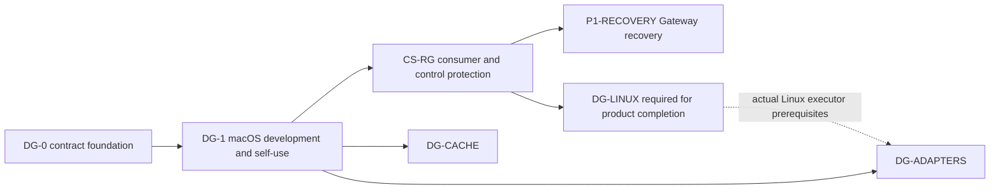

# DevGuard execution planning

Reference date: 2026-09-22; revised 2026-09-27 by design revision 1. Repository: `/Volumes/DevData/Projects/IdeaProjects/DevGuard`.
English is the authoritative editorial source. [Reviewed Korean translations](../ko/planning/README.md) are maintained through the [translation registry](../translations.json).

The contract baseline is DG-0: accounting, persistence and fake-backend tests. DG-1 is complete: its six implementation PRs delivered C01–C12, and its macOS SLO is qualified for release `0.1.0-5daee5d-b3fa569e` on the measured host and policy. Linux enforcement and CodeSpace integration remain unqualified. The [ledger](../../milestones.json) owns milestone IDs, dependencies and status. Individual milestone documents own work IDs, commit boundaries, tests, evidence and rollback.

## Reading order and ownership

1. [Current English design reference](../design.md), the immutable [approved Korean source](../design.ko.md) and its [checksum](../design-source.json).
2. [Design revision 1](../design-revision-1.md): CS-RG execution ownership, the D1–D3 decisions and the reuse policy adopted on 2026-09-27.
3. [Decisions and source baselines](decisions.md): single Runner registration, Gateway-only recovery, authority ownership, compatibility and execution ownership.
4. [Consumer readiness](consumer-readiness.md): adoption levels and platform claims.
5. The milestone documents below: proposed commits and logical PR groups.
6. [CodeSpace integration](codespace-integration.md): actual source paths and intended registration, execution, control and recovery flow.
7. [Verification](verification.md): available versus planned commands, scope, SLOs and evidence.
8. [PR delivery](pr-delivery.md): preparation, exact-head sequential merges, cleanup and handoff.

[Contracts](../contracts.md) describe implemented behavior. Planning must not present a future API as an existing feature. The canvas is a secondary view of repository documents and actual PRs.

## Dependencies

DG-1 qualifies standalone daemon/CLI, development workloads and bounded self-use. CS-RG separately qualifies the integrated Runner, MCP, approvals and replay. This avoids requiring unimplemented CS-RG features to complete DG-1. Initial recovery requires a live independent Runner; InProcess and restoration of I/O after Runner restart are excluded.

Design revision 1 (2026-09-27) makes CodeSpace's execution state and ownership coordination common. It adds CSRG-C00, which verifies the execution boundary first, and CSRG-C09, which decides the legacy `off` backends before final qualification. It keeps DevGuard free of Codex dependencies as a present engineering choice, not a permanent prohibition, and permits bounded adaptation with recorded provenance. It changes the plan, not implementation or qualification status.

| Milestone | Owner | Proposed work commits | Logical PR groups | Baseline state |
| --- | --- | --- | --- | --- |
| [DG-0](milestones/DG-0.md) | DevGuard | One actual initial commit, documented retrospectively | No invented historical PRs | Implemented contract/fake scope |
| [DG-1](milestones/DG-1.md) | DevGuard | 12 | 6 | Implemented (C01–C12); macOS SLO qualified for release `0.1.0-5daee5d-b3fa569e` |
| [CS-RG](milestones/CS-RG.md) | CodeSpace | 10 | 6 | Not started |
| [P1-RECOVERY](milestones/P1-RECOVERY.md) | CodeSpace | 6 | 3 | Not started |
| [DG-LINUX](milestones/DG-LINUX.md) | DevGuard and CodeSpace | 6 | 3 | Not started; required overall |
| [DG-CACHE](milestones/DG-CACHE.md) | DevGuard | 6 | 3 | Not started; not a P1 prerequisite |
| [DG-ADAPTERS](milestones/DG-ADAPTERS.md) | DevGuard | 8 | 4 | Not started; not a P1 prerequisite |
| Total follow-up plan | — | **48** | **25** | Planning counts, not GitHub numbers |

## Execution rules

IDs such as `DG1-C01`, commit titles and logical PR labels are proposed values. Record real SHAs and PR URLs only after creation. Documentation work DGP-D01–D06 and CSP-D01–D04 is separate from these 48 units; append-only preparation changes preserve their history and immutable links.

`scripts/qualify.py dg1-authority` verifies the C01 boundary, and `scripts/qualify.py dg1-auth` verifies C02 local authentication/transport. Other qualification suites and CodeSpace's `scripts/qualify-devguard.py` remain planned until their implementation PR provides them. A configuration file or authenticated session alone does not prove that a command consumes the central budget.

For DG-1, complete one PR through review, current-head checks, normal merge, push-triggered main checks and cleanup before beginning the next. Use one Cargo job and one test thread for necessary bootstrap work. At DG1-C10, validate and freeze a parent artifact containing the new parent-budget capability, then immediately start bounded real self-use. A C08/C09 functional artifact is not presumed to implement C10 operations, and the C10 parent is not an SLO-qualified release until C12 passes.

Keep source/client pins, installed daemon/helper hashes, product wire versions and documentation revisions distinct. Preserve Apache-2.0. Design revision 1 keeps the existing Codex pin `6b9826e3aa83b1a5947db50f4332cb9c65f1b340`; a later change is a separate decision based on verification.
